:::figure

:::

**ЦЕРЕМОНИЯТА** по откриване и водене на деловата работа на Ложа на Майстор Масони е почти същата, както в степените Чирак и Калфа, вече обяснени. Цялата работа на една „Синя ложа“ (тоест ложа от трите степени) се извършва, когато ложата е отворена в тази степен, с изключение на въвеждането на Чирак или повишаването на Калфа, когато за тази цел ложата се понижава от степента Майстор Масон.

Третата степен се счита за върха на Древното Свободно зидарство и за най-възвишената от всички степени в Масонството (без дори да се изключва Кралската арка); и когато той се присъжда, ложата обикновено е добре изпълнена с членове на ложата и с гостуващи братя.

Традиционният разказ за смъртта, многократните погребения и възкресения на един от занаятчиите — Хирам Абиф, синът на вдовицата — както се развива при присъждането на тази степен, е изключително интересен.

В Библията четем, че Хирам Абиф е бил един от главните майстори, наети при построяването на Храма на цар Соломон, а други древни писания ни съобщават, че той е бил посредник между цар Соломон и Хирам, цар на Тир; но неговата трагична смърт никъде не е записана, освен в архивите на Свободното зидарство. Нито Библията, нито писанията на Йосиф Флавий, нито каквито и да било други, колкото и древни да са, известни нам писмени източници дават сведения относно неговата смърт.

Много е странно, че човек, толкова прочут като Хирам Абиф — всеобщо признат за третия най-изтъкнат мъж, живял по онова време, и в много отношения най-великия човек в света — е могъл да напусне сцената на дейността си в присъствието на цар Соломон, три хиляди и триста велики надзиратели и сто и петдесет хиляди работници, с които е прекарал много години, и при това, заедно със своя близък приятел цар Соломон, без някой от неговите многобройни събратя дори да запише смъртта му или каквото и да било за нея.

Ложа на Майстор Масони се нарича така, когато е отворена в тази степен и тогава двата върха на пергела са издигнати над правият ъгъл. 
:::figure

:::
**ПЕРГЕЛИ, ПОСТАВЕНИ В ЛОЖА НА МАЙСТОР МАСОНИ,  
„И ДВАТА ВЪРХА ИЗДИГНАТИ НАД ПРАВИЯ ЪГЪЛ“**

Кандидатът за възвишената степен Майстор Масон обикновено (както и в предходните степени) се подготвя от Младшия Дякон и двамата Стюарди, или от други братя, изпълняващи тази длъжност.

**ПОДГОТОВКА НА КАНДИДАТА**

Кандидатът се съблича от всички дрехи, с изключение на ризата и долните дрехи; а ако няма такива, братята, които го подготвят, му осигуряват чифт. Долните дрехи се навиват малко над коленете на кандидата, а и двете му ръце се изваждат от ръкавите на ризата, като по този начин краката и гърдите му остават оголени. Въже, наричано технически от Масоните кабел-тау, се увива около тялото му три пъти, а превръзка или превез (хуудуинк) се завързва много плътно върху очите му. 
:::figure

:::

Когато кандидатът е подготвен, Дяконът го отвежда в _Sanctum Sanctorum_, или Светая Светих, на Храма на цар Соломон; 
Хващайки го за лявата ръка, той го отвежда до вратата на ложата и дава три силни, отчетливи удара.
Старшият Дякон, който е заел мястото си при вътрешната врата, отдясно на Старшия Надзирател, като чуе тези удари, се изправя, прави знака на Майстор Масон към Майстора и казва:

**С. Д.** — Достопочтени Майсторе, докато сме заети със законното упражняване на Масонството, има тревога на вътрешната врата на нашата ложа.

**Д. М.** — Ще се погрижите за тревогата и ще установите причината.

Старшият Дякон дава три силни удара (• • •), на които отвън се отговаря с един (•). След това Старшият Дякон отвръща с един удар (•) и отваря вратата. (Виж [[Бележка J, Приложение]].)

**С. Д.** — Кой идва тук?

**Мл. Д.** — Брат Гейб, който е бил редовно въведен като Чирак, повишен в степента Калфа и сега желае да получи още светлина в Масонството, като бъде въздигнат в възвишената степен Майстор Масон.

**С. Д.** — Брат Гейб, по твоя собствена свободна воля и съгласие ли е това?

**Кандидатът** — Така е.

**С. Д.** — Брат Младши Дякон, достоен и добре квалифициран ли е?

**Мл. Д.** — Така е.

**С. Д.** — Надлежно и истински подготвен ли е?

**Мл. Д.** — Така е.

**С. Д.** — Направил ли е подходящ напредък в предходните степени?

**Мл. Д.** — Направил е.

**С. Д.** — И надлежно поръчан ли е?

**Мл. Д.** — Така е.

**С. Д.** — Кой поръчва за него?

**Мл. Д.** — Един брат.

**С. Д.** — По какво допълнително право или преимущество очаква да получи допускане?

**Мл. Д.** — По преимущество на паролата.

**С. Д.** — Има ли той паролата?

**Мл. Д.** — Той я няма, но аз я имам за него.

**С. Д.** — Пристъпи напред и ми я дай.

Тук Младшият Дякон пристъпва напред и прошепва в ухото на Старшия Дякон: „Тувал-Каин“.

**С. Д.** — Паролата е вярна; ще изчакате с търпение, докато Достопочтеният Майстор бъде уведомен за вашето искане и неговият отговор бъде върнат.

След това Дяконът затваря вратата, отива в центъра на ложата пред олтара и удря жезъла си в пода три пъти (• • •), на което Майсторът отговаря с три удара на чукчето си. Тогава Старшият Дякон прави знака на Майстор Масон  и казва:

**С. Д.** — Брат Гейб, който е бил редовно въведен като Чирак, повишен в степента Калфа и сега желае да получи още светлина в Масонството, като бъде въздигнат в възвишената степен Майстор Масон.

**Д. М.** — По негова собствена свободна воля и съгласие ли е това?

**С. Д.** — Така е.

**Д. М.** — Достоен и добре квалифициран ли е, надлежно и истински подготвен?

**С. Д.** — Така е.

**Д. М.** — Направил ли е подходящ напредък в предходната степен?

**С. Д.** — Направил е.

**Д. М.** — И надлежно поръчан ли е?

**С. Д.** — Така е.

**Д. М.** — Кой поръчва за него?

**С. Д.** — Един брат.

**Д. М.** — По какво допълнително право или преимущество очаква да получи допускане?

**С. Д.** — По преимущество на паролата.

**Д. М.** — Има ли той тази парола?

**С. Д.** — Той я няма, но аз я имам за него.

**Д. М.** — Пристъпи напред и ми я дай.

Старшият Дякон пристъпва към Майстора и прошепва в ухото му: „Тувал-Каин“.

**Д. М.** — Паролата е вярна. Нека влезе и бъде приет по надлежния ред.

Старшият Дякон пристъпва към олтара, взема пергелите, отива до вратата, отваря я и казва:

**С. Д.** — Нека влезе и бъде приет по надлежния ред.

Младшият Дякон пристъпва напред, следван от Стюардите с жезлите си, когато Старшият Дякон ги спира, като поставя ръката си срещу кандидата, като същевременно казва:

**С. Д.** — Брат Гейб, при първото си влизане в тази ложа ти бе приет на върха на пергела, притиснат към оголената ти лява гърда, чийто нравствен смисъл ти бе обяснен. При второто си влизане ти бе приет на правия ъгъл, което също ти бе обяснено. Сега те приемам и на двата върха на пергела, простиращи се от оголената ти лява до оголената ти дясна гърда (тук той поставя двата върха върху гърдите на кандидата), за да те научи, че както жизненоважните части на човека се съдържат в гърдите, така и най-превъзходните принципи на нашата институция се съдържат между върховете на пергела — а именно: Приятелство, Нравственост и Братска Любов.

Младшият Дякон сега предава кандидата на Старшия Дяконът, а той (Младшият Дякон), заема мястото си близо до вратата, от дясната страна на Старшия Надзирател на запад, докато Старшият Дякон пристъпва да води кандидата, следван от двамата Стюарди, три пъти около Ложата, през което време Достопочтеният Майстор прочита следния откъс от Свещеното Писание:

„Помни Създателя си в дните на младостта си, преди да дойдат зли дни и да настъпят години, за които ще кажеш: ‘Нямам удоволствие в тях’; преди да помръкнат слънцето, или луната, или звездите, и преди облаците да се върнат след дъжда; в деня, когато пазачите на дома ще треперят и силните мъже ще се прегънат, и мелачките ще престанат, защото са малко; и ония, които гледат през прозорците, ще потъмнеят; и вратите към улицата ще се затворят, когато шумът на мелницата е слаб, и човек ще става от гласа на птицата, и всички дъщери на песента ще стихнат. И още — когато ще се боят от височините и страхове ще има по пътя, и бадемовото дърво ще цъфти, и скакалецът ще бъде бреме, и желанието ще изчезне; защото човек отива в дългия си дом, и оплаквачите обикалят по улиците; преди да се прекъсне сребърната връв или да се счупи златната чаша при извора, или колелото при кладенеца. Тогава пръстта ще се върне в земята, каквато е била, а духът ще се върне при Бога, Който го е дал.“

Докато Старшият Дякон и кандидатът преминават покрай различните места на длъжностните лица, те (длъжностните лица) удрят чукчетата си по следния начин: при първото преминаване покрай Младшия Надзирател на юг той дава един удар (•), Старшият Надзирател — един удар, а Достопочтеният Майстор — един удар; при второто обикаляне Младшият Надзирател дава два удара, Старшият Надзирател — два удара, и Достопочтеният Майстор — два удара (• •); при третото обикаляне Младшият Надзирател дава три удара (• • •), Старшият Надзирател — три удара, и Достопочтеният Майстор — три удара. Майсторът така съгласува прочита на откъса от Писанието, че да го завърши точно когато участниците достигнат мястото на Младшия Надзирател на юг при третото обикаляне, където те спират.

**Мл. Н.** — Кой идва тук?

**Провождачът (С. Д.)** — Брат Гейб, който е бил редовно въведен като Чирак, повишен в степента Калфа и сега желае да получи още светлина в Масонството, като бъде въздигнат в възвишената степен Майстор Масон.

**Мл. Н.** — Брат Гейб, по твоя собствена свободна воля и съгласие ли е това?

**Кандидатът** — Така е.

**Мл. Н.** — Брат Старши Дякон, достоен и добре квалифициран ли е, надлежно и истински подготвен?

**С. Д.** — Така е.

**Мл. Н.** — Направил ли е подходящ напредък в предходните степени?

**С. Д.** — Направил е.

**Мл. Н.** — И надлежно поръчан ли е?

**С. Д.** — Така е.

**Мл. Н.** — Кой поръчва за него?

**С. Д.** — Един брат.

**Мл. Н.** — По какво допълнително право или преимущество очаква да получи допускане?

**С. Д.** — По преимущество на паролата.

**Мл. Н.** — Има ли той паролата?

**С. Д.** — Той я няма, но аз я имам за него.

**Мл. Н.** — Пристъпи напред и дай паролата.

Старшият Дякон пристъпва напред и прошепва в ухото на Надзирателя: „Тувал-Каин“.

**Мл. Н.** — Паролата е вярна. Ще ви позволя да преминете към мястото на Старшия Надзирател на запад за неговото изпитване.

Старшият Дякон преминава към запад, където същите въпроси се задават и се дават същите отговори, както по-рано, и Старшият Надзирател им позволява да преминат към Достопочтения Майстор на изток, където същите въпроси и отговори се повтарят.

**Д. М.** — Откъде идвате и накъде пътувате?

**С. Д.** — От запад, пътувайки към изток.

**Д. М.** — Защо напускате запада и пътувате към изток?

**С. Д.** — В търсене на още светлина в Масонството.

**Д. М.** — Тъй като това е целта на вашето търсене, вие ще отведете този кандидат обратно при Старшия Надзирател на запад, с моите нареждания той да бъде научен как да пристъпи към изтока — мястото на по-нататъшната светлина в Масонството — чрез три прави, правилни стъпки, с изправено тяло пред олтара, пред Достопочтения Майстор на изток.

След това Старшият Дякон отвежда кандидата при Старшия Надзирател на запад и докладва:

**С. Д.** — Брат Старши Надзирател, по нареждане на Достопочтения Майстор вие трябва да научите този кандидат как да пристъпи към изтока — мястото на по-нататъшната светлина в Масонството — чрез три прави, правилни стъпки, с изправено тяло пред олтара, пред Достопочтения Майстор на изток.

Старшият Надзирател пристъпва към кандидата, обръща го с лице към изток (тоест към Майстора) и казва:

**Брате**, ще пристъпиш напред с левия си крак една пълна стъпка и ще поставиш петата на десния си крак в кухината на левия; сега пристъпи напред с десния си крак и постави петата на левия си крак в кухината на десния; сега пристъпи напред с левия си крак и събери двете си пети заедно. (Виж Фиг. 14.)
:::figure

:::
**Фиг. 14. Първите три стъпки в Масонството.**

**С. Н.** — Кандидатът е в надлежен ред, Достопочтени, и очаква вашата по-нататъшна воля и разпореждане.

**Д. М.** — Ще наредите той да коленичи на голите си колене, с двете си ръце, положени върху Светата Библия, ъгъла и пергела.

**Д. М.** — Брат Гейб, ти коленичиш за трети път пред олтара на Масонството, за да поемеш върху себе си тържествената клетва на Майстор Масон; и аз, като Майстор на тази Ложа, имам удоволствието, както и при предишните случаи, да те уверя, че в нея няма нищо, което би влязло в противоречие с дълга, който дължиш на своя Бог, на своя ближен, на своята страна или на самия себе си. Готов ли си да положиш клетвата?

:::figure

:::
**„Коленичил на двете си голи колене, с двете си ръце, положени върху Светата Библия, ъгъла и пергела.“**

**Кандидатът** — Готов съм.

**Д. М.** — Ще повториш името си и ще кажеш след мен:

**„Аз, Питър Гейб** (Майсторът дава три удара с чукчето си, при което всички присъстващи се събират около олтара), **по собствена свободна воля и съгласие, в присъствието на Всемогъщия Бог и на тази достопочтена Ложа, издигната в Негова чест и посветена на светите Йоановци, тук и сега най-тържествено и искрено обещавам и се заклевам, че винаги ще признавам, винаги ще пазя в тайна и никога няма да разкривам нито една от тайните, изкуствата, частите, точките или каквото и да е от Степента на Майстор Масон, на което и да е лице или лица, освен ако не е истински и законен брат от тази Степен, или в редовно учредена Ложа на Майстори Масони; и дори и на него или на тях — не, докато чрез строг изпит, надлежно изследване или законна информация не установя, че той или те имат също толкова законно право върху тях, колкото и аз самият.**

**По-нататък обещавам и се заклевам, че ще спазвам и ще се подчинявам на всички закони, правила и разпоредби на Степента на Майстор Масон и на Ложата, в която впоследствие мога да стана член, доколкото същите стигнат до моето знание; и че винаги ще поддържам и защитавам Конституцията, законите и постановленията на Великата Ложа, под чиято власт тя се намира.**

**По-нататък — че ще признавам и ще се подчинявам на всички надлежни знаци и повиквания, изпратени до мен от Ложа на Майстори Масони или предадени ми от брат от тази Степен, ако са в рамките на дължината на моя кабел-теглич.**

**По-нататък — че винаги ще помагам и ще подпомагам всички бедни, изпаднали в нужда и достойни Майстори Масони, техните вдовици и сираци, когато знам, че са такива, доколкото техните нужди го изискват и моите възможности позволяват, без съществена вреда за мен самия и моето семейство.**

**По-нататък — че ще пазя неприкосновено тайните на един достоен брат Майстор Масон, когато са ми били поверени и приети от мен като такива, убийството и държавната измяна изключени.**

**По-нататък — че няма да съдействам, нито ще присъствам на посвещаването, повишаването или въздигането на жена, на старец в умствен упадък, на младеж в непълнолетие, на атеист, на безумец или на глупец, когато знам, че са такива.**

**По-нататък — че няма да заседавам в Ложа на незаконно произведени Масони, нито ще разговарям по теми, свързани с Масонството, с незаконно произведен Масон, нито с такъв, който е бил изключен или отстранен от Ложа, докато е под такова наказание, когато знам, че той или те са такива.**

**По-нататък — че няма умишлено да мамя, ощетявам или измамвам Ложа на Майстори Масони, нито брат от тази Степен, нито ще го измествам в някое от неговите достойни начинания, а ще му давам навременно и надлежно предупреждение, за да може да се предпази от всяка опасност.**

**По-нататък — че няма умишлено да удрям брат Майстор Масон, нито по друг начин да му нанасям лична телесна повреда в гняв, освен при необходимата защита на моето семейство или имущество.**

**По-нататък — че няма да имам незаконни плътски отношения със съпругата, майката, сестрата или дъщерята на брат Майстор Масон, нито ще допускам това да бъде извършено от други, ако е в моя власт да го предотвратя.**

**По-нататък — че няма да давам Великата масонска дума по какъвто и да е друг начин или форма, освен по този, по който ще я получа, и то с тих дъх.**

**По-нататък — че няма да давам Великия призивен знак на бедствието, освен в случай на най-непосредствена опасност, в справедлива и законна Ложа, или за целите на наставлението; и че ако някога видя този знак да бъде даден или чуя думите, които го съпровождат, от достоен брат в беда, ще се притеча на помощ, ако има по-голяма вероятност да спася неговия живот, отколкото да загубя своя собствен.**

**Всичко това най-тържествено и искрено обещавам и се заклевам, с твърдо и непоколебимо решение да го изпълня, без никакво колебание, умствена уговорка или тайно увъртане на ума каквото и да било, обвързвайки се под не по-малко наказание от това тялото ми да бъде разсечено на две, вътрешностите ми да бъдат извадени и изгорени на пепел, а пепелта разпръсната пред четирите небесни ветрове, за да не остане никакъв спомен за толкова низък и порочен злодей, какъвто бих бил, ако някога умишлено наруша това мое задължение на Майстор Масон. Така да ми помага Бог и да ме крепи в надлежното изпълнение на същото.“**

**Д. М.** — Ще отдръпнеш ръцете си и ще целунеш Книгата. В настоящото си състояние, какво желаеш най-много?

**Кандидатът** (подсказан от водача) — По-нататъшна светлина в Масонството.

**Д. М.** — Нека получи по-нататъшна светлина.

Тук водачът сваля превръзката от очите и премахва кабел-теглича, а всички около олтара поставят ръцете си в положението на дюгарда на Майстор Масон.  Достопочтеният Майстор дава един удар с чукчето, при което всички братя се оттеглят по местата си, като при олтара остават Майсторът, водачът и кандидатът.

**Д. М.** — Брат Гейб, при получаването на по-нататъшна светлина ти възприемаш повече, отколкото досега. И двата върха на пергела са издигнати над ъгълника, което трябва да те учи никога да не губиш от поглед онези истински масонски добродетели, които са: приятелство, нравственост и братска любов.

Майсторът сега отстъпва около три крачки назад от олтара и казва:

**Брат Гейб, ти ме виждаш да се приближавам към теб от изток, под дюгарда** (някои казват — _крачка, дюгард и знак_) **на Майстор Масон; и в знак на по-нататъшното продължение на моята братска любов и благоволение, ти подавам дясната си ръка, а с нея — паролата и знака на паролата на Майстор Масон.**

Хваща кандидата с „истинския захват“ на Калфа и казва:

**Твоят водач ще отговори вместо теб.**

**Д. М.** — Ще бъде ли _off_ или _from_?

**Водачът** — _From._

**Д. М.** — От какво и към какво?

**Водачът** — От „истинския захват“ на Калфа към проходния захват на Майстор Масон.
:::figure

:::

**Водачът** — тук наставлява кандидата да прекара палеца си от втората става към пространството отвъд нея, което е второто пространство.

**Д. М.** (гледайки водача в очите) — Какво е това?

**Водачът** — Проходният захват на Майстор Масон.

**Д. М.** — Има ли име?

**Водачът** — Има.

**Д. М.** — Ще ми го дадеш ли?

**Водачът** — Не съм го получил по този начин, нито мога по този начин да го предам.

**Д. М.** — Как ще се разпоредиш с него?

**Водачът** — Ще го избуквя или ще го разделя.

**Д. М.** — Раздели го и започни.

**Водачът** — Не, ти започни.

**Д. М.** — Започни ти.

**Водачът** — Ту.

**Д. М.** — Бал.

**Водачът** — Каин.  
(Произнася се от водача — **Тубал Каин**.)¹

**Д. М.** (повдигайки кандидата) — Ще станеш и ще поздравиш Младшия и Старшия Надзиратели като задължен Майстор Масон.

---

Тук Ложите се различават в начина си на работа; някои превеждат кандидата около Ложата само веднъж и при преминаването му покрай Младшия и Старшия Надзиратели той дава знака на Майстор Масон. 

Майсторът следва да настави кандидата (и обикновено го прави) как да дава знаците, преди той да стане от олтара след полагането на задължението. Следното изглежда да е правилният начин:

След като кандидатът стане от олтара, водачът трябва да го отведе направо от олтара до мястото на Младшия Надзирател на юг и да даде три удара по пода с жезъла си, на които Младшият Надзирател отговаря с три удара с чукчето си.

**Мл. Н.** — Кой идва тук?

**Водачът** — Брат Гейб, задължен Майстор Масон.

**Мл. Н.** — Как да узная, че е такъв?

**Водачът** — По паролата и знака на паролата на Майстор Масон.

**Мл. Н.** (поднасяйки ръката си на кандидата) — Предай знака.  
(Те се хващат за ръцете с истинския захват на Калфа. 

**Мл. Н.** — Ще бъде ли _off_ или _from_?

**Водачът** (от името на кандидата) — _From._

**Мл. Н.** — От какво и към какво?

**Водачът** — От истинския захват на Калфа към проходния захват на Майстор Масон.

**Мл. Н.** — Преминете.  
(Сега те преминават към проходния захват на Майстор Масон.)

**Мл. Н.** — Какво е това?

**Водачът** — Проходният захват на Майстор Масон.

**Мл. Н.** — Има ли име?

**Водачът** — Има.

**Мл. Н.** — Ще ми го дадеш ли?

**Водачът** — Не съм го получил по този начин, нито мога по този начин да го предам.

**Мл. Н.** — Как ще се разпоредиш с него?

**Водачът** — Ще го избуквя или ще го разделя.

**Мл. Н.** — Раздели го и започни.

**Водачът** — Не, ти започни.

**Мл. Н.** — Започни ти.

**Водачът** — Ту.

**Мл. Н.** — Бал.

**Водачът** — Каин.  
(Произнася се от водача — **Тубал Каин**.)

**Мл. Н.** — Знакът е правилен и паролата е правилна. Ще преминете към мястото на Старшия Надзирател на запад за неговия изпит.

---

Те преминават към мястото на този офицер, където се задават и отговарят същите въпроси, както при Младшия Надзирател, и той (Старшият Надзирател) им позволява да продължат към мястото на Достопочтения Майстор на изток. Когато се приближават към мястото на Достопочтения Майстор, той казва:

**Д. М.** — Брат Старши Дякон, ще върнеш кандидата при Старшия Надзирател на запад с моите нареждания той да го научи как да носи престилката си като Майстор Масон.

Водачът тогава се обръща към Старшия Надзирател на запад и казва:

**Брат Старши Надзирател, по нареждане на Достопочтения Майстор ти следва да научиш този кандидат как да носи престилката си като Майстор Масон.**
:::figure

:::
### ПРЕСТИЛКАТА НА МАЙСТОР МАСОН

**Водачът** сега отвежда кандидата обратно при Достопочтения Майстор на изток.
**Д. М.** — Брат Гейб, тъй като си облечен като Майстор Масон¹, необходимо е да ти бъдат представени работните инструменти на Майстор Масон.  
(Майсторът държи малка мистрия, която показва на кандидата, докато започва да чете обяснението за нея.)

Работните инструменти на Майстор Масон са всички инструменти на Масонството, принадлежащи безразборно към първите три степени, но по-специално **мистрията**.
:::figure
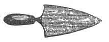
:::

Мистрията е инструмент, използван от оперативните зидари за разстилане на цимента, който съединява сградата в една обща маса; но ние, като Свободни и Приети Масони, сме научени да я използваме за по-благородната и славна цел — да разпространяваме цимента на братската любов и привързаност; онзи цимент, който ни обединява в една свещена връзка или общество от приятели и братя, между които никога не бива да съществува раздора, освен онова благородно съревнование — или по-скоро подражание — кой най-добре може да работи и най-добре да живее в съгласие.

**Д. М.** — Брат Старши Дякон, сега ще върнеш този кандидат на мястото, откъдето дойде, ще го облечеш отново с това, от което бе лишен, и ще изчакаш по-нататъшната ми воля и разпореждане.

След това водачът отвежда кандидата в центъра на Ложата, при олтара, и дава дюгарда и знака на Майстор Масон, на което Майсторът отговаря; след което водачът и кандидатът напускат Ложата. Докато излизат, Майсторът дава три удара с чукчето си (• • •) и казва с висок глас:

**Д. М.** — Брат Младши Надзирател, колко е часът?

**Мл. Н.** — Високият дванадесет, Достопочтени.

**Д. М.** — Ако си уверен, че е високият дванадесет, ще издигнеш колоната си и ще повикаш братството от труд към отдих за срок от тридесет минути (или петнадесет минути, според случая), като ги повикаш обратно при звука на чукчето.

При получаването на тази заповед Младшият Надзирател взема от бюрото си малка дървена колона, дълга около осемнадесет инча, и я поставя в изправено положение от дясната си страна; същевременно дава три удара с чукчето си (• • •) и казва:

**Мл. Н.** — Братя, вие сте съответно в отдих.

Тук следва да се отбележи, че на бюрото на Старшия Надзирател има подобна колона, която винаги се поставя в хоризонтално положение (т.е. легнала настрани), когато колоната на Младшия Надзирател е изправена, и обратно. Когато Ложата е открита, колоната на Младшия Надзирател е обърната надолу, а тази на Старшия Надзирател — изправена от дясната му страна.

Сега на братята се позволява няколко минути за развлечение, което масоните наричат **отдих**; през това време кандидатът се подготвя в преддверието, а Ложата се подрежда за оставащата част от церемонията по посвещението.

Последното се извършва по следния начин: от шкаф или сандък в помещението се изважда платно, дълго около седем фута и широко около шест фута, с по пет или шест здрави примки от всяка страна; и от същото място се взема кожена торба от еленова кожа, напълнена с косми, приблизително с големината на два боксови ръкавици. И двата предмета се използват, както ще бъде описано по-нататък.

Помещението се освобождава, като се премахват олтарът и светлините, както и двата големи стълба, използвани във Втората степен. До този момент кандидатът е облечен; престилката му е вързана като на Майстор Масон, с повдигнат десен ъгъл, и той носи ярем с прикрепен към него накит на Старшия Надзирател. В някои Ложи братята при този случай обличат кандидата с особено богата престилка и ярем.

Когато кандидатът е напълно облечен, вратата се отваря без церемонии и той, заедно с други лица, получава разрешение да влезе в Ложата. Неговите приятели сега се приближават към него и го поздравяват за масонския му вид, като го питат как му харесва степента и дали не се радва, че всичко е приключило, и т.н., и т.н.

Целта на това е да се заблуди кандидатът и да се внуши в ума му, че повече от церемонията няма и че посвещението му е завършено.

Достопочтеният Майстор дава един удар с чукчето си (•).

**Мл. Н.** — Братя, сега сте повикани от отдих отново към труд.  
(Дава един удар (•), отива до бюрото си и обръща малката колона легнала настрани, както бе обяснено.)

Едновременно с това Старшият Надзирател отива до своето място и изправя колоната на бюрото си отдясно. Братята всички сядат, както и кандидатът.

**Д. М.** — Брат Старши Надзирател, знаеш ли за някаква допълнителна работа пред тази Ложа на Майстор Масони, преди да пристъпим към закриване?

**Ст. Н.** (изправяйки се и давайки знака на Майстор Масон) — Нищо, Достопочтени.

**Д. М.** — Имаш ли нещо за предлагане, брат Младши Надзирател?

**Мл. Н.** (дава знак) — Нищо, Достопочтени.

**Д. М.** — Имаш ли нещо на бюрото си, брат Секретар?

**Секр.** (дава знак) — Нищо, Достопочтени.

**Д. М.** — Има ли някой брат присъстващ нещо за предлагане в полза на Масонството?  
(Никой не говори, и Достопочтеният Майстор продължава:) Тогава ще пристъпим към закриване; но преди да направим това, бих казал на брат Гейб (кандидата) — присъства ли той?

**Някой брат** — Присъства.

**Д. М.** — Брат Гейб, моля, приближи се на изток.

**Водачът** (Ст. Д.) отвежда кандидата напред, пред мястото на Майстора на изток.

(Авторът тук отбелязва, по отношение на въпроса за закриването на Ложата и питането на Надзирателите дали знаят за нещо допълнително пред Ложата преди закриването, че това е хитрост за заблуда на кандидата, тъй като Майсторът няма намерение да закрива Ложата, докато церемонията по посвещението не бъде завършена.)

След като кандидатът е отведен на изток, пред Майстора, водачът застава зад кандидата, държейки в ръката си или скрита в джоба си качулката.

**Д. М.** (гледайки кандидата сериозно в лицето) — Брат Гейб, предполагам, че сега се смяташ за Майстор Масон и като такъв имаш право на всички привилегии на Майстор Масон, нали?

**Кандидатът** — Така е.

**Д. М.** — Предположих, че е така по накита, който носиш — това е накитът на Старшия Надзирател.

**Д. М.** — Брат Гейб, ти все още не си Майстор Масон, нито знам дали някога ще бъдеш, докато не узная колко добре ще устоиш на удивителните изпитания и опасности, които те очакват. Надзирателите и братята на тази Ложа изискват по-задоволително доказателство за твоята вярност към повереното ти, преди да са готови да ти поверят по-ценните тайни на тази степен. Пред теб стои груб и труден път за изминаване, осеян с крадци, разбойници и убийци; и ако загубиш живота си при този опит, това няма да е първият подобен случай, братко мой. Помни в кого полагаш упованието си, с онова божествено уверение, че „който устои докрай, той ще бъде спасен“. Досега си имал някого, който да се моли за теб, но сега нямаш никого. Ти сам трябва да се молиш за себе си. Затова ще позволиш отново да ти бъде сложена качулката, ще коленичиш там, където си, и ще се молиш гласно или наум, както пожелаеш. Когато приключиш, дай знак, като кажеш „Амин“, след което стани и продължи пътя си.

Кандидатът тогава коленичи, а водачът завързва качулката много плътно върху двете му очи, така че той да не може да вижда.

След като кандидатът е казал „Амин“ и помещението на Ложата е потъмнено чрез намаляване или загасване на газовите светлини или лампите, водачът хваща кандидата за дясната ръка, помага му да стане и те започват да обикалят три пъти около помещението, движейки се по посока на слънцето. Когато тръгват, водачът започва да разказва на кандидата следното:

**Водачът** — Братко, обичайна практика на нашия Велик Майстор Хирам Абиф (това е първият път, когато кандидатът чува за Хирам Абиф) бе всеки ден при високия дванадесет да влиза в незавършеното _Sanctum Sanctorum_, или _Святая Светих_, на Храма на цар Соломон, докато братството бе повикано от труд към отдих, с цел да изработва своите замисли върху чертожната дъска, по които братството да продължава труда си; след което бе негова практика да възнася молитвите си към Божеството. След това той се оттегляше през южната порта на външните дворове на Храма; и в съответствие с обичая на нашия Велик Майстор, чиято памет всички ние тъй благоговейно почитаме, и ние сега ще се оттеглим през южната порта на Храма.

Те вече са обиколили Ложата три пъти и когато се приближават към мястото на Младшия Надзирател на юг, той тихо излиза от мястото си на пода и застава срещу завързания кандидат, хващайки го грубо за яката, като едновременно с това възкликва:
:::figure
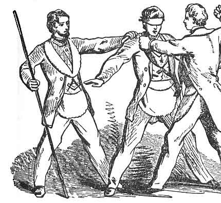
:::
**Мл. Н. (Юбела, Първият злодей.)** — Велик Майсторе Хирам, радвам се, че те срещам тъй сам. Отдавна търсех тази възможност. Ти ще си спомниш, че ни обеща, когато Храмът бъде завършен, да получим тайните на Майстор Масон, чрез които да можем да пътуваме в чужди страни, да работим и да получаваме надницата на Майстор. Виж! Храмът сега е почти завършен, а ние не сме получили онова, което тъй дълго сме търсили. Първоначално не се съмнявах във верността ти; но сега се съмнявам!  
(Дръпва кандидата внезапно за яката.)  
Затова сега от теб изисквам тайните на Майстор Масон!

**Водачът (от името на кандидата.)** — Братко, това е необичаен начин да ги искаш. Това не е нито подходящо време, нито място; но ти бъди верен на своите задължения и аз ще бъда верен на своите. Изчакай, докато Храмът бъде завършен, и тогава, ако бъдеш намерен достоен и добре подготвен, без съмнение ще получиш тайните на Майстор Масон; но дотогава — не можеш.

**Злодеят** — Това (разтърсвайки кандидата) не ме удовлетворява! Не ми говори за време или място, а ми дай тайните на Майстор Масон, или ще ти отнема живота!

**Водачът** — Не мога; нито пък те могат да бъдат дадени, освен в присъствието на Соломон, царя на Израил, Хирам, царя на Тир, и на самия мен.

**Злодеят** — Това не ме удовлетворява. Няма да слушам повече твоите увъртания!  
(Стиска кандидата още по-жестоко.)  
Дай ми Майсторската дума, или ще ти отнема живота още в този миг!

**Водачът** — Няма!
:::figure
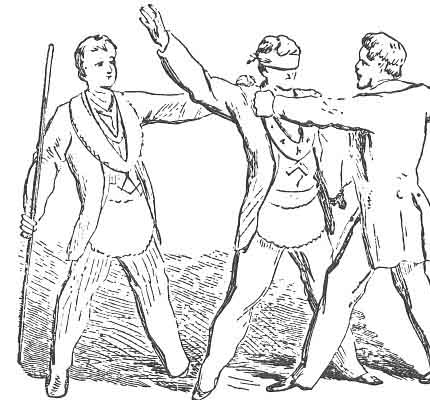
:::
**Злодеят** нанася на кандидата движение с дясната си ръка напреко през гърлото, и в същото време отпуска захвата си с лявата, отстъпва тихо встрани и позволява на водача и кандидата да продължат към станцията на Старшия Надзирател на запад, което става, като водачът се придвижва много бързо напред, дърпайки кандидата след себе си. Когато се приближават към западната страна, Старшият Надзирател излиза напред, както направи и Младшият Надзирател, застава срещу кандидата и, стискайки го за яката още по-грубо от Младшия Надзирател, възкликва следното:

**С. Н. (Втори злодей.)** — Дай ми тайните на Майстор Масон!

**Водачът (от името на кандидата.)** — Не мога.

**Злодеят** — Дай ми тайните на Майстор Масон!  
(Разтърсва кандидата.)

**Водачът** — Няма да го направя.

**Злодеят** — Дай ми Майсторската дума, или ще ти отнема живота още в този миг!  
(Разтърсва кандидата внезапно.)

**Водачът** — Няма!

**Злодеят** (т.е. Старшият Надзирател) нанася на кандидата удар с дясната си ръка напреко през лявата гръд, и в същото време го пуска да премине, като водачът го пришпорва напред към източния край на Ложата, където Майсторът е застанал, за да изпълни ролята на Третия злодей — **Юбелум**, който обикновено е снабден с торба от еленова кожа, пълна с косми, за да представлява каменоделски чук (_setting-maul_).

Докато кандидатът е пришпорван напред към Юбелум (Достопочтения Майстор), последният го хваща с двете си ръце за яката на дрехата и го завърта така, че гърбът му да бъде обърнат към изток, а петите му да се окажат на няколко сантиметра от ръба на платното, споменато по-рано. Това платно обикновено се държи зад кандидата, в наклонено положение, от някои от братята, и служи за да го улови, когато бъде препънат от предполагаемия злодей Юбелум. Тогава Майсторът (Третият злодей) възкликва:

**Д. М. (като Трети злодей.)** — Дай ми тайните на Майстор Масон!

**Водачът (от името на кандидата.)** — Не мога!

**Злодеят** — Дай ми тайните на Майстор Масон, или ще ти отнема живота!

**Водачът** — Няма да го направя!

**Злодеят** — Ти (тук Майсторът стиска кандидата още по-свирепо и придава вид на крайна решимост) си избегнал „Юбела“ и „Юбело“; от мен няма да избягаш; името ми е „Юбелум“! Каквото възнамерявам — това изпълнявам. В ръката си държа оръдие на смъртта; затова — дай ми Майсторската дума, или ще ти отнема живота още в този миг!

**Водачът** — Няма!

**Злодеят** — Тогава умри!

Тук Достопочтения Майстор нанася на кандидата удар по главата с торбата от еленова кожа, или с каменоделския чук;¹ и в същото време, бутайки го назад, допира петите на кандидата до ръба на платното, препъва го, и кандидатът пада по гръб, уловен от платното, без да докосне пода, невредим, но в много случаи — силно уплашен.
:::figure
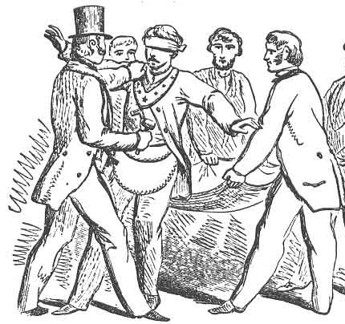
:::
Общоприето е вярването (и то лесно би се заключило от повечето разкрития на Масонството), че кандидатът бива повален с голям каменоделски чук (_setting-maul_), държан за тази цел; но нито един разумно мислещ човек не би могъл дори за миг да допусне подобна представа за церемонията по възвеждане в степента Майстор Масон. Кандидатът **не се наранява умишлено** в никоя степен на Масонството; единственото, което се цели чрез церемониите, са **впечатления с траен нравствен характер**.

Когато кандидатът пада върху платното, братята го спускат до пода, след което между онези, които държат платното, и Майстора, или брата, изпълняващ ролята на Третия злодей, се води следният диалог:

**Злодеят** — Мъртъв ли е?

**Отговор** — Да, черепът му е разбит.

**Злодеят** — Какво ужасно дело извършихме?

**Отговор** — Убихме нашия Велик Майстор, Хирам Абиф,  
и не получихме онова, което търсехме; това не е време за празни размишления — въпросът е: **какво да правим с тялото?**

**Отговор** — Ще го погребем в развалините на Храма до ниско дванадесет, а след това ще се съберем и ще му дадем прилично погребение.

**Отговор** — Съгласни!

Те увиват платното около и върху кандидата там, където е паднал — в източния или североизточния ъгъл на Ложата — и за няколко мига се оттеглят. Тогава в Ложата настъпва тишина като в полунощ; не се допуска да се издаде никакъв звук; всички — ако изобщо се движат — го правят на пръсти. Майсторът безмълвно пристъпва към изток, близо до главата на кандидата, и отброява часа на **ниско дванадесет** (т.е. дванадесет часа през нощта) върху триъгълник или звънец. Когато последният звук на дванадесет заглъхне, тримата злодеи предпазливо се приближават до тялото и разговарят помежду си приблизително така:

**Първи злодей** — Това ти ли си, Юбела?

**Отговор** — Да.

**Втори злодей** — Това ти ли си, Юбелум?¹

**Отговор** — Да.

**Трети злодей** — Това ти ли си, Юбело?

**Отговор** — Да.

**Първи злодей** — Добре, всички се събрахме, както се уговорихме; въпросът е — какво ще правим с тялото? Сега е вече след полунощ и ако не действаме решително, ще се съмне и ще бъдем разкрити и заловени. Ще отнесем тялото на запад от Храма, до билото на хълма западно от планината Мория, където съм изкопал гроб, ориентиран изток–запад, шест фута дълбок.

**Отговор** — Съгласни!

Достатъчен брой братя сега вдигат тялото (все още увито в платното) и, поставяйки го на раменете си, започват да го носят из Ложата, с главата напред, **три пъти**, като символично изкачване на хълм; при третия път спират в западния край на Ложата, почти пред станцията на Старшия Надзирател, и малко вдясно. След като пристигнат там, започват да го спускат в т.нар. гроб — но в действителност само от раменете си до пода.

След като кандидатът е положен, един от злодеите казва:

Да посадим акация при главата на гроба, за да го прикрием, и мястото да може да бъде разпознато, ако по-късно възникне нужда.

В някои Ложи има малка кутия с растение в саксия или сухо клонче, която се поставя на пода близо до главата на кандидата. Един от злодеите възкликва:

Сега да избягаме извън страната!

И незабавно един от най-съобразителните братя застава при вратата на преддверието, и когато онези, които са изпълнявали ролята на злодеите, се приближават до него, се разиграва следният разговор:

**Първи злодей** — Здравей, приятелю! Ти морски капитан ли си?

**Капитанът** — Да.

**Втори злодей** — Ще отплаваш ли скоро?

**Капитанът** — Незабавно.

**Трети злодей** — Накъде си се запътил?

**Капитанът** — Към Етиопия.

**Злодеят** — Точно това пристанище търсим. Ние тримата бихме желали да пътуваме с теб.

**Капитанът** — Добре, можете да получите превоз. Предполагам, че сте братя, работници от Храма, и пътувате, нали?

**Злодеите** — Така е.

**Капитанът** — Ще се радвам на вашата компания. Имате пропуск от цар Соломон, предполагам?

**Злодеите** (с престорено учудване) — Не, нямаме пропуск; не знаехме, че е необходим. Бяхме изпратени набързо и по спешна работа; нищо не беше казано за пропуск, и предполагаме, че е било забравено или не е било счетено за нужно.

**Капитанът** — Как! Нямате пропуск? Как! Нямате пропуск? В такъв случай не можете да пътувате с мен — уверявам ви. Това е строго забранено; така че можете да сте спокойни.

**Злодеите** — Ще се върнем и ще си вземем пропуск, ако това е необходимо.

**Капитанът** — Колкото по-скоро, толкова по-добре! Подозрителни типове!

Злодеите се връщат отново близо до тялото и между тях се води следният разговор:

**Първи злодей** — Какво ще правим в този случай?

**Втори злодей** — Ще отидем в друго пристанище.

**Трети злодей** — Но правилата са също толкова строги и в другите пристанища.

**Първи злодей** — Ако такива са наредбите, няма да получим пропуск никъде — и какво ще стане с нас?

**Втори злодей** — Ще бъдем заловени и умъртвени.

**Трети злодей** — Да се укрием до нощта, да откраднем малка лодка и да излезем в морето.

**Първи злодей** — Няма да успеем по този начин. Крайбрежието е опасно и ще бъдем заловени; защото до този момент бягството ни вече ще е открито и брегът ще бъде обсаден от нашите преследвачи.

**Втори злодей** — Тогава да избягаме във вътрешността на страната и да избягваме залавяне колкото е възможно по-дълго.

**Трети злодей** — Съгласни!

Те се оттеглят от тялото в различни посоки. След като в Ложата отново настъпва тишина за няколко секунди, братята скачат, започват да се смеят, пеят и т.н., възкликвайки:

**Няма работа днес. Занаятчии, хубаво си прекарваме; чудя се дали ще продължи!**

Те се раздвижват за няколко мига, когато биват приведени в ред от удара на чукчето от мястото на Майстора на изток, който пита с висок глас следното:

**Д. М. (вече наричан цар Соломон.)** — Братко Младши Велик Надзирателю, какво означава цялото това безредие сред работниците? Защо не работят, както обикновено?

**С. Н. (вече наричан Мл. В. Н.)** — Най-достопочтени царю Соломоне, за нас няма разпределена работа и се казва, че няма да има. Няма начертани проекти върху чертожната дъска и по тази причина мнозина от нас бездействат.

**Ц. С.** — Няма разпределена работа — няма чертежи на чертожната дъска? Какво означава това? Къде е нашият Велик Майстор, Хирам Абиф?

**Мл. В. Н.** — Не знаем, най-достопочтени царю Соломоне. Той не е бил виждан от високо дванадесет вчера.

**Ц. С.** — Не е бил виждан от високо дванадесет вчера! Страхувам се, че му се е случило нещо. Нареждам да се извърши стриктно издирване из помещенията на Храма и да се направи надлежно разследване. Нека бъде намерен, ако е възможно.

Братята започват на висок глас да се разпитват един друг:

**Видял ли е някой нещо от нашия Велик Майстор Хирам Абиф? Не — от високо дванадесет вчера**, и т.н., и т.н.

**Мл. В. Н.** — Най-достопочтени царю Соломоне, извършено е усърдно издирване. Той не може да бъде намерен. Не е бил виждан в или около Храма.

**Ц. С.** — Страхувам се, че някакво нещастие го е сполетяло. Братко Велик Секретарю (обръщайки се към Секретаря на Ложата), ще излезеш и ще се погрижиш да бъдат повикани всички списъци на занаятчиите и да ми бъде докладвано възможно най-скоро.

**В. Сек.** — Съберете се, занаятчии! По заповед на цар Соломон всички списъци да бъдат повикани и доклад да бъде представен възможно най-скоро.

По тази заповед Секретарят излиза от Ложата, придружен от десет или петнадесет братя, в преддверието, като оставя вратата отворена, за да може кандидатът да чува как се извикват списъците. Братята се подреждат около Секретаря като ученици в училище. Секретарят започва да изрежда множество библейски имена, на които всеки брат отговаря с висок глас: „Тук!“, докато стигне до името на Първия злодей:

**„Юбела! Юбела!! Юбела!!!“**

След като извиква още няколко имена, на които братята отговарят, той казва:

**„Юбело! Юбело!! Юбело!!!“**

и след още няколко имена — името на Третия злодей:

**„Юбелум! Юбелум!! Юбелум!!!“**

След като приключва с още няколко имена, той оставя братята в преддверието, затваря вратата и докладва на цар Соломон по следния начин:

**В. Сек.** — Най-достопочтени царю Соломоне, всички списъци бяха извикани и докладите направени, от което се установи, че липсват трима калфи, а именно: Юбела, Юбело и Юбелум, които, по сходството на имената им, предполагам, че са братя и мъже от Тир.

**Мл. В. Н.** — Най-достопочтени царю Соломоне, при портата има дванадесет калфи, които желаят да бъдат допуснати; казват, че носят важни вести.

**Ц. С.** — Нека бъдат допуснати.

Тук Надзирателят отваря вратата на преддверието и казва:  
**„Влезте, вие дванадесет калфи“**,  
след което всички онези, които Секретарят беше оставил вън, влизат в Ложата, тропайки и блъскайки се нарочно — особено ако са малко на брой — за да се внуши на кандидата, че са повече. Те пристъпват пред Майстора на изток и се подреждат напречно през Ложата, когато всички правят **дюгарда и знака на Калфа**, които Майсторът им отвръща. Тогава един от най-добре подготвените произнася следното, с ясен и отчетлив глас:

> **„Най-достопочтени царю Соломоне,**  
> ние идваме да ви уведомим, че петнадесет от нас — калфи, виждайки, че Храмът е на път да бъде завършен и желаейки да получим тайните на Майстор Масон, чрез които бихме могли да пътуваме в чужди страни и да получаваме майсторска заплата — влязохме в ужасен заговор да ги изнудим от нашия Велик Майстор, Хирам Абиф, или да му отнемем живота.  
> Но, изпълнени с ужас от чудовищността на това престъпление, дванадесет от нас се разкаяха; останалите трима обаче упорстваха в убийствения си замисъл и ние се боим, че са отнели живота на Великия Майстор.  
> Поради това сега се явяваме пред Ваше Величество, облечени с бели ръкавици и престилки, като знак за нашата невинност, и, признавайки предварителната си вина, смирено молим за Вашата прошка.“**

(Всички коленичат.)

**Ц. С.** — Станете, вие дванадесет калфи; разделете се на отряди и тръгнете на път — трима на изток, трима на север, трима на юг и трима на запад — заедно с други, които ще назнача, за да издирите злодеите.

Братът, който е изпълнявал ролята на морския капитан, отново заема мястото си при вратата, когато калфите се приближават към него на запад.

**Първи калфа** — Здравей, приятелю! Видял ли си да минават някакви странници оттук?

**Капитанът** — Видях — трима.

**Калфата** — Опиши ги, ако обичаш.

**Капитанът** — Бяха трима братя, работници от Храма, които търсеха превоз за Етиопия, но, тъй като нямаха пропуск от цар Соломон, не успяха да получат такъв и се върнаха обратно във вътрешността на страната.

**Втори калфа** — Точно същите, които търсим. Казваш, че са се върнали в страната?

**Капитанът** — Да.

**Калфата** — Ще ги преследваме; те са хората, които търсим.  
(Тръгвайки, един казва:)  
**— Да докладваме.**

И веднага пристъпва към катедрата на Майстора и докладва така:

> **„Най-достопочтени царю Соломоне,**  
> аз, като един от онези, които поеха в западна посока, слизайки близо до пристанището Йопия, срещнах моряк, когото попитах дали е видял някакви странници да минават оттам. Той ми съобщи, че е видял трима, които по външния си вид били работници от Храма, търсещи превоз за Етиопия, но, тъй като нямали пропуск от цар Соломон, не успели да го получат и се върнали обратно във вътрешността на страната.“

**Ц. С.** — Разделете се отново и тръгнете, както по-рано, с категорична заповед да намерите злодеите и със също тъй категорично уверение, че ако не го сторите, дванадесетте ще бъдете счетени за убийците и всеки от вас ще понесе наказание за извършеното престъпление.

Те отново се разпръскват из Ложата, като си казват един на друг:

**„Това е много несправедливо от страна на царя. Казват ни, че ако не намерим злодеите, ще бъдем наказани — вероятно екзекутирани. Какво сме сторили? Вярно е, че сме били в общност с тези трима злодеи, но не сме извършили никакво действително престъпление.“**

Междувременно се приближават до кандидата (който все още лежи на пода, увит в платното), когато един от групата сяда близо до главата му и казва:

**„Е, братя, много съм уморен; трябва да седна и да си почина, преди да продължа.“**

Един от спътниците му възкликва:  
**„И аз съм уморен!“**  
и сяда близо до кандидата.

Друг казва:  
**„Какъв път да поемем? Не бива да отиваме и да се докладваме — ако го сторим, дванадесетте ще бъдем погубени. Тук са трима от нещастните хора с нас; не бива да ги предаваме, за да бъдат екзекутирани. По-добре да поемем на югозапад или северозапад. Къде да отидем?“**

Един от братята отговаря:  
**„Да поемем на югозапад и ще настигнем нашите братя.“**

Опитвайки се да стане, той възкликва:  
**„Хей! Какво е това?“**  
и в същото време издърпва вечнозеленото растение — **акацията**, както се нарича — при главата на гроба.¹  
**„Какво означава тази акация, която така лесно се изважда? Земята е прясно разкопана; това има вида на гроб,“**  
като сочи кандидата на пода.

В този момент от ъгъла наблизо се чува гласът на един от братята, представящ един от тримата злодеи, който възкликва с висок, но плътен тон:

**„О, да беше гърлото ми прерязано, езикът ми изтръгнат с корен и заровен в грубите пясъци на морето, при отлив, където приливът и отливът се сменят два пъти в денонощието, преди да съм станал съучастник в смъртта на такъв добър човек като нашия Велик Майстор, Хирам Абиф!“**

**„Чуйте! Това е гласът на Юбела.“**

**„О, да беше гърдите ми разпорени, сърцето ми изтръгнато и поставено на най-високия връх на Храма, за да бъде изядено от лешоядите на въздуха, преди да съм се съгласил със смъртта на такъв добър човек като нашия Велик Майстор, Хирам Абиф!“**

**„Чуйте! Това е гласът на Юбело.“**

**„О, да беше тялото ми разсечено на две, вътрешностите ми извадени и изгорени на пепел, а пепелта разпръсната към четирите ветрове на небето, та да не остане никакъв спомен за такъв подъл и зъл злодей като мен. Ах, Юбела! Юбело! Аз го ударих по-силно от вас двамата; аз му нанесох смъртоносния удар; аз го убих!“**

**„Това е гласът на Юбелум.“**

Тримата калфи, които през цялото това време стоят до кандидата и слушат злодеите, чиито гласове разпознават, си казват един на друг:

**„Какво да правим? Те са трима, а ние също сме трима.“**

Един казва:  
**„Нашата кауза е справедлива; да се хвърлим и да ги заловим!“**

Тогава тримата калфи се втурват напред през пейки и столове, залавят злодеите не особено нежно и ги отвеждат пред седалището на Достопочтения Майстор на изток, където един от тях докладва:

> **„Най-достопочтени царю Соломоне,**  
> аз, като един от онези, които поеха в западна посока, и на връщане, след няколко дни безплодно търсене, бидейки по-уморен от спътниците си, седнах на билото на един хълм да си почина и освежа силите; и когато станах, случайно хванах клонче от акация,¹ което лесно се откъсна и възбуди подозренията ми. Подбуден от любопитство, го изследвах и открих, че това е гроб.“

Щом този калфа приключва доклада си, пристига друга група със злодеите и докладва следното:

> **„Най-достопочтени царю Соломоне,**  
> докато седяхме да си починем и освежим силите, чухме следните ужасни възклицания от цепнатините на съседните скали. Първото бе гласът на Юбела, който възкликваше:  
> ‘О, да беше гърлото ми прерязано, езикът ми изтръгнат с корен и заровен в грубите пясъци на морето, при отлив, където приливът и отливът се сменят два пъти в денонощието, преди да съм станал съучастник в смъртта на такъв добър човек като нашия Велик Майстор, Хирам Абиф.’  
> Вторият бе гласът на Юбело, който възкликваше:  
> ‘О, да беше гърдите ми разпорени, сърцето ми изтръгнато и поставено на най-високия връх на Храма, за да бъде изядено от лешоядите на въздуха, преди да съм се съгласил със смъртта на такъв добър човек като нашия Велик Майстор, Хирам Абиф.’  
> Третият бе гласът на Юбелум, който възкликваше по-силно от всички останали:  
> ‘Аз нанесох смъртоносния удар; аз го убих. О, да беше тялото ми разсечено на две, вътрешностите ми извадени и изгорени на пепел, а пепелта разпръсната към четирите ветрове на небето, та да не остане никакъв спомен за такъв подъл и зъл злодей като мен. Ах, Юбела! Юбело! Аз го ударих по-силно от вас двамата; аз му нанесох смъртоносния удар; аз го убих.’  
> След което се втурнахме напред, заловихме и вързахме злодеите и сега ги довеждаме пред Ваше Величество.“

**Ц. С.** — Юбела, ти стоиш обвинен като съучастник в смъртта на нашия Велик Майстор, Хирам Абиф. Как се признаваш — виновен или невинен?

**Отговор** (с дълбоко разкаяние) — Виновен, господарю.

**Ц. С.** — Юбело, и ти стоиш обвинен като съучастник в смъртта на нашия Велик Майстор, Хирам Абиф. Как се признаваш — виновен или невинен?

**Отговор** — Виновен, господарю.

**Ц. С.** — Юбелум, ти стоиш обвинен като умишления убиец на нашия Велик Майстор, Хирам Абиф. Как се признаваш — виновен или невинен?

**Отговор** — Виновен, господарю.

**Ц. С.** — Подли, нечестиви негодници! Презрени злодеи! Размислете с ужас върху чудовищността на престъплението си и върху благородния характер на вашия достопочтен Велик Майстор, когото така низко сте убили. Вдигнете главите си и чуйте присъдата си.  
Нареждам да бъдете изведени извън портите на двора и екзекутирани, съгласно собствените ви проклятия, в цепнатините на скалите.  
Братко Младши Велик Надзирателю, ще се погрижиш заповедите ми да бъдат надлежно изпълнени.  
**Махайте се!**

Всички излизат с бързина от Ложата в преддверието, където се подреждат в кръг. Един от тях, действащ като главен подбудител, повдига десния си крак от пода и едновременно с това ръцете си, като при пляскане, прави две лъжливи движения; но при третото всички едновременно стоварват десните си крака и ръце, произвеждайки много остър звук. Следва кратко мълчание, по време на което един от групата стене, сякаш умира. Всичко това е предназначено да въздейства върху слуха на кандидата. То също така представя екзекуцията и смъртните стонове на Юбела, първия злодей, и се повтаря още два пъти, за да представи смъртта на другите двама злодеи. В някои Ложи се използва голям барабан, а в други — търкалят голямо оръдейно гюле по пода на преддверието, оставяйки го да се удари в възглавница, поставена до стената. Това обаче не се практикува в градските Ложи.

След като злодеите са екзекутирани, всички братя се връщат тихо в Ложата, когато един от тях докладва с висок глас:

**„Най-достопочтени царю Соломоне, вашите заповеди бяха надлежно изпълнени спрямо тримата убийци на Великия Майстор Хирам Абиф.“**¹

**Ц. С.** — Вие дванадесет калфи ще отидете да търсите тялото и, ако бъде намерено, ще наблюдавате дали върху него или около него се намира Майсторската дума, или ключ към нея, или каквото и да е, принадлежащо към степента Майстор Масон.

Братята, представящи дванадесетте разкаяли се заговорници, сега се отправят към мястото, където лежи кандидатът, и когато се приближат до него, един от тях казва:

**„Е, братя, можем ли да намерим мястото, където беше изскубната акацията?“**

Приближавайки се до кандидата, друг отговаря:

**„Да, това е мястото; нека разчистим отломките и да копаем тук.“**

Трети, повдигайки платното, казва:

**„Да, ето тялото на нашия Велик Майстор Хирам Абиф, в осакатено и разложено състояние. Нека отидем и да докладваме. Но какви бяха нашите заповеди? Бяхме заповядани да наблюдаваме дали Майсторската дума, или ключ към нея, или нещо, принадлежащо към степента Майстор Масон, се намира върху или около тялото; но, братя, ние сме само калфи и не знаем нищо за Майсторската дума, нито за ключ към нея, нито за каквото и да е, принадлежащо към степента Майстор Масон; все пак трябва да извършим проверка,**  
**иначе ще бъдем осъдени на смърт.“**

Тогава започват да претърсват около кандидата, като махат платното, опипват около врата му и т.н.; накрая един от братята, хващайки се за украшението, прикрепено към ярема около врата на кандидата, възкликва:

**„Това е украшението на неговата длъжност.“**

Друг казва:

**„Нека отидем и да докладваме, че не намерихме нищо върху или около тялото, освен украшението на неговата длъжност.“**

Един от братята сега сваля украшението от врата на кандидата и всички се отправят към седалището на Майстора на изток и докладват:

**„Вести за тялото.“**

**Ц. С.** — Къде беше намерено?

**Отговор** — В западна посока, там, където нашият уморен брат седна да си почине и да се освежи.

**Ц. С.** — Имаше ли Майсторската дума, или ключ към нея, или нещо, принадлежащо към степента Майстор Масон, върху или около него?¹

**Отговор** — Най-достопочтени царю Соломоне, ние сме само калфи и поради това не знаем нищо за Майсторската дума или за степента Майстор Масон. Не бе намерено нищо върху или около тялото, освен украшението на неговата длъжност, чрез което тялото беше разпознато.

Те поднасят украшението на Майстора, който, след като го разглежда, казва:

**„Това е украшението на нашия Велик Майстор Хирам Абиф; вече не може да има никакво съмнение относно самоличността на тялото.“**

**Ц. С.** — Вие дванадесет калфи сега ще отидете и ще помогнете за въздигането на тялото.

Обръщайки се на мястото си към бюрото на Ковчежника, той казва на Ковчежника:

**„Достоен мой брат от Тир, тъй като Майсторската дума сега е изгубена, първият знак, даден при гроба, и първата дума, произнесена след въздигането на тялото, ще бъдат приети за правило във всички Майсторски Ложи, докато бъдещите поколения открият истинската.“**

**Ковчежникът** — Съгласен.

Всички сега се подреждат в кръг около тялото, като Майсторът и Надзирателите са при главата, когато Майсторът прави **знака на бедствие** на Майстор Масон, който се извършва чрез вдигане на двете ръце и ръце над главата. (Виж Велик възгласен знак на бедствие) Докато Майсторът прави този знак, той казва:

**„О, Господи, Боже мой, боя се, че Майсторската дума е завинаги изгубена!“**

Тук следва да се отбележи, че в някои Ложи Майсторът не прави първо знака на бедствие при тялото, а само дава знака на Майстор Масон, който се извършва чрез прекарване на дясната ръка напречно през тялото, с палеца навътре.  След като знакът бъде даден, цялата група започва да обикаля около тялото по посока на слънцето, като изпява следния траурен напев; и ако Ложата разполага с орган или мелодеон, на този случай се свири по особено тържествен и въздействащ начин.
:::figure
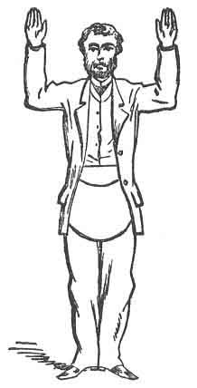
:::
**Майсторът (в ролята на Цар Соломон)** прави **Великия възгласен знак на бедствие**  (някои Майстори правят този знак два пъти), придружен от следното възклицание, а именно:  
**„О, Господи, Боже мой, боя се, че Майсторската дума е завинаги изгубена!“**  
След това той се обръща към Младшия Надзирател и казва:  
**„Ти ще вземеш тялото с хвата на Чирак и ще видиш дали може да бъде въздигнато.“**

Младшият Надзирател тогава хваща дясната ръка на кандидата, давайки му хвата на Чирак, след което оставя ръката си да се изплъзне по небрежен начин и докладва:

**„Най-достопочтени царю Соломоне, поради високата степен на разлагане, тъй като тялото е мъртво вече петнадесет дни, кожата се плъзга и тялото не може да бъде въздигнато.“**

**Ц. С.** _(правейки Великия възгласен знак на бедствие)_ —  
**„О, Господи, Боже мой, боя се, че Майсторската дума е завинаги изгубена!“**

Обръщайки се към Старшия Надзирател, той продължава:

**Ц. С.** — **„Достоен мой брат от Тир, ще ти бъда благодарен да се опиташ да въздигнеш тялото чрез хвата на Калфата.“**

Старшият Надзирател тогава хваща дясната ръка на кандидата, давайки **истинския хват на Калфата** , и като бързо оставя ръката си да се изплъзне, докладва следното:

**„Поради вече посочената причина, плътта се отделя от костта и тялото не може да бъде въздигнато по този начин.“**

**Ц. С.** — **„О, Господи, Боже мой! О, Господи, Боже мой!! О, Господи, Боже мой!!! Има ли надежда за сина на вдовицата?“**

При всяко възклицание той дава Великия възгласен знак на бедствие, което прави общо три пъти; след което, обръщайки се към Старшия Надзирател, казва:

**„Достоен мой брат от Тир, какво да сторим?“**

**С. Н.** — **„Нека се помолим.“**

Сега всички братя коленичат около тялото на едно коляно. Майсторът коленичи при главата на кандидата и, сваляйки шапката си, произнася следната молитва, която може да бъде намерена във всички масонски Монитори:

---

### **МОЛИТВА**

**Ти, о Боже, познаваш нашето сядане и нашето ставане и разбираш мислите ни отдалеч. Пази и защитавай ни от злите намерения на нашите врагове и ни подкрепяй в изпитанията и скърбите, които сме предопределени да понасяме, докато пътуваме през тази долина на сълзите. Човекът, роден от жена, е с малко дни и пълен със страдание. Той излиза като цвете и бива отсечен; бяга също като сянка и не остава. Понеже дните му са определени, броят на месеците му е у Теб; Ти си определил границите му, които той не може да премине; отвърни се от него, за да си почине, докато изпълни деня си. Защото има надежда за дървото, ако бъде отсечено, че то ще**
:::figure
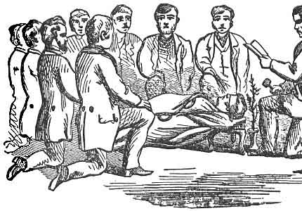
:::
**покълва отново и нежната му клонка не престава. Но човек умира и изчезва; да, човек предава духа си — и де е той? Както водите се отдръпват от морето и реката намалява и пресъхва, така човек ляга и не става, докато небесата не престанат да бъдат. Но, о Господи! смили се над чедата на Твоето творение, подай им утеха във време на скръб и ги спаси с вечно спасение. Амин.**

**Отговор:** — _Тъй да бъде._

Всички братя сега се изправят на крака.

**Ц. С. (към Старшия Надзирател)** —  
**„Достоен мой брат от Тир, ще се опитам (с твоята помощ) да въздигна тялото чрез силния хват, или Лъвската лапа, от племето на Юда.“**  
(Вж. Фиг. 17.)

Майсторът пристъпва към краката на кандидата, навежда се, хваща го с **истинския хват на Майстор масон**, поставя десния си крак срещу десния крак на кандидата и ръката си на гърба му, и **с помощта на братята** го издига **перпендикулярно в изправено положение**. Когато той вече е стабилно на крака, Майсторът му дава **Великата масонска дума** върху **петте точки на братството**. (Вж. Фиг. 18.)

През това време платното незабелязано се изнася извън Ложата и когато Майсторът започва да дава или прошепва думата в ухото на кандидата, някой от братята сваля превръзката от очите му — и това е първият път, вероятно от около час насам, в който той отново вижда светлина.

Следва **представяне на Майстора, който дава на кандидата Великата масонска дума**, или по-точно **нейния заместител**, тъй като, според масонската традиция, **истинската дума е била изгубена при смъртта на Хирам Абиф**.  
Тази дума **не може да бъде дадена по никакъв друг начин**, и от масоните се счита за **изпитание на всички „книжни“ масони**.

Майсторът, след като дава думата, която е:

**МАХ-ХАХ-БОН**,

с тих дъх, моли кандидата да я повтори заедно с него по следния начин:

**Майсторът (шепне в ухото на кандидата):** — _Мах._  
**Кандидатът:** — _Хах._  
**Майсторът:** — _Бон._

Майсторът наставлява кандидата **никога да не дава тази дума по друг начин, освен по начина, по който я е получил**.

След това Майсторът отстъпва една крачка назад и казва:

**„Братко Гейб, ти сега получи онази Велика масонска дума, която тържествено си се заклел никога да не предаваш по друг начин или форма, освен по начина, по който я получи — а именно върху петте точки на братството и то с тих дъх.“**  
(Вж. стр. 247.)

**„Петте точки на братството са: стъпало до стъпало, коляно до коляно, гърди до гърди, ръка на гърба и буза до буза — или уста до ухо.“**
:::figure
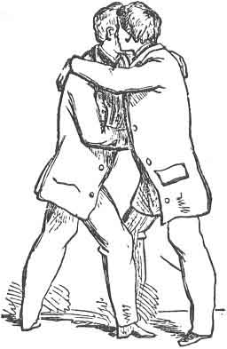
:::
**„1-во. Стъпало до стъпало** — че никога няма да се колебаеш да вървиш пеша и дори да се отклоняваш от пътя си, за да помагаш и служиш на достоен брат.

**2-ро. Коляно до коляно** — че винаги ще помниш благото на брата си, както и своето собствено, във всички свои обръщения към Божеството.

**3-то. Гърди до гърди** — че винаги ще пазиш в гърдите си тайните на брат, когато са ти поверени и приети от теб като такъв, с изключение на убийство и държавна измяна.

**4-то. Ръка на гърба** — че винаги ще бъдеш готов да протегнеш ръка, за да подпомогнеш и спасиш паднал брат; и че ще защитаваш неговия характер зад гърба му, така както и пред лицето му.

**5-то. Буза до буза, или уста до ухо** — че винаги ще наставляваш и нашепваш добър съвет в ухото на заблуден брат и по най-братския начин ще му напомняш за грешките му, ще подпомагаш неговото поправление и ще му даваш навременно и подобаващо предупреждение, за да може да отблъсне приближаващата опасност.“**

Всички братя сядат по местата си, с изключение на Майстора и кандидата, когато Майсторът продължава:

**„Братко Гейб, сега ще се отправиш на Изток и ще получиш исторически разказ за тази степен.“**

Майсторът заема мястото си на Изток и приканва кандидата да застане пред него.

---

## ИСТОРИЧЕСКИ РАЗКАЗ

**В. М.** —  
**„Братко Гейб, втората секция на тази степен представя пример на добродетел, твърдост и честност, рядко срещан — ако изобщо някога надминат — в историята на човечеството.**

Тази вечер ти представи един от най-великите мъже, а може би и най-великия масон, когото светът някога е познавал — а именно нашия Велик Майстор **Хирам Абиф**, който бе убит малко преди завършването на Храма на цар Соломон.

Неговата смърт бе предварително замислена от петнадесет калфи, които, виждайки Храма почти завършен и желаейки да получат тайните на Майстор масон, чрез които биха могли да пътуват в чужди страни и да получават майсторско възнаграждение, влязоха в ужасен заговор да ги изтръгнат от нашия Велик Майстор Хирам Абиф или да отнемат живота му. Но, ужасени от чудовищността на престъплението, дванадесет от тях се отказаха; останалите трима упорстваха в своите убийствени намерения.

Нашият Велик Майстор Хирам Абиф бе убит на _висок дванадесет_. Обичайно за него бе в този час, когато братството се оттегляше от труда към отдих, да влиза в незавършеното **„Светая Светих“** на Храма, там да възнася своите поклонения към Божеството и да изготвя своите чертежи върху чертожната дъска.

Тримата калфи, които упорстваха в престъпните си намерения, знаейки този негов обичай, застанаха при южната, западната и източната порта на вътрешните дворове на Храма и там го изчакаха.

След като завърши обичайните си действия, нашият Велик Майстор Хирам Абиф се опита да се оттегли през южната порта, когато бе пресрещнат от **Юбела**, който трикратно му поиска тайните на Майстор масон, или Майсторската дума; и след като му бе отказано, му нанесе удар с двадесет и четири-инчовата мярка през гърлото. Тогава той побягна и се опита да излезе през западната порта, където бе пресрещнат от **Юбело**, който по същия начин поиска от него тайните на Майстор масон или Майсторската дума; и при отказ му нанесе удар с ъгъла през гърдите. След това той побягна и се опита да избяга през източната порта, където бе пресрещнат от **Юбелум**, който по същия начин трикратно поиска тайните на Майстор масон или Майсторската дума; и при неговия отказ му нанесе силен удар с дървения чук по челото, който го повали мъртъв на място.

Разбойниците погребаха тялото в отломките на Храма до _ниско дванадесет_, или полунощ, когато се срещнаха по уговорка и го отнесоха на запад от Храма до възвишение западно от планината Мория, където го погребаха в гроб, изкопан точно изток–запад, шест фута дълбок, и на чиято глава посадиха акация, за да го прикрият и за да може мястото да бъде разпознато, ако някога възникне нужда, след което избягаха.

На следващия ден се установи, че нашият Велик Майстор Хирам Абиф липсва; отсъствието му бе забелязано по това, че нямаше изготвени чертежи върху чертожната дъска.

Цар Соломон, смятайки, че той е неразположен, нареди да се извърши строго търсене и надлежно разследване из всички помещения на Храма, за да бъде намерен, ако е възможно. Но нищо не се видя и не се чу за него.

Тогава, опасявайки се, че му се е случило нещо лошо, царят нареди да бъдат повикани списъците на работниците и се установи, че трима липсват — а именно: **Юбела, Юбело и Юбелум**, които по сходството на имената си били смятани за братя и мъже от Тир.

По това време дванадесетте калфи, които се бяха отказали от престъпните си намерения, се явиха пред цар Соломон, облечени с бели ръкавици и престилки, като знак за своята невинност, признаха предварителната си вина и, коленичили, умоляваха за неговата прошка.

Тогава цар Соломон им нареди да се разделят на групи и да тръгнат по трима на изток, запад, север и юг; и заедно с други, които той щеше да определи, да тръгнат в търсене на разбойниците.

Тримата, които поеха на запад, достигайки близо до пристанището Яфа, срещнаха моряк, от когото попитаха дали е виждал някакви странници да минават оттам. Той им съобщи, че е видял трима, които по външния си вид били работници от Храма и търсели превоз до Етиопия, но понеже нямали пропуск от цар Соломон, не им било позволено да получат такъв и те се върнали обратно във вътрешността на страната.

Те се върнаха и докладваха това на цар Соломон, който им нареди да се преобразят и да пътуват отново, както преди, с категорични инструкции да намерят разбойниците и със също толкова категорично уверение, че ако не го направят, дванадесетте ще бъдат смятани за убийци и ще понесат тежко наказание за извършеното престъпление.

Те тръгнаха отново и след петнадесет дни на тежко пътуване и лишения, един от братята, по-изморен от останалите, седна на възвишение западно от планината Мория, за да си почине и да се освежи; и при опит да стане, се хвана за акация, която лесно се откърти и възбуди любопитството му. При проверка установиха, че това е гроб.

По това време пристигна и друга група с разбойниците и разказа, че докато седели да си починат, чули следните ужасни възклицания от пукнатините на близката скала. Първото било гласът на Юбела, възкликващ: „О, да ми бе прерязано гърлото…“ и т.н.  
Второто било гласът на Юбело…  
Третото — гласът на Юбелум…

След което те се втурнали, заловили, вързали и довели разбойниците пред цар Соломон, който, след като надлежно установил вината им, наредил да бъдат изведени извън портите на храмовите дворове и екзекутирани съобразно проклятията, които сами бяха изрекли над главите си.

Цар Соломон тогава нареди на дванадесетте калфи да отидат да търсят тялото и, ако бъде намерено, да проверят дали Майсторската дума, или ключ към нея, или нещо, принадлежащо на Майсторската степен, се намира върху или около него.

Тялото на нашия Велик Майстор Хирам Абиф бе намерено на запад от Храма, където уморените братя бяха седнали да си починат и да се освежат.

След отстраняване на земята те достигнаха до тялото на нашия Велик Майстор Хирам Абиф, което намериха в напреднало състояние на разложение и жестоко осакатено, тъй като бе погребано вече петнадесет дни. Миризмата, която се издигаше от него, ги принуди неволно да поставят ръцете си по този начин (Майсторът тук поставя ръцете си във формата на дюгард на Майстор масон, което напомня положението на ръцете му при полагането на клетвата), за да предпазят ноздрите си; но нищо не бе намерено върху или около тялото, освен **знака на неговата длъжност**, по който тялото бе лесно разпознато.

Тогава цар Соломон им нареди да отидат и да съдействат при въздигането на тялото; и между него и Хирам, царя на Тир, бе уговорено, че тъй като Майсторската дума тогава е изгубена, **първата въздишка, издадена при гроба, и първата дума, изречена след въздигането на тялото, да бъдат използвани за управлението на всички Майсторски ложи** **за управлението на всички Майсторски ложи, докато бъдещите поколения не открият истинската.**

Те се отправиха към гроба, когато цар Соломон нареди на един от Калфите да хване тялото с хвата на **Чирака** и да провери дали може да бъде въздигнато; но поради напредналото състояние на разлагане, то не можеше да бъде въздигнато — плътта се отделяше от костта.

Тогава цар Соломон нареди да бъде хванато с хвата на **Калфата**; но и при този опит, по вече изложената причина, хватът на Калфата не даде никакъв резултат — тялото не можеше да бъде въздигнато.

Тогава цар Соломон възкликна:  
**„О, Господи, Боже мой, страхувам се, че Майсторската дума е завинаги изгубена! Братко мой от Тир, какво да сторим? Нека се помолим.“**

След молитвата цар Соломон хвана тялото със **силния хват на Майстор масон**, или **лъвската лапа**, и го въздигна на **петте точки на братството**, които вече ти бяха обяснени. След това тялото бе отнесено в Храма за по-достойно погребение и бе погребано по надлежния ред.

Тялото на нашия Велик Майстор бе погребано три пъти:  
първо — в отломките на Храма;  
второ — на възвишението западно от планината Мория;  
и трето, и последно — възможно най-близо до **„Светая Светих“** на Храма на цар Соломон, доколкото това позволяваше юдейският закон.  
А масонското предание ни съобщава, че в негова памет бил издигнат масонски паметник, състоящ се от **„красива девица, плачеща над пречупена колона; пред нея — отворена книга; в дясната ѝ ръка — клонка акация, в лявата — урна; зад нея стои Времето, което разгръща и преброява къдриците на косата ѝ.“**

Красивата девица, плачеща над пречупената колона, означава незавършеното състояние на Храма, както и преждевременната смърт на нашия Велик Майстор Хирам Абиф;  
отворената книга пред нея — че неговите добродетели са записани за вечни времена;  
клонката акация в дясната ѝ ръка — божествеността и безсмъртието на душата;  
урната в лявата ѝ ръка — че неговите тленни останки са били безопасно положени под **„Светая Светих“** на Храма на цар Соломон.

Времето, което разгръща къдриците на косата ѝ, означава, че **времето, търпението и постоянството постигат всичко**.

След това Майсторът показва и обяснява на кандидата различните **знаци и хватове на тази степен**, започвайки с първите (вж. фиг. 5, 6 и 7, стр. 17 и 18) и завършвайки с хватовете (вж. фиг. 16 и 17, стр. 97 и 120; вж. също Бележка L, Приложение).

След това Майсторът насочва вниманието на кандидата към **трите велики масонски стълба**, които обикновено са изобразени върху **Майсторския килим** (Майсторският килим е голяма карта, която ложите обикновено притежават и която е богато украсена с масонски символи).

Майсторът, посочвайки тези стълбове, казва:  
**„Те се наричат трите велики масонски колони или стълбове и са означени като Мъдрост, Сила и Красота.**

**Стълбът на Мъдростта** представя Соломон, царя на Израил, чиято мъдрост замисли този величествен градеж;  
**Стълбът на Силата** — Хирам, царя на Тир, който укрепи Соломон в неговото велико начинание;  
**Стълбът на Красотата** — Хирам Абиф, синът на вдовицата, чиято изкусна сръчност и изящно майсторство украсиха и облагородиха Храма.

**Изграждането на този велик храм бе съпроводено от две забележителни обстоятелства.**  
От Йосиф Флавий научаваме, че макар за построяването му да били необходими седем години, през цялото това време не валял дъжд през деня, за да не бъдат възпрепятствани работниците в труда си;  
а от Свещеното Писание става ясно, че **нито звук от чук, нито от брадва, нито от какъвто и да било железен инструмент се е чувал в Храма, докато той се е изграждал**.

Този прочут градеж бил поддържан от **хиляда четиристотин петдесет и три колони** и **две хиляди деветстотин и шест пиластри** — всички изсечени от най-финия пароски мрамор.

В изграждането му били заети **трима Велики Майстори; три хиляди и триста Майстори или надзорници на работата; осемдесет хиляди Калфи**, които дялали камъка по планините и в кариерите; и **седемдесет хиляди Чираци**, носачи на товари.  
Всички те били разпределени и подредени с такава мъдрост от Соломон, че нито завист, нито раздор, нито безредие били допуснати да нарушат онзи всеобщ мир и спокойствие, които обхващали света в този важен период.“**

**„Братко Гейб, седем съставляват Ложа на Чираци** — един Майстор масон и шест Чираци. Те обикновено се събират на Приземния етаж на Храма на цар Соломон.

**Пет съставляват Ложа на Калфи** — двама Майстор масони и трима Калфи. Те обикновено се събират в Средната камера на Храма на цар Соломон.

**Трима съставляват Ложа на Майстор масони** — трима Майстор масони. Те се събират в **Светая Светих** на Храма на цар Соломон.“**

След това Майсторът или прочита, или произнася наизуст следващото от Монитора — което мнозина научават наизуст; но когато той владее „работата“ (т.е. онази част, която не е мониторна), не е необходимо да знае наизуст тъй наречения **Майсторски килим с емблемите**, но тъй като той е част от посвещението в Третата степен, авторът предлага да го изложи в неговия редовен порядък на ложевото дело.
:::figure
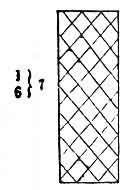
:::

:::figure
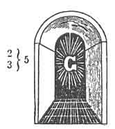
:::

:::figure
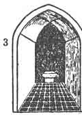
:::

## ТРИТЕ СТЪПАЛА
:::figure
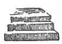
:::

Обикновено изобразявани върху Майсторския килим, те са **емблематични за трите главни етапа от човешкия живот**, а именно: **младост, зрелост и старост**.  
В младостта, като **Чираци**, ние трябва усърдно да занимаваме умовете си с придобиването на полезни знания;  
в зрелостта, като **Калфи**, трябва да прилагаме тези знания при изпълнението на нашите съответни задължения към Бога, към ближните си и към самите себе си;  
така че в старостта, като **Майстор масони**, да можем да се наслаждаваме на радостните размисли, произтичащи от добре изживян живот, и да умрем с надеждата за славно безсмъртие.

## КАДИЛНИЦАТА
:::figure
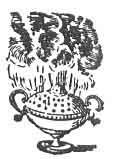
:::

Е емблема на **чистото сърце**, което винаги е приемлива жертва пред Божеството; и както тя гори с пламенна жар, така и нашите сърца трябва непрестанно да горят с благодарност към великия и благодеен Творец на нашето съществуване за многобройните благословии и утешения, които получаваме.

## КОШЕРЪТ
:::figure
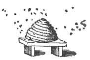
:::

Е емблема на **трудолюбието** и препоръчва упражняването на тази добродетел на всички сътворени същества — от най-висшия серафим на небето до най-низшето пълзящо същество в праха.  
Той ни учи, че както идваме на света като разумни и мислещи същества, така трябва винаги да бъдем и трудолюбиви; никога да не сядаме доволни, докато нашите ближни около нас търпят лишения, когато е в нашите сили да им помогнем без неудобство за самите себе си.

Когато съзерцаваме природата, виждаме човека в неговата младенческа възраст по-безпомощен и нуждаещ се от животните; той лежи дни, месеци и години напълно неспособен сам да си осигури препитание, да се защити от нападенията на дивите зверове или да се предпази от суровостта на времето.

Великият Създател на небето и земята е могъл да направи човека независим от всички други същества; но тъй като **зависимостта е една от най-силните връзки на обществото**, човечеството е било създадено взаимно зависимо за защита и сигурност, за да има по-добри възможности да изпълнява задълженията на взаимната любов и приятелство.

Така човекът е бил сътворен за обществен и деен живот — най-благородната част от Божието творение; а онзи, който не се стреми да допринася към общия запас от знание и разум, може справедливо да бъде смятан за **търтей в кошера на природата**, безполезен член на обществото и недостоен за нашата закрила като масони.

## КНИГАТА НА КОНСТИТУЦИИТЕ,

ПАЗЕНА ОТ МЕЧА НА ТАЙЛЪРА
:figure
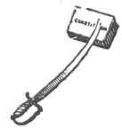
:::

Ни напомня, че трябва винаги да бъдем **бдителни и предпазливи в своите мисли, думи и дела**, особено когато сме пред враговете на Масонството; като постоянно помним онези истински масонски добродетели — **мълчание и предпазливост**.

## МЕЧЪТ, НАСОЧЕН КЪМ ГОЛОТО СЪРЦЕ
:::figure
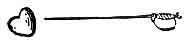
:::

Показва, че **справедливостта рано или късно ще ни настигне**; и макар нашите мисли, думи и дела да са скрити от човешките очи, 

# Всевиждащото око 
:::figure
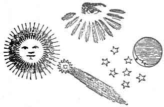
:::

на което се подчиняват слънцето, луната и звездите и под чиято бдителна грижа дори кометите извършват своите величествени движения, вижда най-дълбоките тайници на човешкото сърце и ще ни въздаде според делата ни.

## КОТВАТА И КОВЧЕГЪТ
:::figure
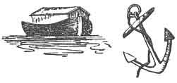
:::

Са емблеми на **добре утвърдена надежда** и **добре изживян живот**. Те символизират онзи божествен ковчег, който безопасно ни пренася през това бурно море от несгоди, и онази котва, която ще ни закотви сигурно в тихо пристанище, където злите престават да смущават, а уморените намират покой.

## ЧЕТИРИДЕСЕТ И СЕДМИЯТ ПРОБЛЕМ НА ЕВКЛИД
:::figure
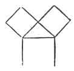
:::

Той е откритие на нашия древен приятел и брат — великия Питагор, който по време на своите пътешествия из Азия, Африка и Европа бил посветен в различни жречески ордени и въздигнат до възвишената степен на **Майстор масон**.  
Този мъдър философ обогатил ума си с обширно познание за света, а особено в геометрията, или зидарството. По този предмет той формулирал много задачи и теореми, а сред най-изтъкнатите поставил именно тази, която в радостта на сърцето си нарекъл **„Еврика“**, което на гръцки означава „Открих го“; и по повод на това откритие, казват, принесъл жертва от сто вола.  
Тя учи масоните да бъдат всеобщи почитатели на **изкуствата и науките**.

## ПЯСЪЧНИЯТ ЧАСОВНИК
:::figure
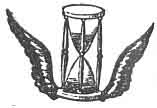
:::

Е емблема на **човешкия живот**. Вижте колко бързо се изсипват песъчинките и колко стремително животът ни се приближава към своя край.  
Не можем без удивление да наблюдаваме как тези малки частици преминават почти незабележимо, и все пак — за краткото време от един час — всички се изчерпват.  
Така изчезва и човекът! Днес той пуска нежните листа на надеждата; утре разцъфтява и носи своите румени почести; на следващия ден идва слана, която пречупва стъблото, и когато той мисли, че величието му още расте, той пада — като есенните листа — за да обогати нашата майка земя.

## КОСАТА
:::figure
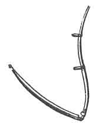
:::

Е емблема на **времето**, което прерязва крехката нишка на живота и ни въвежда във вечността.  
Вижте какво опустошение причинява косата на времето сред човешкия род: ако по щастлива случайност избегнем многобройните злини на детството и младостта и достигнем с здраве и сила годините на зрелостта, то въпреки това скоро ще бъдем покосени от всепоглъщащата коса на времето и събрани в земята, където нашите бащи са отишли преди нас.

**Братко Гейб**, позволи ми да насоча вниманието ти към последната емблема на килима — **лопатата, чука (setting-maul), ковчега, гроба и клонката акация**.

Лопатата, която изкопа гроба на нашия Велик Майстор, може скоро да изкопае и нашия;  
чукът, който прекъсна неговото земно съществуване, може да бъде сред онези случайности, които рано или късно ще прекратят и нашето;  
ковчегът, който прие неговите тленни останки, може скоро да приеме и нашите;  
гробът — това обиталище на мъртвите — може скоро да бъде и нашият;  
а **акацията** — вечнозеленото растение, което някога отбеляза временното място на покой на прославения мъртвец и стана причина за навременното му откриване — е емблема на нашата **вяра в безсмъртието на душата**, която **никога — никога — не умира**.

:::figure
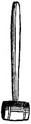
:::

:::figure

:::

:::figure
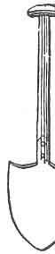
:::

Това, братко мой, може скоро да обозначи **нашето последно място за покой** в онова вечно и безмълвно обиталище, това пристанище на отдих, този мирен дом, „**където нечестивите престават да смущават и уморените намират покой**“.

Братко, бъди винаги съзнателен за онази велика промяна, когато ще бъдем призовани от земните трудове към онова **вечно освежаване в рая Божи**.

Позволи ми да те наставя по най-сериозния начин относно края на живота — че когато студената зима на смъртта отмине и се яви светлото лятно утро на възкресението, **Слънцето на Правдата** ще слезе и ще изпрати Своите ангели да съберат изкупените ни мъртви; и тогава, ако бъдем намерени достойни, **по силата на Неговия „проход“** ще получим готов достъп в онази **Небесна ложа горе**, където пребъдва Върховният Архитект на Вселената, където ще видим Царя в красотата на светостта и заедно с Него ще влезем във **вечна безкрайност**.

### Някои Майстори добавят следното:

Така, братко, завършваме нашето наставление за емблемите с тържествената мисъл за смъртта. Всички сме родени, за да умрем; изпращаме своите приятели до ръба на гроба и, застанали на брега на необятен океан, гледаме с мъчителна тревога, докато последната борба приключи и ги видим да потъват в бездънната бездна. Усещаме как и нашите собствени нозе се хлъзгат от несигурния ръб, на който стоим; и още няколко слънца — и ние ще бъдем погълнати под страшната вълна на смъртта, за да почиваме в тихите сенки, където мрак и тишина ще властват около нашето тъжно обиталище.

Но това ли е краят на човека и на възвишените надежди на всички верни масони? **Не!** Благословен да е Бог — ние не спираме стъпките си нито на първата, нито на втората стъпка; а верни на нашите принципи, гледаме напред към **по-голяма светлина**. Когато тлеещите въглени на смъртността едва мъждукат в очите на съществуването, **Библията** отмахва тъмния облак, разтваря черните завеси на гроба, приканва надеждата и радостта да ни събудят и подкрепя и ободря отиващия си дух; тя сочи отвъд безмълвния гроб и ни заповядва да насочим очите си с вяра и упование към разгръщащите се сцени на нашата вечност.

Почитаемият Майстор дава **три удара** с чука си, което изправя цялата Ложа на крака.

---

## НАСТАВЛЕНИЕ КЪМ ЛОЖАТА

И сега, братя мои, нека внимаваме и така уреждаме живота си **по отвеса на справедливостта**, като винаги **измерваме делата си по правия ъгъл на добродетелта**, та когато Великият Надзирател на Небето ни повика, да бъдем намерени готови.  
Нека усърдно развиваме благородните принципи на нашия Орден — **братска любов, помощ и истина**; и от правия ъгъл да се учим на нравственост, от нивелира — на равенство, от отвеса — на правота на живота.

Нека подражаваме във всички негови съвършенства на онзи, който, нападнат от убийствената шайка на бунтовни занаятчии, запази своята почтеност дори в смъртта и запечата обета си със собствената си кръв. Нека подражаваме на неговото благородно и добродетелно поведение, на неговата искрена набожност към Бога и на неговата непоколебима вярност към поверения му дълг. И както вечнозеленото растение, което разцъфтя над гроба му, посочи мястото на неговото погребение, така и вечнозелената красота на добродетелта да ни отличава като **свободни и приети масони**.

С мистрията щедро да разстиламе **цимента на братската любов и привързаността**; и, ограничени от пергелите, добре да обмисляме думите и делата си; и всички сили на нашия ум и привързаността на нашата душа да бъдат насочени към постигането на одобрението на нашия **Върховен Велик Надзирател**.

Така, когато разпадането се приближи, и студените ветрове на смъртта зашумят около нас, и хладните ѝ роси вече заблестят по челата ни, с радост ще откликнем на призива на Великия Надзирател на Небето и ще преминем от земните си трудове към **вечни освежавания в Рая Божи**.

Тогава, по силата на **прохода — един чист и безупречен живот**, и с твърдо упование в Божественото Провидение, ще получим готов достъп в онази **Небесна ложа горе**, където Върховният Велик Надзирател пребъдва и царува вечно. И когато бъдем поставени отдясно Му, Той ще благоволи да ни обяви за **справедливи и прави масони**; тогава ще бъдем пригодени като живи камъни за онзи духовен храм, „**дом неръкотворен, вечен на небесата**“, където няма да се чуе разногласен глас, а всичко, което душата ще преживява, ще бъде съвършено блаженство, и всичко, което ще изразява, ще бъде съвършена хвала; и божествената любов ще облагородява всяко сърце, а възвишени алилуии ще заемат всеки език.

Майсторът дава **един удар** с чука си; всички сядат, освен кандидата, който остава прав пред Майстора и бива наставен, както следва:

---

### П. М. — НАСТАВЛЕНИЕ

**Братко Гейб**, при закриването на тази Степен ти давам следното **НАСТАВЛЕНИЕ**:

Братко, твоето усърдие към институцията на Масонството, напредъкът, който си направил в тайнството, и съответствието ти с нашите правила, те посочиха като достоен обект на нашето благоволение и уважение.

Сега си обвързан с дълг, чест и признателност да бъдеш верен на повереното ти; да поддържаш достойнството на своя характер при всякакви обстоятелства; и чрез поука и личен пример да налагаш послушание към принципите на Ордена.

В качеството си на **Майстор масон** ти си упълномощен да поправяш грешките и нередностите на по-непросветените си братя и да ги предпазваш от нарушение на верността. Постоянна твоя грижа трябва да бъде запазването на доброто име на братството неопетнено; и за тази цел е твоя задача да препоръчваш на по-нисшестоящите — послушание и подчинение; на равните — учтивост и приветливост; на по-висшите — доброжелателност и снизходителност.

Всеобщата благожелателност винаги трябва да развиваш; и чрез редовността на собственото си поведение да даваш най-добрия пример за по-малко просветените. Древните граници на Ордена, поверени на твоята грижа, трябва ревностно да пазиш; и никога да не допускаш тяхното нарушаване, нито да поощряваш отклонение от установените обичаи и традиции на братството.

Твоята добродетел, чест и име са заложени в достойното поддържане на характера, който сега носиш. Нека, следователно, никакъв мотив не те отклонява от дълга ти, да нарушиш обетите си или да предадеш доверието, което ти е оказано; но бъди верен и постоянен и подражавай на примера на онзи прочут майстор, когото тази вечер представяш. Така ще се окажеш достоен за честта, която ти оказахме, и ще заслужиш доверието, което ти възложихме.

**П. М.** — Братко Гейб, сега ще заемеш мястото си в тази Ложа като **Майстор масон**, след като пристъпиш към масата на Секретаря и подпишеш конституцията и устава — което ще те направи член на тази Ложа.

## ПЪРВА СЕКЦИЯ

**В.** Ти Майстор масон ли си?  
**О.** Майстор масон съм.

**В.** Какво те подбуди да станеш Майстор масон?  
**О.** За да мога да пътувам в чужди страни, да работя и да получавам заплатата на Майстор; да бъда по-добре способен да издържам себе си и семейството си и да допринасям за подпомагането на достойни, изпаднали в нужда Майстор масони, техните вдовици и сираци.

**В.** Какво те прави Майстор масон?  
**О.** Моята обетна клетва.

**В.** Къде беше направен Майстор масон?  
**О.** В редовно устроена ложа на масони.

**В.** Как беше подготвен?  
**О.** Като бях лишен от всички метали, нито гол, нито облечен, нито бос, нито обут, със завързани очи, с въже три пъти около тялото ми, в което състояние бях доведен до вратата на Ложата от един брат.

**В.** Защо имаше въже три пъти около тялото си?  
**О.** За да означи, че моите задължения и отговорности стават все по-обвързващи с напредването ми в Масонството.

**В.** Как получи достъп?  
**О.** С три отчетливи почуквания.

**В.** На какво те намекват?  
**О.** На трите скъпоценности на Майстор масона, а именно: **приятелство, нравственост и братска любов**.

**В.** Какво ти бе казано отвътре?  
**О.** Кой идва тук?

**В.** Твоят отговор?  
**О.** Брат А. Б., който е редовно приет **Чирак**, повишен в степента **Калфа**, и сега желае по-нататъшна светлина в Масонството, като бъде въздигнат в възвишената степен на **Майстор масон**.

**В.** Какво ти бе запитано тогава?  
**О.** Дали това е по моя свободна воля и съгласие; дали съм достоен и добре подготвен; дали съм надлежно и истински подготвен; дали съм направил съответен напредък в предходната степен и дали съм надлежно поръчан — на всичко това отговорих утвърдително, след което бях запитан по какво по-нататъшно право или преимущество очаквам да получа достъп.

**В.** Какво последва?  
**О.** Бях наставен да чакам с търпение, докато Почитаемият Майстор бъде уведомен за моята молба и отговорът му бъде върнат.

**В.** Какъв отговор върна той?  
**О.** Нека влезе и бъде приет по надлежен начин.

**В.** Как беше приет?  
**О.** Върху двата върха на пергелите, простиращи се от голата ми лява към дясната ми гръд, за да ме научат, че както най-жизнените части на човека се съдържат в гърдите, така и най-съвършените принципи на нашия Орден се съдържат между върховете на пергелите — **приятелство, нравственост и братска любов**.

**В.** Как беше разпоредено с теб след това?  
**О.** Бях преведен три пъти около Ложата до Младшия Надзирател на юг, където ми бяха зададени същите въпроси и бяха върнати същите отговори, както на вратата.

**В.** Как постъпи Младшият Надзирател с теб?  
**О.** Той ме насочи към Старшия Надзирател на запад, а той — към Почитаемия Майстор на изток, където отново бяха зададени същите въпроси и върнати същите отговори.

**В.** Как постъпи Почитаемият Майстор с теб?  
**О.** Той нареди да бъда върнат при Старшия Надзирател на запад, който ме научи да се приближавам към изток с три прави и правилни стъпки, стъпалата ми образуващи ъгъла на съвършен **прав ъгъл**, тялото ми изправено при олтара пред Почитаемия Майстор на изток.

**В.** Какво направи Почитаемият Майстор с теб?  
**О.** Той ме направи Майстор масон по надлежен начин.

**В.** Какъв беше този надлежен начин?  
**О.** Коленичейки на двете си голи колене, с двете ръце, положени върху Светата Библия, правия ъгъл и пергелите; в което надлежно положение положих тържествената клетва на Майстор масон.

**В.** След клетвата какво те попитаха?  
**О.** Какво най-много желая.

**В.** Твоят отговор?  
**О.** По-нататъшна светлина в Масонството.

**В.** Получи ли я?  
**О.** Получих — по нареждане на Почитаемия Майстор и със съдействието на братята.

**В.** Когато бе доведен на светлина, какво откри повече от преди?  
**О.** Двата върха на пергелите, издигнати над правия ъгъл, което ме учи никога да не губя от поглед онези истински масонски добродетели — **приятелство, нравственост и братска любов**.

**В.** Какво откри след това?  
**О.** Почитаемия Майстор, който се приближаваше към мен от изток под дюгарда на Майстор масон и, като знак за продължаващата си братска любов и благоволение, ми подаде дясната си ръка и с нея — **прохода и знака на прохода** на Майстор масон, и ми нареди да стана и да поздравя Младшия и Старшия Надзирател като такъв.

**В.** След като поздрави Надзирателите, какво първо откри?  
**О.** Почитаемия Майстор, който ме изпрати при Старшия Надзирател на запад, за да ме научи как да нося престилката си като Майстор масон.

**В.** Как трябва Майстор масон да носи престилката си?  
**О.** С капака и ъглите спуснати надолу, за да бъде отличаван като Майстор масон или надзирател на работата.

**В.** След като беше научен как да носиш престилката си, какво последва?  
**О.** Бях доведен при Почитаемия Майстор на изток, който ми представи работните инструменти на Майстор масон — всички инструменти на Масонството без разлика, но особено **мистрията**.

**В.** Каква е употребата на тези инструменти?  
**О.** Мистрията е инструмент, използван от действащите масони за разстилане на цимента, който съединява сградата в едно цяло; а ние, като свободни и приети масони, сме научени да я използваме за по-благородната и възвишена цел — да разстиламе **цимента на братската любов и привързаността**.

**В.** Как беше разпоредено с теб след това?  
**О.** Бях нареден да бъда върнат на мястото, откъдето дойдох, да бъда отново облечен в онова, от което бях лишен, и да очаквам волята и разпореждането на Почитаемия Майстор.

---

## ВТОРА СЕКЦИЯ

**В.** Какво представя Ложата на Майстор масон?  
**О.** Недовършеното **Светая Светих** на Храма на цар Соломон.

**В.** Върна ли се някога в Ложата?  
**О.** Върнах се.

**В.** При завръщането си къде беше поставен?  
**О.** В центъра, където бях накаран да коленича и да умолявам за благословията на Божеството.

**В.** След като умоля за благословията на Божеството, какво последва?  
**О.** Изправих се и, при обиколката си из Ложата, бях пресрещнат от трима **Калфи**, които трикратно поискаха от мен тайните на Майстор масон; и след като им отказах, първият ми нанесе удар с двадесет и четири-инчовата мярка през гърлото; вторият — с **правия ъгъл** през гърдите; третият — с тежкия чук по челото, което ме повали мъртъв на място.

**В.** Какво представяше ти тогава?  
**О.** Нашия Велик Майстор **Хирам Абиф**, който бе убит малко преди завършването на Храма на цар Соломон.

**В.** Беше ли смъртта му предумишлена?  
**О.** Беше — от петнадесет Калфи, които, виждайки, че Храмът е на път да бъде завършен и желаейки да получат тайните на Майстор масон, чрез които биха могли да пътуват в чужди страни, да работят и да получават заплатата на Майстор, влязоха в ужасен заговор да ги изнудят от нашия Велик Майстор Хирам Абиф или да отнемат живота му; но, ужасени от чудовищността на престъплението, дванадесет от тях се отказаха, а останалите трима упорстваха в убийствените си намерения.

**В.** В колко часа бе убит нашият Велик Майстор Хирам Абиф?  
**О.** Във високия дванадесет.

**В.** Как се случи да бъде убит в този час?  
**О.** Това беше обичайната му практика във високия дванадесет, когато братята биваха повиквани от труд към отдих, да влиза в недовършеното Светая Светих на Храма, да възнася своите молитви към Божеството и да чертае проектите си върху чертожната дъска.

**В.** Кои бяха убийците?  
**О.** Тримата Калфи, които упорстваха в убийствените си намерения и, знаейки за този негов навик, застанаха при южната, западната и източната порта на вътрешните дворове на Храма, за да го чакат.

**В.** Какво последва?  
**О.** Нашият Велик Майстор Хирам Абиф, след като завърши обичайните си упражнения, се опита да се оттегли през южната порта, където бе пресрещнат от **Юбела**, който трикратно поиска от него тайните или думата на Майстор масон; и след отказа му му нанесе удар с двадесет и четири-инчовата мярка през гърлото. Той побягна към западната порта, където бе пресрещнат от **Юбело**, който по същия начин трикратно поиска тайните или думата на Майстор масон и, след отказа, го удари с **правия ъгъл** през гърдите. Тогава той побягна към източната порта, където бе пресрещнат от **Юбелум**, който също трикратно поиска тайните или думата на Майстор масон и, след отказа, му нанесе силен удар с тежкия чук по челото, който го уби на място.

**В.** Какво направиха с тялото?  
**О.** Погребаха го сред развалините на Храма до ниския дванадесет, или полунощ, когато по уговорка го изнесоха на запад от Храма, до билото на хълм западно от планината Мория, където го погребаха в гроб, изкопан строго изток–запад, шест фута дълбок, и на главата му засадиха акация, за да го прикрият и за да може мястото да бъде разпознато при нужда, след което избягаха.

**В.** Кога беше установено, че нашият Велик Майстор Хирам Абиф липсва?  
**О.** На следващия ден.

**В.** Как бе установено отсъствието му?  
**О.** По това, че нямаше начертани проекти върху чертожната дъска.

**В.** Какво последва?  
**О.** Цар Соломон, уведомен за това, предположи, че е неразположен, и нареди строго издирване из всички помещения на Храма; но той не беше намерен.

**В.** Какво последва?  
**О.** Цар Соломон, опасявайки се, че му се е случило нещо, нареди да бъдат извикани списъците на работниците; и при преброяването се установи, че липсват трима занаятчии — Юбела, Юбело и Юбелум, които по сходството на имената си бяха смятани за братя и мъже от Тир.

**В.** Какво последва?  
**О.** По това време дванадесетте Калфи, които се бяха отказали от убийствените си намерения, се явиха пред цар Соломон, облечени с бели ръкавици и престилки в знак на невинността си, признаха предварителната си вина и смирено молеха за прошка.

**В.** Какво последва?  
**О.** Цар Соломон им заповяда да се разделят на групи и да тръгнат — трима на изток, трима на запад, трима на север и трима на юг — заедно с други, които той щеше да определи, в търсене на злодеите.

**В.** Какво последва?  
**О.** Тримата, поели на запад, близо до пристанището Яфа, срещнаха моряк, когото запитаха дали е видял да минават непознати. Той им каза, че е видял трима, които по външния си вид били работници от Храма и търсели преминаване към Етиопия, но тъй като нямали пропуска на цар Соломон, не им било позволено и те се върнали обратно в страната.

**В.** Какво последва?  
**О.** Те се върнаха и донесоха това известие на цар Соломон, който им заповяда отново да се разделят и да пътуват както преди, с категорични указания да намерят злодеите и със също толкова категорично уверение, че ако не го сторят, самите дванадесет ще бъдат считани за убийците и ще понесат тежко наказание за извършеното престъпление.

**В.** Какво последва?  
**О.** Те пътуваха отново и след много дни на труд и лишения, при завръщането си един от братята, по-изморен от останалите, седна да си почине върху билото на хълм; и при опит да стане, случайно се хвана за акация, която лесно се откъсна, възбуждайки любопитството му; той повика другарите си и при проверка откриха, че това е гроб.

**В.** Какво последва?  
**О.** По това време пристигна група с хванатите злодеи и разказа, че докато си почивали, чули ужасни възклицания от цепнатините на близка скала: първият бил гласът на Юбела — „О, дано гърлото ми беше прерязано…“; вторият — гласът на Юбело — „О, дано гърдите ми бяха разсечени…“; третият — гласът на Юбелум — „О, дано тялото ми беше разсечено на две и вътрешностите ми извадени…“. Тогава те нахлули, заловили ги, вързали ги и ги довели пред цар Соломон, който, след като вината им била надлежно доказана, наредил да бъдат екзекутирани според собствените им проклятия, изречени от цепнатините на скалите.

**В.** Какво последва след екзекуцията на убийците?  
**О.** Цар Соломон заповяда на дванадесетте Калфи да отидат в търсене на тялото и, ако бъде намерено, да наблюдават дали думата на Майстор масон, или ключ към нея, или нещо, принадлежащо на степента Майстор масон, се намира върху или около него.

**В.** Намериха ли тялото?  
**О.** Намериха го.

**В.** Къде беше намерено?  
**О.** В западна посока от Храма, там, където нашият уморен брат беше седнал да си почине и да се освежи.

**В.** В какво състояние го намериха?  
**О.** В силно разложено, осакатено и обезобразено състояние, тъй като беше погребано вече петнадесет дни.

**В.** Намериха ли върху или около тялото думата на Майстор масон, или ключ към нея, или нещо, принадлежащо на степента Майстор масон?  
**О.** Не намериха нищо върху или около тялото, освен украшението на службата му, по което тялото беше разпознато.

**В.** Какво направиха с това известие?  
**О.** Те се върнаха и донесоха вестта на цар Соломон, като му представиха украшението.

**В.** Какво последва тогава?  
**О.** Цар Соломон заповяда на дванадесетте Калфи да отидат и да съдействат при въздигането на тялото.

**В.** Как беше направен първият опит да бъде въздигнато тялото?  
**О.** По заповед на цар Соломон, тялото беше хванато с ръкохвата на **Чирак**, за да се види дали може да бъде въздигнато.

**В.** С какъв резултат?  
**О.** Поради високата степен на разложение, кожата се отдели и тялото не можа да бъде въздигнато.

**В.** Какво последва?  
**О.** Цар Соломон заповяда да бъде направен втори опит — този път с ръкохвата на **Калфа**.

**В.** С какъв резултат?  
**О.** Поради същата причина — плътта се отдели от костта и тялото отново не можа да бъде въздигнато.

**В.** Какво възкликна тогава цар Соломон?  
**О.** „О, Господи Боже мой, боя се, че думата на Майстора е завинаги изгубена!“

**В.** Какво направи след това?  
**О.** Той се обърна към цар Хирам от Тир и каза: „Какво да сторим?“ И бе решено да се помолят.

**В.** Какво последва след молитвата?  
**О.** Цар Соломон хвана тялото със **силния ръкохват, или лъвската лапа, от племето на Юда**, и с помощта на братята го въздигна **на петте точки на общението**.

**В.** Какво представляват петте точки на общението?  
**О.**  
– стъпало до стъпало,  
– коляно до коляно,  
– гърди до гърди,  
– ръка до гръб,  
– буза до буза, или уста до ухо.

**В.** Какво беше направено след въздигането на тялото?  
**О.** Тялото беше отнесено в Храма за по-почтено погребение и беше погребано по надлежен ред.

**В.** Колко пъти беше погребано тялото на нашия Велик Майстор Хирам Абиф?  
**О.** Три пъти:  
първо — сред развалините на Храма;  
второ — на билото на хълм западно от планината Мория;  
и трето, и последно — възможно най-близо до **Светая Светих** на Храма на цар Соломон, доколкото позволявал юдейският закон.

**В.** Какво ни съобщава масонската традиция относно паметта му?  
**О.** Че в негова памет бил издигнат масонски паметник, състоящ се от **красива девица, оплакваща счупена колона**; пред нея — отворена книга; в дясната ѝ ръка — клонка акация; в лявата — урна; а зад нея стои Времето, което разгръща и брои къдриците на косите ѝ.

**В.** Какво означава тази символика?  
**О.**  
– красивата девица, оплакваща счупената колона — недовършеното състояние на Храма и преждевременната смърт на нашия Велик Майстор;  
– отворената книга — че добродетелите му са записани завинаги;  
– клонката акация — безсмъртието на душата;  
– урната — че тленните му останки са надеждно положени;  
– Времето — че чрез време, търпение и постоянство се постига всичко.

## ТРЕТА СЕКЦИЯ

**В.** Колко време се е строял Храмът?  
**О.** Седем години; през което време не валяло през деня, за да не бъдат възпрепятствани работниците в труда си.

**В.** На какво се е поддържал Храмът?  
**О.** На хиляда четиристотин петдесет и три колони и две хиляди деветстотин и шест пиластри, всички изсечени от най-финия пароски мрамор.

**В.** От какво друго е бил поддържан?  
**О.** От три велики колони или стълба.

**В.** Как са се наричали те?  
**О.** Мъдрост, Сила и Красота.

**В.** Какво са представяли?  
**О.**  
Стълбът на **Мъдростта** е представлявал Соломон, цар на Израил, чиято мъдрост е замислила това могъщо здание;  
стълбът на **Силата** — Хирам, цар на Тир, който укрепил Соломон в великото му начинание;  
стълбът на **Красотата** — Хирам Абиф, синът на вдовицата, чийто изкусен занаят и изящно майсторство са украсили и възвеличили Храма.

**В.** Колко души са били заети в построяването на Храма на цар Соломон?  
**О.** Трима Велики Майстори, три хиляди и триста Майстори или надзиратели на работата, осемдесет хиляди Калфи и седемдесет хиляди Чираци и носачи на товари.

**В.** Колко съставляват Ложа на Чираци?  
**О.** Седем — един Майстор и шест Чираци.

**В.** Къде обикновено са се събирали?  
**О.** На Долния етаж на Храма на цар Соломон.

**В.** Колко съставляват Ложа на Калфи?  
**О.** Пет — двама Майстори и трима Калфи.

**В.** Къде обикновено са се събирали?  
**О.** В Средната камера на Храма на цар Соломон.

**В.** Колко съставляват Ложа на Майстори?  
**О.** Трима Майстор масони.

**В.** Къде обикновено са се събирали?  
**О.** В **Светая Светих** на Храма на цар Соломон.

**В.** Имате ли символи в тази степен?  
**О.** Имаме няколко, и те са разделени на два класа.

**В.** Кои са от първия клас?  
**О.** Кадилницата, Кошерът, Книгата на конституциите, пазена от меча на Тайлера, Мечът, насочен към оголено сърце, Всевиждащото око, Котвата и Ковчегът, Четиридесет и седмата задача на Евклид, Пясъчният часовник, Косата и Трите стъпала на Майсторския килим.

**В.** Как се обясняват те?  
**О.** Тези обяснения са мониторни.

**В.** Кои са символите от втория клас?  
**О.** Чукът, Лопатата, Ковчегът, Гробът и Клонката акация, и се обясняват по следния начин.

---

С това завършват **първите три степени на Масонството**, а именно степента **Майстор масон**.

Малцина масони проявяват достатъчен интерес, за да напреднат по-нататък, и поради това не получават **изгубената парола**, която била изгубена при трагичната смърт на Хирам Абиф.

Смята се, че цар Соломон е заместил изгубената дума с тази, която сега се използва в степента Майстор масон — **Мах-Ха-Бон**, която се дава на петте точки на общението и с тих дъх.

Истинската изгубена дума е била намерена след четиристотин и седемдесет години и тогава, както и сега, се използва в степента **Кралски свод**, както ще се види в ритуалите на тази степен.

---

## ЗАКРИВАНЕ НА ЛОЖАТА

Ложата се закрива почти по същия начин, по който се открива, и всъщност и трите степени се закриват по един и същ начин.

Да предположим, че работата на Ложата е приключила и Майсторът пристъпва към закриване.

**Достопочтеният Майстор:**  
Брат Старши Надзирател, знаете ли за нещо друго, което да бъде разгледано в тази Ложа преди закриването?

**Старши Надзирател** _(става и дава знака на Майстор масон)_:  
Нищо, Достопочтени, на запад.

**Достопочтеният Майстор:**  
Има ли нещо на юг, брат Младши Надзирател?

**Младши Надзирател** _(дава същия знак)_:  
Нищо, Достопочтени.

**Достопочтеният Майстор:**  
Брат Секретарю, имате ли нещо на бюрото си?

**Секретарят:**  
Нищо, Достопочтени.

**Достопочтеният Майстор:**  
Има ли брат в Ложата, който да желае да предложи нещо за благото на Масонството, преди да пристъпим към закриване?

_(Протоколът се прочита и се одобрява.)_

**Достопочтеният Майстор:**  
Брат Младши Дякон, последната, както и първата грижа на масоните, когато са събрани?

**Младши Дякон:**  
Да се уверят, че Ложата е надлежно охранявана.

**Достопочтеният Майстор:**  
Изпълнете дълга си и уведомете Тайлера, че пристъпваме към закриване.

_(След проверката)_

**Достопочтеният Майстор:**  
Брат Старши Надзирател, как трябва да се срещат масоните?

**Старши Надзирател:**  
На нивото.

**Достопочтеният Майстор:**  
А как да действат, брат Младши?

**Младши Надзирател:**  
По отвеса.

**Достопочтеният Майстор:**  
И да се разделят по правия ъгъл; и така нека винаги да се срещаме, действаме и разделяме.

_(Майсторът сваля шапката си и произнася молитвата.)_

**МОЛИТВА**

„Нека благословията на Небето да почива върху нас и върху всички редовни масони; нека братската любов владее и всяка нравствена и обществена добродетел ни споява. Амин.“

**Отговор:**  
Тъй да бъде.

## НАСТАВЛЕНИЕ ПРИ ЗАКРИВАНЕ НА ЛОЖАТА

**БРАТЯ:**  
Сега предстои да напуснете това свещено убежище на приятелство и добродетел, за да се върнете отново сред света. Сред неговите грижи и изкушения не забравяйте задълженията, които толкова често са ви били внушавани и с такава сила препоръчвани в тази Ложа.  
Бъдете прилежни, разумни, въздържани и предпазливи.  
Помнете, че сте обещали да подпомагате и облекчавате всеки брат, който се нуждае от вашата помощ; обещали сте да му напомняте по най-братски начин за неговите заблуждения и, ако е възможно, да му съдействате в неговото поправление.

Тези благородни принципи трябва да се простират още по-далеч. Всеки човешки съществуващ има право на вашето доброжелателно съдействие. Правете добро на всички.  
Но го помнете **особено спрямо дома на верните**.

И накрая, братя, бъдете единомислещи, живейте в мир и нека Богът на любовта и мира благоволи да обитава с вас и да ви благославя.

**Достопочтеният Майстор:**  
Брат Старши Надзирател, сега обявявам тази Ложа за надлежно закрита.  
Брат Младши Дякон _(обръщайки се към него)_, уведомете Тайлера.

_(Достопочтеният Майстор дава един удар с чука си, с което Ложата се закрива, а братята свалят своите регалии, подготвяйки се да се завърнат по домовете си.)_

:::figure
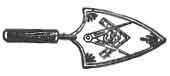
:::