:::figure
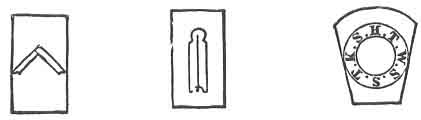
:::

## МАРК МАЙСТОР (БЕЛЕЖИТ МАЙСТОР)

Степента **Марк Майстор**, която е четвърта в масонската последователност, е, от историческа гледна точка, от изключителна важност, тъй като сме осведомени, че чрез нейното влияние всеки оперативен масон при строежа на Храма на цар Соломон е бил познаван и ясно разграничаван, а безпорядъкът и объркването, които иначе биха могли да съпътстват едно толкова грандиозно начинание, били напълно предотвратени. Не само самите занаятчии, но и всяка част от тяхната изработка била различавана с най-голяма точност и с най-голяма лекота.

Масонските автори твърдят, че тази степен в Масонството е била учредена от цар Соломон по време на строежа на Храма с цел разкриване на самозванци при изплащането на надниците на занаятчиите. От всеки оперативен масон се изисквало да поставя **своя знак (марка)** върху плода на своя труд и всички тези отличителни знаци били известни на Старшия Велик Надзирател. Ако някоя част от изработката се окажела дефектна, надзорниците без никакво затруднение можели незабавно да установят кой е несъвършеният занаятчия и да отстранят недостатъка. Така виновният работник бил наказван, без да се намаляват надниците на прилежните и верни занаятчии.

Кандидат, на когото е била предадена тази степен, се счита, че е бил „**повишен в почетната степен на Марк Майстор**“.

---

## ДЛЪЖНОСТНИ ЛИЦА

За откриването на Ложа в тази степен са необходими **осем длъжностни лица**, а именно:

1. Достопочтен Майстор
    
2. Старши Велик Надзирател
    
3. Младши Велик Надзирател
    
4. Старши Дякон
    
5. Младши Дякон
    
6. Главен Надзорник
    
7. Старши Надзорник
    
8. Младши Надзорник
    

### Съответствие с длъжностите в Капитул

Длъжностите в Капитула съответстват по следния начин:

- **Първосвещеникът** – Достопочтен Майстор
    
- **Царят** – Старши Велик Надзирател
    
- **Книжникът** – Младши Велик Надзирател
    
- **Капитанът на войнството** – Майстор на церемониите
    
- **Главният странник** – Старши Дякон
    
- **Капитанът на Кралския свод** – Младши Дякон
    
- **Майсторът на Третата завеса** – Главен Надзорник
    
- **Майсторът на Втората завеса** – Старши Надзорник
    
- **Майсторът на Първата завеса** – Младши Надзорник
    

Касиерът, Секретарят и Тайлерът заемат съответстващи по ранг длъжности, както и в другите степени. Тези длъжности се изпълняват от офицерите на Капитула, под чийто патент се провежда Ложата.

---

## ОТЛИЧИТЕЛНИ БЕЛЕЗИ

Символичният цвят на степента Марк Майстор е **пурпурен**.  
Престилката е от бяла агнешка кожа, обшита с пурпурно, а якичката е пурпурна, обшита със злато.

Но тъй като Ложите на Марк Майстори вече не са самостоятелни тела, а винаги действат под патента на Кралския свод, обикновено при предаването на степента Марк Майстор се използват престилките, якичките и накитите на Капитула.

Ложите на Марк Майстори са **посветени на Хирам, Строителя**.

---

## РАЗПОЛОЖЕНИЕ НА ЛОЖАТА

Вътрешното устройство на Ложата и местата на Майстора, Надзирателите, Дяконите, Секретаря и Касиера са същите като в степента **Чирак**.  
Главният Надзорник заема място отдясно на Достопочтения Майстор на изток.  
Старшият Надзорник седи отдясно на Старшия Велик Надзирател на запад, а Младшият — отдясно на Младшия Велик Надзирател на юг.

---

## ОТКРИВАНЕ НА ЛОЖАТА

**Достопочтеният Майстор** _(дава един удар с чука)_:  
— Братя, възнамерявам да открия Ложа на Марк Майстори на това място за разглеждане на дела. Моля за вашето внимание и съдействие. Ако присъства лице, което не е получило тази степен, то се приканва да се оттегли.

_(Към Старшия Велик Надзирател)_  
— Брат Старши, убеден ли сте, че всички присъстващи са Марк Майстори?

**Старшият Велик Надзирател:**  
— Достопочтени, желая братята да предадат паролата.

_(Двамата Дякони обикалят Ложата и приемат думата, която е **ЙОПА**, по същия начин както в степента Майстор.)_

**Достопочтеният Майстор** _(един удар)_:  
— Брат Младши Дякон, коя е първата грижа на събрани масони?

**Младшият Дякон** _(изправя се и дава знака)_:  
— Да се уверят, че Ложата е надлежно охранявана, Достопочтени.

**Достопочтеният Майстор:**  
— Изпълнете тази част от задължението си и уведомете Тайлера, че предстои откриване на Ложа на Марк Майстори на това място, за разглеждане на дела, и го упътете да охранява съответно.

_(След изпълнение на процедурата)_

**Младшият Дякон:**  
— Вратата е охранявана, Достопочтени.

**Достопочтеният Майстор:**  
— Как е охранявана?

**Младшият Дякон:**  
— Отвътре, зад външната врата, от брат от тази степен, с изваден меч в ръка.

**Достопочтеният Майстор:**  
— Какво е задължението му там?

**Младшият Дякон:**  
— Да държи далеч всички профани и подслушвачи и да не допуска никой да преминава без надлежна квалификация или разрешение от Достопочтения Майстор.

**Достопочтеният Майстор:**  
— Да се облечем, братя.
_(След като братята се обличат с престилки и отличителни знаци.)_

Достопочтеният Майстор дава **два удара с чука**, при което всички подчинени офицери се изправят на местата си, и всеки, на въпрос, заявява своето задължение.

**Достопочтен Майстор:**  
— Мястото на Младшия Надзорник в Ложата?

**Младши Надзорник:**  
— При южната порта.

**Достопочтен Майстор:**  
— Твоето задължение там, брат Младши Надзорник?

**Младши Надзорник:**  
— Да преглеждам всички материали, донесени за строежа на Храма; и ако бъдат одобрени, да ги препращам на Старшия Надзорник при западната порта за по-нататъшна проверка.

**Достопочтен Майстор:**  
— Мястото на Старшия Надзорник в Ложата?

**Старши Надзорник:**  
— При западната порта.

**Достопочтен Майстор:**  
— Твоето задължение там, брат Старши Надзорник?

**Старши Надзорник:**  
— Да преглеждам всички материали, донесени за строежа на Храма; и ако бъдат одобрени, да ги препращам на Главния Надзорник при източната порта за по-нататъшна проверка.

**Достопочтен Майстор:**  
— Мястото на Главния Надзорник в Ложата?

**Главен Надзорник:**  
— При източната порта.

**Достопочтен Майстор:**  
— Твоето задължение там, брат Главен Надзорник?

**Главен Надзорник:**  
— Да председателствам проверката на всички материали, донесени за строежа на Храма; и ако бъдат отхвърлени, да свикам съвет на моите братя Надзорници.

---

**Достопочтен Майстор:**  
— Мястото на Младшия Дякон в Ложата?

**Младши Дякон:**  
— Отдясно, пред Старшия Велик Надзирател.

**Достопочтен Майстор:**  
— Твоето задължение там, брат Младши?

**Младши Дякон:**  
— Да пренасям съобщения от Старшия Велик Надзирател на запад до Младшия Велик Надзирател на юг и на други места в Ложата, според неговите разпореждания.

**Достопочтен Майстор:**  
— Мястото на Старшия Дякон в Ложата?

**Старши Дякон:**  
— Отдясно, пред Достопочтения Майстор на изток.

**Достопочтен Майстор:**  
— Твоето задължение там, брат Старши?

**Старши Дякон:**  
— Да пренасям съобщения от Достопочтения Майстор на изток до Старшия Велик Надзирател на запад и на други места в Ложата, според неговите разпореждания; да подпомагам подготовката и посвещението на кандидатите; и да посрещам и обличам всички гостуващи братя.

---

**Достопочтен Майстор:**  
— Мястото на Секретаря в Ложата?

**Секретар:**  
— Отляво на Достопочтения Майстор на изток.

**Достопочтен Майстор:**  
— Твоето задължение там, брат Секретар?

**Секретар:**  
— Да записвам делата на Ложата, да събирам всички парични средства, да ги предавам на Касиера и да водя точен и верен отчет за същите.

**Достопочтен Майстор:**  
— Мястото на Касиера в Ложата?

**Касиер:**  
— Отдясно на Достопочтения Майстор на изток.

**Достопочтен Майстор:**  
— Твоето задължение там, брат Касиер?

**Касиер:**  
— Да получавам всички средства от ръцете на Секретаря, да водя точен и верен отчет за тях и да ги изплащам по нареждане на Достопочтения Майстор, със съгласието на братята.

---

**Достопочтен Майстор:**  
— Мястото на Младшия Велик Надзирател в Ложата?

**Младши Велик Надзирател:**  
— На юг, Достопочтени.

**Достопочтен Майстор:**  
— Твоето задължение там, брат Младши?

**Младши Велик Надзирател:**  
— Както слънцето е на юг при високия пладнец, слава и красота на деня, така стои Младшият Велик Надзирател на юг, за да призовава занаятчиите от труд към отдих и от отдих към труд, за да може Достопочтеният Майстор да има полза и удовлетворение от тях.

---

**Достопочтен Майстор:**  
— Мястото на Старшия Велик Надзирател в Ложата?

**Старши Велик Надзирател:**  
— На запад, Достопочтени.

**Достопочтен Майстор:**  
— Твоето задължение там, брат Старши?

**Старши Велик Надзирател:**  
— Както слънцето залязва на запад, за да затвори деня, така стои Старшият Велик Надзирател на запад, за да подпомага Достопочтения Майстор при откриването и закриването на Ложата, да изплаща надниците на занаятчиите, ако има дължими, и да се уверява, че никой не си отива недоволен; защото хармонията е силата и опората на всички институции, а най-вече на нашата.

---

**Достопочтен Майстор:**  
— Мястото на Достопочтения Майстор в Ложата?

**Старши Велик Надзирател:**  
— На изток, Достопочтени.

**Достопочтен Майстор:**  
— Неговото задължение там, брат Старши?

**Старши Велик Надзирател:**  
— Както слънцето изгрява на изток, за да отвори и украси деня, така въздига се Достопочтеният Майстор на изток, за да открие и украси своята Ложа и да постави занаятчиите на работа с надлежни наставления за техния труд.

---

**Достопочтеният Майстор (изправя се):**  
— След този образец така постъпвам и аз. Моята воля и желание е Ложа на Марк Майстори да бъде открита на това място за разглеждане на дела. Брат Старши, моля да съобщиш това на Младшия Велик Надзирател на юг, за да имат братята надлежно и своевременно известие за това.

**Старши Велик Надзирател (към Младшия):**  
— Брат Младши, това е заповед на Достопочтения Майстор — Ложа на Марк Майстори да бъде открита на това място за разглеждане на дела. Моля, уведоми братята за това.

**Младши Велик Надзирател** _(дава три удара с чука • • •)_:  
— Братя, това е заповед на Достопочтения Майстор — Ложа на Марк Майстори да бъде открита на това място за разглеждане на дела. Нарежда ви се да вземете надлежно сведение и да се съобразявате с това.

**Достопочтен Майстор:**  
— Братя, обърнете внимание на знаците.

Тук Достопочтеният Майстор дава **всички знаци**, в установения им ред — от **Чирак** до **Марк Майстор**, като всички братя го следват.  

След като бъдат дадени **дюгардът и знакът на Чирака**, **дюгардът и знакът на Калфата**, и **дюгардът, знакът и великият призивен знак на Майстор Масон** в установения им ред, се пристъпва към **знаците на Марк Майстора**.

### ПЪРВИ ЗНАК — „ПРЕХВЪРЛЯНЕТО“ (HEAVE-OVER)

Той се изпълнява по следния начин:
:::figure
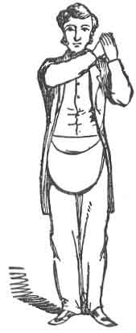
:::

Постави плоската задна част на дясната ръка в плоската длан на лявата и ги дръж отпред, срещу дясното бедро; след това с бързо движение ги повдигни към лявото рамо, сякаш хвърляш нещо зад лявото си рамо. При събирането на ръцете ги удари една в друга с рязък плясък, като дланите са обърнати към рамото.

В старо време този знак се е изпълнявал чрез преплитане на пръстите. (Виж „Монитора“ на Ричардсън.)

Този знак се нарича **„Прехвърлянето“** и се отнася до **отхвърлянето на ключовия камък** в тази степен. (Виж фиг. 19.)

---

### ВТОРИ ЗНАК

След като се изпълни първият знак, ръцете се отпускат от двете страни на тялото, след което се свиват **последните два пръста на дясната ръка**, като първите два пръста и палецът остават отворени, успоредни един на друг и на разстояние около един инч.

:::figure
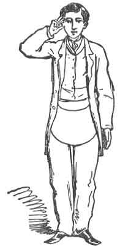
:::

Това се отнася до начина, по който кандидатът е наставен да носи ключовия камък.

След това дясната ръка се вдига бързо към дясното ухо, като палецът и първите два пръста остават отворени, и с кръгово движение ръката се прекарва около ухото, сякаш приглаждаш кичур зад ухото, като ухото минава между двата пръста и палеца. (Виж фиг. 20.)

Този знак се отнася до **наказанието по обета** — **да бъде отсечено ухото**.

---

След като този знак бъде изпълнен, дясната ръка се спуска леко надясно, приблизително на височината на кръста, с отворена и хоризонтална длан; едновременно с това лявата ръка се повдига и се спуска **на ръб, вертикално**, върху китката на дясната. (Виж фиг. 21.)

Всички тези движения трябва да се извършват ясно, но бързо.

Този знак се отнася както до **наказанието по обета**, така и до наказанието на **самозванец**, което е **отсичане на дясната ръка**.

---

### ЗНАКЪТ ЗА ПОЛУЧАВАНЕ НА НАДНИЦА

Той се изпълнява, като дясната ръка се протяга напред в пълна дължина, палецът и първите два пръста са отворени на разстояние около един инч, третият и малкият пръст са свити, а дланта е обърната нагоре. (Виж фиг. 22.)

Този знак се отнася до **особения начин**, по който Марк Майсторът е наставен да получава надницата си, **за да могат самозванците да бъдат разпознати**.

---

Тук е уместно да се отбележи, че **при откриването на всяка Масонска Ложа** се започва със знаците на **Чирака**, след което се преминава **през всички знаци на различните степени**

:::figure
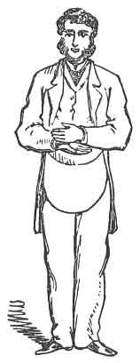
:::

:::figure
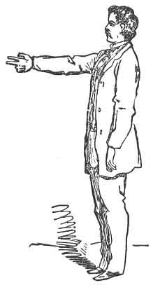
:::

в установена последователност, докато достигнат степента, в която се открива Ложата; при закриване започват от знака на степента, в която са работили, и слизат надолу до последната.

След това Майсторът прочита от ритуалната книга следното:

> „Затова, братя мои, отхвърлете всяка злоба, и всяка коварност, и лицемерие, и завист, и всяко злословие.  
> Ако сте вкусили, че Господ е благ; и като пристъпвате към Него като към жив камък, отхвърлен от човеците, но избран от Бога и скъпоценен; и вие самите, като живи камъни, се съграждайте в духовен дом, свято свещенство, за да принасяте духовни жертви, угодни Богу.  
> Братя, това е Божията воля — с добри дела да затваряте устата на невежеството на безумните човеци.  
> Като свободни — но не като употребяващи свободата си за покривало на злоба, а като слуги Божии.  
> Почитайте всички човеци, обичайте братството, бойте се от Бога.“

След това Достопочтеният Майстор дава **два удара** с чука; **Старшият Велик Надзирател — два**, и **Младшият Велик Надзирател — два**, като тези удари се повтарят.

**Достопочтен Майстор:**  
— С това обявявам тази Ложа на Марк Майстори за открита по надлежна и древна форма и с настоящото забранявам всяко неподобаващо поведение, с което може да бъде смущавана тази Ложа, под не по-малко наказание от онова, което уставът, по решение на мнозинството от Ложата, счете за уместно да наложи.

**Достопочтен Майстор (към Младшия Дякон):**  
— Брат Младши, моля, уведоми Тайлерa, че Ложата е открита.

Младшият Дякон уведомява Тайлерa и се връща на мястото си.

---

### ПОДГОТОВКА НА КАНДИДАТА

В Ложа на Марк Майстори **не се извършва друго дело**, освен **посвещаването на кандидат в Четвъртата степен на Масонството**.  
Тъй като тази степен се извършва под санкцията на **Кралската Арка**, всички други дела — като балотиране за кандидати, доклади на комисии и т.н. — се извършват в **Седмата, или Кралска Арка степен**.

След като Ложата е открита и готова за делото, което ѝ е позволено да извърши, Достопочтеният Майстор нарежда на **Старшия Дякон** да провери дали има кандидати, желаещи да бъдат **повишени в почетната степен Марк Майстор**.

Старшият Дякон се оттегля в преддверието и, ако открие чакащи кандидати, се връща в Ложата и уведомява Достопочтения Майстор.

Задължение на Старшия Дякон е **да подготви и води кандидата** (или кандидатите, ако са повече) по време на първата част от церемонията на посвещението.  
Ако има кандидати за повишение, Достопочтеният Майстор нарежда на този офицер да се оттегли в преддверието и да се увери, че те са **надлежно и истински подготвени**.

---

### ФОРМИРАНЕ НА „РАБОТНИЦИТЕ ОТ КАМЕНОЛОМНИТЕ“

Младшият Дякон, заедно с помощник, напуска Ложата и отива в преддверието, където чака кандидатът  
(за примера ще приемем, че има **само един кандидат**).

Той го моли **да свали сакото си и да навие ризата си до рамото**.  
Старшият Дякон и неговият помощник правят същото.

Когато са подготвени, Дяконът взема в **дясната си ръка** малък блок от мрамор или боядисано дърво, приблизително с размерите на тухла, тежащ **пет или шест фунта**.  
Неговият помощник също взема подобен блок.

Единият от блоковете има **изсечен прав ъгъл**,  
другият — **отвес**.  
(Виж илюстрацията.)

След това на кандидата се дава **блок, представляващ ключов камък**, който той трябва да носи **между палеца и първите два пръста на дясната ръка**, като останалите пръсти са свити, с ноктите плътно притиснати в дланта, а ръката е **спусната вертикално надолу покрай тялото**.

Двамата офицери носят своите блокове **по същия начин**.

Тримата са наричани **„работници от каменоломните“**.

Както вече бе казано, блокът, който носи кандидатът, представлява **ключов камък** и върху него са гравирани в кръг инициалите:

**H. T. W. S. S. T. K. S.**

Понякога този камък тежи **дванадесет или петнадесет фунта**, и се счита за много трудно изпитание да бъде носен **перфектно отвесно**.  
Блоковете, които носят придружаващите, обикновено са дървени и затова са сравнително леки.

---

### ВЛИЗАНЕ В ЛОЖАТА

Тримата „работници“ застават в линия, на разстояние около **три фута един от друг**, като **кандидатът е последен**.

Вратата се отваря **без церемония**, и Младшият Дякон като водещ, заедно с помощника си и кандидата, влизат в Ложата и **обикалят залата четири пъти**, като при последното спиране застават на поста на **Младшия Надзорник**, при **южната порта**, където водещият дава **четири удара (на двойки)** по пода с петата си:

**• • • •**

:::figure
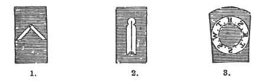
:::

**Младши Надзорник:**  
— Кой идва тук?

**Старши Дякон:**  
— Работници от каменоломните, които носят работа.

**Младши Надзорник:**  
— Имате ли образец от работата си?

**Старши Дякон:**  
— Имаме.

**Младши Надзорник:**  
— Представете работата си.

Старшият Дякон поднася своя камък на Младшия Надзорник, който поставя малкия си пробен ъгълник върху различните му ъгли; и тъй като те съвпадат с ъглите на ъгълника, той казва:

**Младши Надзорник:**  
— Това е добра работа — правилна работа — квадратна работа; точно такава работа, каквато сме упълномощени да приемаме за строежа.  
(Връщайки блока на Старшия Дякон.)  
— Преминете нататък към Старшия Надзорник при западната порта за по-нататъшна проверка.

Вторият работник след това представя своя блок и той бива изпитан и върнат по същия начин, както този на водещия.

Двамата работници се придвижват напред около шест крачки, за да доведат кандидата пред поста на Младшия Надзорник. След това Младшият Дякон инструктира кандидата как да даде почукването и как да представи работата си.

**Младши Надзорник:**  
— Кой идва тук?

**Кандидат** _(подсказан)_:  
— Занаятчия от каменоломните, който ви носи работа.

**Младши Надзорник:**  
— Имаш ли образец от работата си?

**Кандидат:**  
— Имам.

**Младши Надзорник:**  
— Представи я.

Кандидатът поднася ключовия камък.

**Младши Надзорник** _(поставяйки ъгълника върху него и установявайки, че не съвпада)_:  
— Това наистина е странно изработен камък; той не е нито продълговат, нито квадратен. Добра работа, истинска работа, квадратна работа — това е единственото, което имаме нареждане да приемаме; освен това върху него няма знака на никой от занаятчиите. Това ли е твоят знак?  
_(Посочва буквите върху ключовия камък.)_

**Кандидат:**  
— Не е.

**Младши Надзорник:**  
— Поради необичайната му форма и красота, се чувствам неохотен да го отхвърля; ще преминеш нататък към Старшия Надзорник при западната порта за неговата проверка.

Водещите и кандидатът преминават към поста на Старшия Надзорник на запад, където същата сцена се повтаря, и те са насочени да продължат към **Главния Надзорник** при източната порта.

Старшият Дякон първо поднася своя блок или камък на Главния Надзорник.

**Главен Надзорник** _(поставяйки ъгълника)_:  
— Това е добра работа, истинска работа и квадратна работа — точно такава работа, каквато съм упълномощен да приемам и пропускам за строежа. Ти имаш право на заплатата си — премини.

Водещите преминават нататък и заемат местата си. След това кандидатът представя своя ключов камък.

**Главен Надзорник** _(поставяйки ъгълника)_:  
— Това е странно изработен камък. Той изглежда нито продълговат, нито квадратен, а знакът върху него не е знак на занаятчия.  
_(Гледайки строго кандидата.)_  
— Това твоя работа ли е?

**Кандидат:**  
— Не е.

**Главен Надзорник:**  
— Откъде го взе?

**Кандидат:**  
— Вдигнах го от каменоломната.

**Главен Надзорник:**  
— Защо носиш работата на друг човек, за да заблуждаваш Надзорниците? Отдели се настрана.

Главният Надзорник сега **удря четири пъти с крак по пода**, което довежда другите двама Надзорници.

**Главен Надзорник:**  
— Брат Младши Надзорник, ти позволи ли тази работа да премине твоята проверка?

**Младши Надзорник:**  
— Позволих; отбелязах на младия занаятчия още тогава, че камъкът не е такъв, какъвто имаме нареждане да приемаме; но поради необичайната му форма и красота се почувствах неохотен да го отхвърля и му позволих да премине към Старшия Надзорник при западната порта.

**Старши Надзорник:**  
— Направих същите забележки на младия занаятчия и по същата причина му позволих да премине към Главния Надзорник при източната порта.

**Достопочтен Майстор:**  
— Както виждате, камъкът не е нито продълговат, нито квадратен, нито има знака на някой от занаятчиите върху себе си. Познавате ли този знак, който е върху него?

**Младши Надзорник:**  
— Не го познавам.

**Старши Надзорник:**  
— Нито аз.

**Главен Надзорник:**  
— Какво да направя с него?

**Младши Надзорник:**  
— Предлагам да го **прехвърлим сред отпадъците**.

**Главен Надзорник:**  
— Съгласен.

Главният и Старшият Надзорник вдигат ключовия камък и, размахвайки го **четири пъти напред и назад** помежду си, при четвъртия път Младшият Надзорник го прихваща **над лявото рамо на Главния Надзорник**  
(в подражание на знака „прехвърляне“ — _heave-over_, виж фиг. 19)  
и го захвърля настрана.

В този момент всички братя започват да се раздвижват из залата, напускайки местата си.

**Достопочтен Майстор** _(дава един удар с чука):_  
— Каква е причината за това смущение сред работниците?

**Старши Велик Надзирател:**  
— Това е шестият час на шестия ден от седмицата и занаятчиите са нетърпеливи да получат заплатата си.

Тук цялата Ложа се изправя и пее следното:

> **„Още шест дни труд отминаха,  
> още една събота настъпи;  
> върни се, душе моя, и намери покой,  
> използвай часовете, които твоят Бог благослови.“**

**Достопочтен Майстор:**  
— Брат Старши Велик Надзирателю, нареждам ти  
да събереш занаятчиите и да поведеш шествие  
към канцеларията на Старшия Велик Надзирател,  
за да получат заплатата си.

Членовете сега се подреждат **по двама** (кандидатът отзад) и обикалят Ложата, пеейки:

---

### ПЕСЕН НА МАРК МАЙСТОРИТЕ

**Мелодия — „America“**

Марк Майстори, всички елате  
пред Главния Надзорник;  
в съгласие вървете.  
Нека той работата ви прегледа,  
защото Главният Архитект,  
ако няма недостатък,  
ще я одобри.

Вие, преминали ъгълника,  
за наградата си се гответе,  
сърце и ръка съединете;  
всеки със своя знак пред очи,  
вървете със справедливите и верните,  
заплата ви се полага  
по право.

Хирам, синът на вдовицата,  
изпрати на Соломон  
нашия велик ключов камък;  
върху него е изписано името,  
което въздига високо славата  
на всички, за които то  
е истински познато.

Сега към запад се насочете,  
където, пълен със сила и любов,  
стои Хирам;  
но ако самозванци  
са смесени с достойните,  
предупредете ги да се пазят  
от дясната ръка.

Сега — за възхвала на онези,  
които надвиха враговете  
на масонското изкуство;  
за достойните трима,  
които основаха тази степен,  
нека всички техни добродетели  
бъдат дълбоко в сърцата ни.

Когато приключат втория куплет, всеки брат по ред се приближава до **Старшия Велик Надзирател**, който стои зад **решетъчен прозорец**, и промушва дясната си ръка през отвора, с **палец и първите два пръста отворени**, а третият и малкият **свити**, с дланта нагоре  
(виж фиг. 22),  
получава своята **пени**, изтегля ръката си и продължава напред; и така един след друг, докато накрая идва **кандидатът**, който последен подава ръката си по същия начин, за да получи своята пени.

**Старшият Велик Надзирател** сграбчва ръката му и, опирайки крак в прозореца, **издърпва ръката на кандидата до рамото**, и възкликва с гняв:

— **Самозванец! Самозванец!**

Друг глас извиква:

— **Отсечете му ръката! Отсечете му ръката!**

и в същото време някой се втурва напред с **изваден меч**, за да нанесе удара.

**Старшият Дякон** сега се намесва в защита на кандидата и казва:

— **Пощадете го! Пощадете го! Той не е самозванец; знам, че е занаятчия — работил съм с него в каменоломните.**

**Старши Велик Надзирател:**  
— Той е самозванец, защото се е опитал да получи заплата, без да може да даде знака, и наказанието трябва да бъде наложено.

**Старши Дякон:**  
— Ако го освободите, ще го заведа при нашия **Достопочтен Майстор** и ще изложа случая му; и ако наказанието трябва да бъде наложено, ще се погрижа то да бъде изпълнено надлежно.

**Старши Велик Надзирател:**  
— При тези условия ще го освободя, **ако може да ме удовлетвори, че е Масон от степента Калфа (Fellow Craft)**.

Кандидатът сега изтегля ръката си и дава **знака на Калфа Масон**  
(виж фиг. 4, стр. 17).

Членовете на Ложата след това заемат местата си.

**Старшият Дякон** _(водейки кандидата към Майстора)_:  
— Достопочтени, този млад занаятчия беше разкрит като самозванец в канцеларията на Старшия Велик Надзирател, докато се опитваше да получи заплата, която не му се полагаше, без да може да даде знака.

**Достопочтен Майстор** _(гледайки строго кандидата)_:  
— Ти Калфа Масон ли си?

**Кандидат:**  
— Такъв съм. Изпитайте ме.

**Достопочтен Майстор:**  
— Дай ми знака на Калфа Масон.

Кандидатът дава знака.

**Достопочтен Майстор** _(към Старшия Дякон)_:  
— Добре. Той без съмнение е Калфа.  
_(Към кандидата.)_  
— Ти си се опитал да получиш заплата, без да можеш да дадеш знака. Учуден съм, че толкова разумно изглеждащ млад занаятчия би се опитал да ни заблуди по този начин. Подобно поведение изисква строго наказание. Наказанието, което си навлякъл, е **да ти бъде отсечена дясната ръка**. Учили ли са те някога как се получава заплата?

**Кандидат** _(подсказан)_:  
— Не са.

**Достопочтен Майстор:**  
— Ах, това донякъде смекчава престъплението ти. Ако бъдеш научен как да получаваш заплата, ще постъпваш ли по-добре занапред?

**Кандидат:**  
— Ще постъпвам.

**Достопочтен Майстор:**  
— Поради твоята младост и неопитност, наказанието се отменя.  
**Брат Старши Дякон**, ще отведеш този млад занаятчия и ще му отправиш строго порицание, след което ще го заведеш в каменоломните и там ще го научиш как да изработва и донася правилно изсечен камък.

Порицанието, което е наредено да бъде отправено на кандидата, в наши дни се пропуска в повечето Ложи; но за удовлетворение на младите Масони и любознателните, го включваме тук.

**Старши Дякон** _(хващайки кандидата за яката)_:  
— Млади човече, изглежда тази вечер си дошъл тук, за да ни заблудиш: първо, като представи работа, негодна за строежа, и после, като поиска заплата, когато нямаше нито една стотинка, която ти се полага. Работата ти не беше одобрена; не ти се полага никаква заплата; и ако не беше навременната ми намеса, щеше да загубиш дясната си ръка, ако не и живота си. Нека това бъде силен урок за теб — **никога повече да не се опитваш да заблуждаваш братството**. Но ела с мен в каменоломните и там покажи образци от своето умение и трудолюбие; и ако работата ти бъде одобрена, ще бъдеш научен как правилно да получаваш заплата. Хайде, казвам; върви с мен.

_(Разтърсва силно кандидата и го отвежда набързо в подготвителната стая.)_

Старшият Дякон се връща на мястото си в Ложата, а **Младшият Дякон** подготвя кандидата за степента, като го лишава от външното му облекло и от всички пари и ценности, оставя гърдите му открити и поставя **кабел-тегло (cable-tow) четири пъти около тялото му**; също така го завързва здраво с превръзка на очите (hoodwink), подготвена за тази цел.

В това състояние той е доведен до вратата от Младшия Дякон, който дава **четири отчетливи почуквания** (• • • •).

**Старши Дякон:**  
— Достопочтени, докато мирно работим върху Четвъртата степен в Масонството, изглежда вратата на нашата Ложа е обезпокоена.

**Достопочтен Майстор:**  
— Брат Старши, обърни внимание на причината за този сигнал.

Старшият Дякон пристъпва към вратата и отговаря на сигнала с четири почуквания. Отвън се отговаря с едно, което Старшият Дякон връща. Вратата се отваря частично.

**Старши Дякон:**  
— Кой идва там?

**Младши Дякон:**  
— Достоен брат, който е бил редовно приет като Чирак Масон, служил е определеното време като такъв, преминал е в степента Калфа и е въздигнат в възвишената степен Майстор Масон, и сега желае по-нататъшна светлина в Масонството, като бъде въздигнат в почетната степен **Марк Майстор Масон**.

**Старши Дякон:**  
— По своя свободна воля и съгласие ли отправя тази молба?

**Младши Дякон:**  
— По своя свободна воля.

**Старши Дякон:**  
— Надлежно и истински ли е подготвен?

**Младши Дякон:**  
— Така е.

**Старши Дякон:**  
— Работил ли е в каменоломните и показал ли е образци от своето умение в предходните степени?

**Младши Дякон:**  
— Работил е.

**Старши Дякон:**  
— По какво по-нататъшно право или привилегия очаква тази благодат?

**Младши Дякон:**  
— По привилегията на парола.

**Старши Дякон:**  
— Има ли парола?

**Младши Дякон:**  
— Той няма, но аз я имам за него.

**Старши Дякон:**  
— Дай ми я.

Младшият Дякон прошепва в ухото му думата **JOPPA**.

**Старши Дякон:**  
— Паролата е вярна. Нека почака, докато Достопочтеният Майстор бъде уведомен за молбата му и отговорът бъде върнат.

**Старшият Дякон** се връща при **Достопочтения Майстор**, където се задават същите въпроси и се дават същите отговори, както при вратата.

**Достопочтен Майстор:**  
— Понеже идва, надарен с необходимите качества, нека влезе **в името на Господа** и да внимава какво предприема, когато влиза.

Вратата се отваря и кандидатът влиза.

**Старшият Дякон** _(приближавайки се към кандидата с чукче и длето за гравиране в ръцете си)_:  
— Братко, мой дълг е да положа върху теб **знак**, който вероятно ще носиш до гроба си. Като **Чирак**, ти беше приет върху едно острие на пергела, притискащо оголената ти лява гръд; като **Калфа**, беше приет върху ъгъла на **прав ъгъл**, притискащ оголената ти дясна гръд; като **Майстор Масон**, беше приет върху двете остриета на пергела, простиращи се от оголената ти лява към дясната гръд. Тези неща ти бяха обяснени.

Длетото и чукчето _(поставяйки острието на длетото върху гърдите му)_ са инструменти, използвани от оперативните зидари, за да дялат, режат, извайват и вдълбават своята работа; но ние, като Свободни и Приети Масони, ги използваме за една по-благородна и славна цел. Ние ги използваме, за да дялат, режат, извайват и вдълбават **ума**.

И като **Марк Майстор Масон**, ние те приемаме **върху острието на вдълбаващото длето и под натиска на чукчето**.

Докато произнася последните думи, той разкрачва здраво краката си, вдига чукчето, прави две или три лъжливи движения и нанася силен удар върху главата на длетото; след това хвърля чукчето и длетото, хваща кандидата за лявата ръка и казва:

— **Следвай ме.**

Те обикалят Ложата **четири пъти**, и всеки път, когато минават покрай местата на **Майстора**, **Старшия Велик Надзирател** и **Младшия Велик Надзирател**, всеки от тях дава по **един силен удар** с чукчето си.

През това време Майсторът чете от книга следните пасажи от Писанието:

(•)  
„**Камъкът, който зидарите отхвърлиха, стана глава на ъгъла.**“  
— Псалм 118:22

(• •)  
„**Не сте ли чели в Писанията: Камъкът, който зидарите отхвърлиха, стана глава на ъгъла?**“  
— Евангелие от Матей 21:42

(• • •)  
„**И не сте ли чели това Писание: Камъкът, който зидарите отхвърлиха, стана глава на ъгъла?**“  
— Марк 12:10

(• • • •)  
„**Какво е тогава това, което е писано: Камъкът, който зидарите отхвърлиха, стана глава на ъгъла?**“  
— Лука 20:17

Четенето е така нагласено, че да приключи тъкмо когато кандидатът достига до мястото на **Младшия Велик Надзирател**, който дава сигнал с **четири почуквания**, и се задават същите въпроси и се дават същите отговори, както при вратата.

Младшият Велик Надзирател го насочва към своя Старши, който при пристигането му дава **четири удара**, и същите въпроси се задават и същите отговори се дават. Оттам той е насочен към **Достопочтения Майстор** на изток, където отново се задават същите въпроси и се дават същите отговори.

След това Майсторът нарежда кандидатът да бъде отведен обратно при **Старшия Велик Надзирател** на запад и от него да бъде научен да пристъпи към изток с **четири изправени, правилни стъпки**, стъпалата му да образуват **прав ъгъл**, а тялото му да бъде изправено пред олтара.

Кандидатът коленичи и приема **клетвата**, както следва:

---

**Аз, Петър Гейб**, по своя свободна воля и съгласие, в присъствието на Всемогъщия Бог и тази Достопочтена Ложа на Марк Майстор Масони, издигната в Негова чест и посветена на **Хирам Строителя**, с това и върху това, в допълнение към моите предишни задължения, най-тържествено и искрено обещавам и се заклевам, че няма да давам тайните на Марк Майстор Масон на никого от по-ниска степен, нито на което и да е друго лице в познатия свят, освен ако не бъде истински и законен брат от тази степен; и не на онзи или онези, за които само ще чуя, че са такива, а само на онзи или онези, които ще намеря, че са такива, след строго изпитване и надлежно изследване, или законна информация.

Освен това обещавам и се заклевам, че ще поддържам Конституцията на Генералната Велика Кралска Арка на Съединените американски щати, както и Великата Кралска Арка на този щат, под чийто патент се държи тази Ложа, и ще се съобразявам с всички устави, правила и наредби на тази или на която и да е друга Ложа на Марк Майстор Масони, в която по всяко време занапред мога да стана член.

Освен това обещавам и се заклевам, че ще се подчинявам на всички редовни знаци и призовки, дадени, подадени, изпратени или хвърлени към мен от ръката на брат Марк Майстор Масон или от тялото на справедливо и законно устроена Ложа на такива, при условие че са в пределите на дължината на моето **кабел-тегло**.

Освен това обещавам и се заклевам, че няма да ощетявам тази Ложа или брат от тази степен със стойността на неговата заплата _(или една пени)_, съзнателно, нито ще позволя това да бъде сторено от други, ако е в моята власт да го предотвратя.

Освен това обещавам и се заклевам, че няма да продавам, разменям, заменям или търгувам със своя **знак**, който впоследствие ще избера, след като бъде вписан в книгата на знаците, за друг, освен ако не бъде мъртъв знак или такъв с по-стара дата; нито ще го залагам втори път, докато не бъде законно освободен от първия залог.

Освен това обещавам и се заклевам, че ще приемам знака на брат, когато ми бъде предложен с молба за услуга, и ще удовлетворявам молбата му, ако е в моята власт; а ако не е в моята власт да я удовлетворя, ще му върна знака заедно със стойността му, която е **половин сикъл сребро или една четвърт долар**.

Всичко това най-тържествено и искрено обещавам и се заклевам, с твърда и устойчива решимост в ума си да го пазя и изпълнявам, като се обвързвам под не по-малко наказание от това **дясното ми ухо да бъде отсечено**, за да не мога никога повече да чуя думата, и **дясната ми ръка да бъде отсечена**, като наказанието на самозванец, ако някога се окажа умишлено виновен в нарушаване на която и да е част от тази моя тържествена клетва или задължение на Марк Майстор Масон.

**Тъй да ми помага Бог и да ме укрепи да пазя и изпълнявам същото.**

---

**Достопочтен Майстор:**  
— Отдели ръката си и целуни книгата **четири пъти**.

Щом кандидатът приеме клетвата, някой брат подава сигнал отвън на вратата.

**Младшият Дякон** _(изправяйки се)_:  
— Има сигнал на вратата, Достопочтени.

**Достопочтен Майстор:**  
— Обърни внимание на сигнала, брате, и виж кой идва там.

Младшият Дякон разпитва за причината за сигнала и се връща с писмо за Достопочтения Майстор, който го отваря и прочита, както следва, или в този смисъл:—

**ДО ДОСТОПОЧТЕНИЯ МАЙСТОР  
НА МАРК ЛОЖА „СВ. ЙОАН“**

**СКЪПИ БРАТЕ,** —  
Понастоящем се намирам в положение, при което притежаването на **двадесет и пет долара** би ми донесло голяма полза. Моля те да се видиш с брат **Гейб** и да го попиташ дали би ми заел тази сума. Със съжаление трябва да кажа, че единственото обезпечение, което мога да предложа за заема, е **моят знак**, който залагам, докато му възстановя парите. Моля те да се погрижиш той да го получи и да изпратиш парите чрез приносителя.

Твой, братски,  
**ДЖОН ДЖЕЙ**

**Достопочтен Майстор** _(към кандидата, като едновременно му подава знака)_:  
— Е, можеш ли да услужиш на брат Джей с тези пари, които той иска назаем?

Кандидатът приема знака и казва, че няма никакви пари у себе си; не може да удовлетвори молбата.

**Старши Велик Надзирател:**  
— Достопочтени, аз мога да услужа на брат Джей с двадесет и пет долара, ако той остави своя знак при мен като залог.

**Достопочтен Майстор** _(към кандидата)_:  
— Тогава ще върнеш ли знака?

Кандидатът го подава обратно.

**Достопочтен Майстор:**  
— Какво е това? Връщаш го **без стойността му** и така нарушаваш клетвата си, още преди да си станал от олтара? Не се ли закле, че когато не можеш да удовлетвориш молбата на брат, ще му върнеш знака **заедно със стойността му**, а именно: **половин еврейски сикъл сребро, или една четвърт долар**?

Кандидатът обикновено се смущава и отговаря, че всичките му пари са били взети от него в подготвителната стая.

**Достопочтен Майстор:**  
— Сигурен ли си, че нямаш дори **една четвърт долар** у себе си?

**Кандидат:**  
— Сигурен съм.

**Достопочтен Майстор:**  
— Потърси още. Може би някой добър приятел, от състрадание към твоето затруднено положение, ти е дал тази сума, без ти да знаеш: претърси всичките си джобове и, ако след щателно търсене установиш, че наистина нямаш нищо, ще имаме по-малко основание да мислим, че си възнамерявал умишлено да нарушиш задължението си.

Кандидатът бърка в джоба си и намира **една четвърт долар**, която някой брат тайно е поставил там. Той заявява, че не е имал намерение да я укрие — наистина е мислел, че няма никакви пари у себе си — и я подава на Майстора заедно със знака.

**Достопочтен Майстор:**  
— Братко, нека тази сцена ти бъде поучителен урок: ако някога занапред ти бъде представен знак от достоен брат, който иска услуга, преди да му откажеш, направи старателна проверка и бъди напълно сигурен, че не си в състояние да му помогнеш; може би тогава ще откриеш, както в настоящия случай, че някое неизвестно лице те е подпомогнало и че всъщност се намираш в по-добро положение, отколкото си мислел.¹

Горното е вярно описание на начина, по който кандидатът **преди** е бил обучаван в своите задължения като **Марк Майстор Масон**. В по-ново време обаче много малко Майстори одобряват този метод на обучение и поради това той е почти напълно изоставен. Планът, който сега обикновено се прилага, е следният:—

След като кандидатът е приел клетвата и докато още коленичи пред олтара, Достопочтеният Майстор му поднася малък метален знак _(обикновено златен или сребърен)_ и иска заем на малка сума пари срещу него. Кандидатът приема знака, но след проверка установява, че няма никакви пари, тъй като всички са били взети от него в преддверието. Той се опитва да го върне на Достопочтения Майстор, но последният отказва да го приеме, като казва на кандидата:

— Не мога, брат Гейб _(или както е случаят)_, да го приема обратно;  
ако го направя, ще наруша клетвата си като Марк Майстор — и ти също ще я нарушиш.

Тук Достопочтеният Майстор насочва вниманието на кандидата към съответната част от задължението.

След това Достопочтеният Майстор моли някой от присъстващите братя да даде на новопосветения брат Марк Майстор **стойността на знака** _(обикновено двадесет и пет цента)_. Някой брат подава тази сума на кандидата, а той от своя страна я подава, заедно със знака, на Достопочтения Майстор. Тогава Достопочтеният Майстор отправя поучението към кандидата, започвайки така:

— **Братко, нека тази сцена…** _(виж ред 16, стр. 168)._

След това Достопочтеният Майстор хваща кандидата за ръката и казва:

— **Стани, брате**, и ще те въоръжа с **преходния захват и дума**, както и с **истинския захват и дума** на Марк Майстор Масон.

**Преходният захват** на тази степен се прави, като се протегнат десните ръце и се стиснат пръстите на дясната ръка, както човек естествено би направил, за да помогне на друг да се изкачи по стръмен склон. Казва се, че той произхожда от факта, че бреговете на реката при—
:::figure
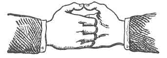
:::
при **Йопа** бяха тъй стръмни, че работниците по Храма бяха принудени да си помагат един на друг при изкачването им, докато пренасяха дървения материал от горите на Ливан. **Преходната дума** е **ЙОПА**.
:::figure
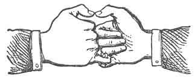
:::
**Достопочтен Майстор** _(към кандидата)_:  
— Ще бъдеш ли **от**, или **към**?

**Кандидатът** _(подсказано)_:  
— **От**.

**Достопочтен Майстор:**  
— От какво?

**Кандидат:**  
— От преходния захват към истинския захват на Марк Майстор Масон.

**Достопочтен Майстор:**  
— Премини.

**Истинският захват** се прави, като се заключат малките пръсти на десните ръце, гърбовете на ръцете се допрат един до друг, а върховете на палците се поставят един срещу друг. Неговото име е **СИРОК**, или **МАРК УЕЛ** (_MARK WELL_), и когато е правилно направен, образува началните букви на тези две думи: **„Mark well“ – „Отбелязвай добре“**.

След като Достопочтеният Майстор увещае кандидата никога да не предава думите по какъвто и да било начин, освен този, по който ги е получил, той се връща на мястото си, при което братята започват да се размърдват и да шаркат с крака.

**Достопочтен Майстор:**  
— Какво означава това смущение между работниците, брат Старши?

**Старши Велик Надзирател** _(става)_:  
— Достопочтени, работниците са в застой поради липсата на определен **ключов камък** за една от главните арки, за който никой не е получил заповед да изработи.

**Достопочтен Майстор:**  
— Ключов камък за една от главните арки? Аз дадох на нашия Велик Майстор, **Хирам Абиф**, строги нареждания да изработи този ключов камък преди неговото убийство.  
_(Удря два пъти с чука, което извиква тримата Надзиратели пред него.)_  
— Братя Надзиратели, бил ли е донасян за проверка камък от такова естество?  
_(Показва изображение на ключов камък.)_

**Надзирателите:**  
— Имаше камък от такова описание, донесен за проверка, но тъй като не беше нито продълговат, нито квадратен, нито имаше знака на някой от занаятчиите върху себе си, а и ние не познавахме знака, който беше върху него, го сметнахме за негоден за строежа и той беше хвърлен сред отломките.

**Достопочтен Майстор:**  
— Нека незабавно бъде направено търсене за него; Храмът не може да бъде завършен без този камък; той е един от най-ценните камъни в цялото здание.

_(Братята отново се раздвижват из Ложата, намират ключовия камък и го донасят на изток.)_

**Старшият Надзирател** взема камъка от ръцете на братята и докладва на Достопочтения Майстор, както следва:

— Достопочтени Майсторе, камъкът беше намерен; открит е заровен сред отломките на Храма и аз го предавам тук на вас чрез надеждни братя.

_(Двама или трима братя го носят на Достопочтения Майстор на изток.)_

Достопочтеният Майстор приема ключовия камък и го поставя пред себе си върху масата, **изправен и отвесен**, с началните букви, обърнати към цялата Ложа, но най-вече към кандидата, който седи на стол пред Достопочтения Майстор.¹

Достопочтеният Майстор удря **четири пъти** с чука _(• • • •)_, при което всички стават на крака.  
_(В някои Ложи това не се прави и братята остават по местата си.)_

Докато чете следните пасажи от Писанието, в края на всеки от тях той удря ключовия камък отгоре с чука — първо **един удар**, после **два**, и така нататък до четвъртия пасаж, а именно:

**Достопочтеният Майстор удря ключовия камък веднъж.** _(•)_  
„**Камъкът, който отхвърлиха зидарите, стана глава на ъгъла.**“ — Псалм 118:22.

**Достопочтеният Майстор удря два пъти.** _(• •)_  
„**Никога ли не сте чели в Писанията: Камъкът, който отхвърлиха зидарите, стана глава на ъгъла?**“ — Матей 21:42.

**Достопочтеният Майстор удря три пъти.** _(• • •)_  
„**И не сте ли чели това Писание: Камъкът, който отхвърлиха зидарите, стана глава на ъгъла?**“ — Марк 12:10.

**Достопочтеният Майстор удря четири пъти.** _(• • • •)_  
„**Какво значи тогава написаното: Камъкът, който отхвърлиха зидарите, стана глава на ъгъла?**“ — Лука 20:17.

Майсторът чете на кандидата от ритуалната книга:

„**На онзи, който победи, ще дам да яде от скритата манна; и ще му дам бял камък, и на камъка — ново име, написано, което никой не знае, освен онзи, който го получава.**“  
_(Откровение 2:17.)_

— Пристъпи напред и приеми **новото име**.

Кандидатът пристъпва напред.

**Майсторът:**  
— Братко, сега ще те въоръжа с **новото име**, което никой, освен Марк Майстор, не може да получи. То представлява **кръг от букви**, които са общият знак на тази степен.

Тук Достопочтеният Майстор насочва вниманието на кандидата към ключовия камък пред него, като му посочва **началните букви върху камъка**, за които му се казва, че се четат, както следва:
:::figure
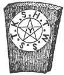
:::
Тук кандидатът бива наставен как да **прочита думите**, когато бъде предизвикан от който и да е непознат, както следва:

**Достопочтен Майстор:** — Хирам.  
**Кандидат:** — Тирски.

**Достопочтен Майстор:** — На вдовица.  
**Кандидат:** — Син.

**Достопочтен Майстор:** — Изпраща.  
**Кандидат:** — До.

**Достопочтен Майстор:** — Цар.  
**Кандидат:** — Соломон.

**Достопочтен Майстор** _(посочвайки центъра в кръга от тези букви)_:  
— Вътре в този кръг от букви всеки Марк Майстор Масон трябва да постави **своя личен, частен знак**, който може да бъде какъвто и да е символ или изображение, по негов избор; и когато веднъж сте избрали своя знак и той бъде надлежно записан в **Книгата на знаците** на тази или на която и да е друга Ложа, в която бихте могли да бъдете приет за член, вие нямате повече право да го променяте, отколкото имате право да промените собственото си име.

Знаците по правило **не се записват**, като това задължение често бива пренебрегвано; то обаче следва да се изпълнява и **стриктно да се налага във всяка Ложа**.

Майсторът чете на кандидата:  
„**Който има ухо да слуша, нека слуша.**“ — _Откровение 3:13._

След това Майсторът по-нататък наставлява кандидата относно **знаците на наказанията** на тази степен _(вж. фиг. 19, 20, 21 и 22)_ и му представя — или му посочва на таблото — **работните инструменти на Марк Майстор Масон**, а именно: **чукът и длетото**, чието предназначение той обяснява по следния начин:

**Длетото**, в нравствен смисъл, показва предимствата на **дисциплината и образованието**. Умът, подобно на диаманта в първоначалното му състояние, е груб и необработен; но както действието на длетото върху външната му обвивка скоро разкрива скритите красоти на диаманта, така и образованието разкрива скритите способности на ума и ги извежда наяве, за да се разпрострат в обширното поле на материята и пространството, да достигнат върха на човешкото познание и нашия дълг към
:::figure
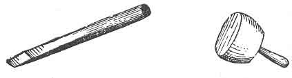
::: 
Бога и човека.  
**Чукът**, в нравствен смисъл, ни учи да **поправяме нередностите** и да привеждаме човека в надлежно равновесие; така че чрез спокойно поведение той да може, в школата на дисциплината, да се научи на удовлетвореност. Каквото е чукът за работника, това е **просветеният разум за страстите**: той обуздава честолюбието, потиска завистта, укротява гнева и насърчава добрите наклонности, откъдето между добрите масони произтича онзи благоприличен ред,

_„Който нищо земно не дарява, нищо земно не руши —  
тихото слънце на душата и сърдечната радост.“_

**Достопочтен Майстор (към кандидата):**  
— Братко, с приемането на тази степен ти си представил един от калфите, които са работили при строежа на Храма на цар Соломон. Било е обичай за тях, в навечерието на шестия ден от седмицата, да изнасят работата си за преглед. Този млад занаятчия открил в каменоломните **ключовия камък** за една от главните арки, който бил изработен от Великия Майстор Хирам Абиф, и като отхвърлил собствената си работа, го отнесъл в Храма, където бил прегледан от Надзорниците, отхвърлен като негоден и хвърлен сред отпадъците.

След това той се отправил към канцеларията на Старшия Велик Надзирател, за да получи заплатата си; но тъй като не могъл да даде знака, бил разкрит като самозванец — което едва не му коствало дясната ръка; но цар Соломон го помилвал и след строго порицание той бил върнат обратно в каменоломните.

Преди завършването на Храма напредъкът на работата бил възпрепятстван поради липсата на ключовия камък; това обстоятелство било съобщено на цар Соломон и той заповядал да се извърши търсене сред отпадъците, където камъкът бил намерен и впоследствие поставен по предназначение.

В шестия час на шестия ден от всяка седмица братята-занаятчии, наброяващи **осемдесет хиляди**, се подреждали в шествие и се отправяли към канцеларията на Старшия Велик Надзирател, за да получат заплатите си; и за да се предотврати измамата от страна на неумели работници, всеки занаятчия, който претендирал за заплата, бил задължен да протегне дясната си ръка през решетъчен прозорец и едновременно с това да даде **този знак**, като държи под двата последни пръста на ръката **копие от своя знак** _(вж. фиг. 22, стр. 156)_.

Старшият Велик Надзирател хвърлял поглед върху съответния знак в книгата (където били записани всички знаци на братството — осемдесет хиляди на брой) и, като виждал каква сума се полага на този знак, я поставял между палеца и двата показалеца на занаятчията, който отдръпвал ръката си и продължавал нататък; и така — всеки по реда си, докато всички бъдат изплатени. Ако някой се опитвал да получи заплата, без да може да даде знака, Старшият Велик Надзирател го хващал за ръката, издърпвал ръката му през прозореца, задържал го и незабавно възкликвал: **„Самозванец!“** По този сигнал служител, поставен там за тази цел, веднага отсичал ръката му.

След това **Достопочтеният Майстор** произнася следното **наставление** към кандидата:

— **Братко**, поздравявам те, че си счетен за достоен да бъдеш въздигнат в тази почтена степен на Масонството. Позволи ми да запечатам в ума ти, че твоето усърдие трябва винаги да бъде съразмерно с твоите задължения, които стават все по-обширни с напредването ти в Масонството. В почетния характер на **Марк Майстор Масон** твой дълг е особено да се стремиш поведението ти в Ложата и сред братята да бъде такова, че да издържи изпитанието на квадрата на Великия Надзирател; за да не бъдеш ти, подобно на незавършената и несъвършена работа на небрежните и неверни от минали времена, отхвърлен и захвърлен като негоден за онзи духовен градеж — дом не с ръце направен, вечен на небесата.

И докато такова е твоето поведение, ако те връхлетят несгоди, ако приятели те изоставят, ако завистта петни доброто ти име и злобата те преследва, все пак можеш да имаш увереност, че сред Марк Майстор Масоните ще намериш приятели, които ще облекчат нуждите ти и ще утешат страданията ти; като винаги помниш, за утеха сред неблагосклонността на съдбата и за насърчение към по-добри надежди, че **камъкът, който зидарите отхвърлиха**, притежавайки достойнства, непознати за тях, **стана главен камък на ъгъла**.

Братята отново се раздвижват из Ложата, както и по-рано.

**Достопочтен Майстор (удря веднъж):**  
— Брат Старши, каква е причината за това смущение?

**Старши Велик Надзирател:**  
— Достопочтени, това е шестият час на шестия ден от седмицата и занаятчиите са нетърпеливи да получат заплатите си.

**Достопочтен Майстор:**  
— Подреди ги в шествие и нека се отправят към канцеларията на Старшия Велик Надзирател, за да получат заплатите си.

Членовете се подреждат по двама и обикалят Ложата **против слънцето**, като пеят от ритуалната книга последните три куплета на **Песента на Марк Майстора**. Церемонията по изплащането на заплатите се извършва при мястото на Майстора на Изток, като Майсторът действа в ролята на Старши Велик Надзирател и изплаща **„на всеки по един пенс“**.

След това членовете се питат един друг: **„Колко получи?“**  
Отговорът е: **„Един пенс.“**  
Някой задава въпроса на кандидата и той отговаря: **„Един пенс.“**

При това известие всички братя се преструват на силно възмутени и с ярост хвърлят своите пенсове на пода, като всеки протестира срещу начина на заплащане на братството.

**Достопочтен Майстор (удря веднъж):**  
— Братя, каква е причината за това смущение?

**Старши Дякон:**  
— Занаятчиите са недоволни от начина, по който им се плаща. Ето един млад занаятчия, който току-що е преминал квадрата и е получил толкова, колкото и ние, които сме понесли товара и горещината на деня; ние не смятаме това за право и справедливо и няма да го търпим.

**Достопочтен Майстор:**  
— Това е законът и той е напълно справедлив.

**Младши Дякон:**  
— Не знам за никакъв закон, който да оправдава подобно действие. Ако има такъв закон, бих желал да ни го покажеш.

**Достопочтен Майстор:**  
— Ако проявите търпение, ще чуете закона. _(Чете):_  
„Защото небесното царство прилича на човек — стопанин на дом, който излезе рано сутринта да наеме работници за лозето си…“ _(Матей 20:1–16 — целият откъс се прочита)._

**Достопочтен Майстор:**  
— Доволни ли сте?

**Братята** _(събирайки пенсовете си):_  
— Доволни сме.

## ГРАДЕЖ НА МАРК МАЙСТОР

### ПЪРВИ РАЗДЕЛ

**Въпрос:** Вие Марк Майстор Масон ли сте?  
**Отговор:** Аз съм; опитайте ме.

**В:** Как ще бъдете опитан?  
**О:** С длетото и чука.

**В:** Защо с длетото и чука?  
**О:** Защото те са надлежните масонски инструменти на тази степен.

**В:** Къде бяхте въздигнат в степента Марк Майстор Масон?  
**О:** В редовна и надлежно учредена Ложа на Марк Майстор Масони.

**В:** Какви бяха подготвителните обстоятелства, съпътстващи въздигането ви в тази степен?  
**О:** Бях накаран да представя един от калфите, заети при строежа на Храма на цар Соломон, чийто обичай беше в навечерието на шестия ден от всяка седмица да изнасят работата си за преглед.

**В:** От кого се извършваше прегледът?  
**О:** От трима Надзорници, назначени от цар Соломон и разположени при южната, западната и източната порта.

**В:** Колко калфи бяха заети при строежа на Храма на цар Соломон?  
**О:** Осемдесет хиляди калфи.

**В:** При толкова голям брой не беше ли възможно Великият ни Майстор да бъде измамен от неумели работници, представящи негодна за употреба работа?  
**О:** Не беше, защото цар Соломон взе предпазна мярка всеки занаятчия да избере за себе си **знак** и да го поставя върху работата си, за да може тя лесно да бъде разпознавана и различавана, когато се представя смесено за преглед.

**В:** Каква беше надницата на калфа, чиято работа беше одобрена?  
**О:** Един пенс на ден.

**В:** А при толкова голям брой не беше ли възможно Великият ни Майстор да бъде измамен от неумели работници, изискващи заплата, която не им се полага?  
**О:** Не беше, защото цар Соломон взе допълнителна предпазна мярка: всеки занаятчия, който искаше заплата, трябваше да пъхне дясната си ръка в покоите на Старшия Велик Надзирател, с копие от своя знак в дланта ѝ, като едновременно с това даваше **този знак** _(вж. стр. 156)_.

**В:** На какво се отнася този знак?  
**О:** Към начина и реда, по които всеки калфа получаваше заплатата си.

**В:** За какво друго служи той?  
**О:** Да различава истинския занаятчия от самозванеца.

**В:** Когато бъде разкрит самозванец, какво трябва да бъде наказанието му?  
**О:** Да му бъде отсечена дясната ръка.

---

### ВТОРИ РАЗДЕЛ

**В:** Къде бяхте подготвен за въздигане в степента Марк Майстор Масон?  
**О:** В помещение, прилежащо към редовна и надлежно учредена Ложа на Марк Майстор Масони.

**В:** Как бяхте подготвен?  
**О:** Бях лишен от всички метали, съблечен от външното си облекло, в работно положение, с кабел-въже, увито четири пъти около тялото ми; в това състояние бях доведен до вратата на Ложата, където бе отправено редовно искане чрез четири (4) отчетливи удара.

**В:** На какво се отнасят четирите (4) отчетливи удара?  
**О:** Към четвъртата (4-та) степен на Масонството, в която предстоеше да вляза.

**В:** Какво ви беше казано отвътре?  
**О:** „Кой идва тук?“

**В:** Вашият отговор?  
**О:** Достоен брат, който е редовно посветен, преминал степента Калфа, въздигнат в възвишената степен Майстор Масон и сега желае по-нататъшно усъвършенстване в Масонството, като бъде въздигнат в степента Марк Майстор Масон.

**В:** Какво ви беше запитано след това?  
**О:** Дали това е по моя собствена свободна воля и съгласие; дали съм достоен и добре подготвен; дали съм работил в каменоломните и съм показал подходящи образци на умение в предходната степен; и дали съм надлежно поръчан — на всичко това отговорих утвърдително. След това бях попитан по какво по-нататъшно право или преимущество очаквам да получа тази важна привилегия.

**В:** Вашият отговор?  
**О:** По правото на паролата.

**В:** Дайте паролата.  
**О:** **Йопа!**

**В:** На какво се отнася тя?  
**О:** Към древния град Йопа, където били разтоварвани материалите за Храма, когато били спускани от планината Ливан. Масонската традиция ни казва, че морският бряг на това място бил толкова стръмен, че работниците трудно можели да се изкачват без помощ отгоре; тази помощ им била оказвана от стражи, поставени там за тази цел. Оттогава тя е приета като надлежна парола за допускане в редовна и добре управлявана Ложа на Марк Майстор Масони.

**В:** Какво ви беше казано след това?  
**О:** Че трябва да почакам, докато Достопочтеният Майстор бъде уведомен за молбата ми и неговият отговор бъде върнат.

**В:** Какъв беше отговорът му?  
**О:** Кандидатът да влезе и да бъде приет по надлежен и древен ред.

**В:** Как бяхте приет?  
**О:** Върху ръба на гравьорското длето, приложено към голата ми лява гръд, и под въздействието на чука — за да ме научи, че нравствените поуки на тази степен трябва да оставят дълбок и траен отпечатък върху ума и бъдещото ми поведение.

**В:** Какво последва?  
**О:** Бях воден четири (4) пъти редовно около Ложата до Почтения Младши Надзирател на Юг, където бяха зададени същите въпроси и дадени същите отговори, както при вратата.

**В:** Как постъпи Почтеният Младши Надзирател с вас?  
**О:** Нареди да бъда отведен при Почтения Старши Надзирател на Запад, където бяха зададени същите въпроси и дадени същите отговори.

**В:** Как постъпи Почтеният Старши Надзирател?  
**О:** Нареди да бъда отведен при Достопочтения Майстор на Изток, където отново бяха зададени същите въпроси и дадени същите отговори.

**В:** Как постъпи Достопочтеният Майстор с вас?  
**О:** Нареди да бъда върнат при Почтения Старши Надзирател на Запад, който ме научи да се приближа към Изтока, напредвайки с четири (4) изправени, редовни масонски стъпки, стъпалата ми образуващи квадрат, а тялото ми — изправено, към Достопочтения Майстор.

**В:** Как постъпи Достопочтеният Майстор след това?  
**О:** Направи ме Марк Майстор Масон.

**В:** Как?  
**О:** По надлежен ред.

**В:** Какъв е този надлежен ред?  
**О:** Коленичил на двете колене, с двете ръце върху Светото Писание, квадрата и пергела; в този надлежен ред приех върху себе си тържествената клетва или задължение на Марк Майстор Масон.

**В:** Имате ли това задължение?  
**О:** Имам.

**В:** Ще го дадете ли?  
**О:** Ще го дам, с ваша помощ.

**В:** Продължете.  
**О:** „Аз, А. Б., и т. н., и т. н.“

**В:** Имате ли знак в тази степен?  
**О:** Имам няколко.

**В:** Покажете ми знак. _(Отсичане на дясното ухо.)_  
**О:** Това е **дюгардът**.

**В:** На какво се отнася?  
**О:** Към наказанието на моето задължение — че бих понесъл дясното ми ухо да бъде отсечено, по-скоро отколкото да разкрия незаконно тайните на тази степен.

**В:** Покажете ми друг знак. _(Отсичане на дясната ръка.)_  
**О:** Това е **знакът**.

**В:** На какво се отнася?  
**О:** Към допълнителната част от наказанието на моето задължение — че бих предпочел дясната ми ръка да бъде отсечена като наказание за самозванец, отколкото незаконно да разкрия тайните на тази степен.

**В:** Покажете ми друг знак. _(Носене на ключовия камък.)_  
**О:** Това е **великият възгласен знак за бедствие** на Марк Майстор Масон.

**В:** На какво се отнася?  
**О:** Към начина и реда, по които всеки брат е задължен да носи своята работа при въздигането си в тази степен.

**В:** Покажете ми още един знак. _(„Прехвърляне“ — Heave-over.)_  
**О:** Това е **главният знак**.

**В:** На какво се отнася?  
**О:** Към **отхвърлянето на ключовия камък** от Надзорниците, когато той бил сметнат за негоден и хвърлен сред отпадъците.

**В:** Как се случи това обстоятелство?  
**О:** Малко преди завършването на Храма нашият Велик Майстор Хирам Абиф бе убит, както вече чухме в предходната степен. Така се случи, че в навечерието на шестия ден от една седмица, когато занаятчиите изнасяха работата си за преглед, един млад калфа, като видя това изделие и заключи, че е предназначено за някаква част от Храма, го занесе за преглед.

**В:** Какво последва?  
**О:** Когато го представи на Младшия Надзорник при южната порта, последният забеляза, че то не е нито правилен правоъгълник, нито квадрат, нито пък носи знака на който и да било от работниците; но поради неговата необикновена форма и красота не пожела да го отхвърли и го допусна да премине към Старшия Надзорник при западната порта.

**В:** Какво последва?  
**О:** Той, по сходни причини, го допусна да премине към Главния Надзорник при източната порта за неговия преглед.

**В:** Какво последва?  
**О:** Главният Надзорник събра своите братя Надзорници и проведе съвещание, като отбеляза, че камъкът не е нито правилен правоъгълник, нито квадрат, нито пък носи знака на който и да било от работниците; те не познаваха и знака, който беше върху него, и като го счетоха за негоден за употреба, се съгласиха да го **прехвърлят** сред отпадъците.

**В:** Какво последва?  
**О:** Старшият Велик Надзирател уведоми цар Соломон, че Храмът е почти завършен, но работниците са почти в застой поради липсата на един определен **ключов камък**, за който никой от тях не е имал заповед да изработи.

**В:** Какво последва?  
**О:** Цар Соломон отбеляза, че тази конкретна работа е била възложена на Великия Майстор Хирам Абиф; и поради неговото известно умение и точност той несъмнено я е завършил съгласно първоначалния замисъл; поради което нареди да се направи запитване към Надзорниците дали за преглед е бил представян камък, носещ определен знак.

**В:** Какво последва?  
**О:** След като бе направено запитването, се установи, че такъв камък действително е бил представян; но тъй като не бил нито правилен правоъгълник, нито квадрат, нито носел знака на който и да било от работниците, и тъй като Надзорниците не познавали знака, който бил върху него, и го сметнали за негоден за употреба, те се съгласили да го прехвърлят сред отпадъците.

**В:** Какво последва?  
**О:** Цар Соломон нареди да се извърши строго и усърдно търсене във и около различните помещения на Храма, както и сред отпадъците, за да се види дали камъкът може да бъде намерен.

**В:** Какво последва?  
**О:** Търсенето бе извършено, камъкът бе намерен и впоследствие приложен по предназначението си.

**В:** Имате ли захват в тази степен?  
**О:** Имам няколко.

**В:** Предайте ми го. _(Дава се захватът.)_

**В:** Има ли той име?  
**О:** Има.

**В:** Дайте името му.  
**О:** **Марк Уел** („Отбележи добре“).

**В:** На какво е основана тази степен?  
**О:** На ключовия камък на една определена арка в Храма на цар Соломон.

**В:** От кого бе изработен той?  
**О:** От нашия Велик Майстор Хирам Абиф; но преди да даде заповед да бъде изнесен нагоре, той бе убит, както вече чухме в предходната степен.

**В:** Какъв беше цветът му?  
**О:** Бял; и към него се отнася определен пасаж от Писанието, който гласи:  
„На оногова, който побеждава, ще дам да яде от скритата манна, и ще му дам бял камък, и на камъка — ново име написано, което никой не знае, освен онзи, който го получава.“

**В:** Какво е това ново име?  
**О:** То е съставено от думите, на които буквите върху „ключовия камък“ са начални.

**В:** Кои са те?  
**О:** „**Хирам, Тирянин, Син на вдовица, Изпраща до цар Соломон**.“

**В:** За какво служи този кръг от букви?  
**О:** Той беше знакът на нашия Велик Майстор Хирам Абиф; сега той е общият знак на тази степен, в чийто център всеки брат поставя своя собствен частен знак — към което особено се отнася връзката в задължението.

**В:** Каква е цената на знака на един брат?  
**О:** Една еврейска половин сикла сребро, равна по стойност на една четвърт долар.

**В:** Бяхте ли по някое време, по време на въздигането ви в тази степен, подложен на изпит с тази част от вашето задължение?  
**О:** Бях.

**В:** Кога?  
**О:** Докато бях коленичил на колене пред олтара.

**В:** Защо точно в този момент?  
**О:** За да се запечата в ума ми по най-тържествен начин, че никога не трябва прибързано да отхвърлям молбата на достоен брат, особено когато тя е съпроводена с толкова свещен залог като неговия знак; а да удовлетворя молбата му, ако е по силите ми, а ако не — да му върна знака заедно с цената му, което ще му позволи да си набави обикновените нужди за живота.

**В:** От кого е основана тази степен?  
**О:** От нашите трима Велики Майстори — Соломон, цар на Израил; Хирам, цар на Тир; и Хирам Абиф.

**В:** С каква цел е основана?  
**О:** Да бъде давана на всички, които бъдат намерени достойни и добре подготвени, не само като почетна награда за тяхната ревност, вярност и преданост към Масонството, но и за да направи невъзможно който и да е брат, достоен да бъде въздигнат в тази степен, някога да бъде доведен до такава крайна нищета, че да страда от липса на обикновените жизнени нужди, щом като цената на неговия знак може да му ги осигури.

**В:** Кого представлява братът, който представя знак и получава помощ?  
**О:** Нашия Велик Майстор Хирам Абиф, който беше беден човек, но поради своето редовно и праведно поведение и голямото си умение в архитектурата и науките стана изключително отличен сред занаятчиите.

**В:** Кого представлява братът, който приема знак и оказва помощ?  
**О:** Нашия Велик Майстор Соломон, цар на Израил, който беше богат човек и изключително отличен със своята голяма щедрост.

**В:** Кои са работните инструменти на Марк Майстор Масон?  
**О:** Длетото и чукът.

**В:** Каква е употребата на длетото?  
**О:** То се използва от оперативните масони да режат, дялат, отбелязват и гравират своята работа.

**В:** Какво поучава то масонски?  
**О:** Длетото нравствено показва предимството на дисциплината и образованието. _(Мониторно.)_

**В:** Каква е употребата на чука?  
**О:** Той се използва от оперативните масони да отстраняват излишъците и да заглаждат повърхностите.

**В:** Какво поучава той масонски?  
**О:** Чукът нравствено учи да се поправят нередностите и човек да бъде доведен до надлежно равнище, така че чрез спокойно поведение, в школата на дисциплината, да се научи на удовлетворение и умереност.

**МОЛИТВА ПРИ ЗАКРИВАНЕ НА ЛОЖА НА МАРК МАЙСТОР**

Върховен Велик Архитекте на Вселената, Ти, Който седиш на престола на милостта, благоволи с око на състрадание да погледнеш нашите трудове в делото на добродетелта и човеколюбието; очисти сърцата ни и ни направи способни да Те познаваме и да Ти служим както подобава. Води ни по пътищата на правотата и честта; поправяй нашите заблуди с безпогрешния квадрат на Твоята мъдрост и ни дай сила така да прилагаме предписанията на Масонството, че всички наши дела да бъдат угодни пред Твоя поглед.

**Тъй да бъде. Амин.**

:::figure
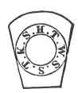
:::
