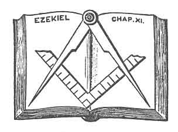
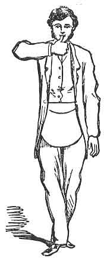
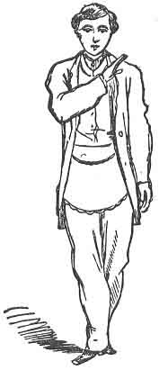
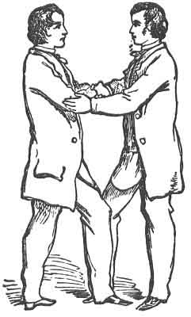
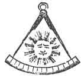

:::figure

:::

**ПОЧИТЕН МАЙСТОР**

Тази степен в Масонството е била учредена, за да изпитва способностите на Майстор Масон, преди да стане Майстор на Ложа, и нито един Масон не може по конституционен ред да председателства Ложа на Майстор Масони, ако не е бил приет в тази Степен. Обикновено Масонът приема тази Степен, преди да се предложи като кандидат за председателстване в Майсторска Ложа; но ако се случи така, че за Майстор на Ложа бъде избран Масон, който не е Минал Майстор, степента „ПочитенМайстор“ може да му бъде дадена без каквато и да е друга церемония, освен полагането на задължението. В такъв случай това обикновено се извършва от Кралско-Аркови Масони, действащи по заповед на Велик Майстор.

Ложата на Миналите Майстори се състои от седем офицери, както следва:

1. Право Досточтим Майстор;
    
2. Старши Надзирател;
    
3. Младши Надзирател;
    
4. Секретар;
    
5. Касиер;
    
6. Старши Дякон;
    
7. Младши Дякон.
    

Вътрешното разположение е същото като при първата степен, а офицерите са разположени по същия начин. (Вж. стр. 8.)

Символичният цвят на Степента „Минал Майстор“ е пурпурен. Престилката е от бяла агнешка кожа, обшита с пурпурно, и върху нея трябва да бъде изобразен накитът на Степента. Яката е пурпурна, обшита със злато. Но тъй като Ложите на Миналите Майстори се провеждат под патентите на Кралско-Арковите Капитули, яките, престилките и накитите на Капитула обикновено се използват при даването на Степента „Минал Майстор“.

Когато Ложа на Миналите Майстори бъде открита по надлежния ред, церемонията е подобна на тази в Ложа на Майстори. Ако има кандидат, който чака, той обикновено бива въведен в Ложата така, сякаш тя е открита в Степента „Марк Майстор“, и бива направен Минал Майстор, преди още да осъзнае това. Поради многобройните разкрития на тази и други степени в Масонството, се изискват голям такт и изобретателност, за да се даде тази Степен така, че да се постигне желаният ефект. Кандидатът се избира за Степента в Кралско-Арковия Капитул, тъй като в тази Степен не се допуска извършването на никаква друга работа, освен инициацията.

В миналото било обичай всички членове да носят шапките си при даването на тази Степен, но сега никой не носи шапка, освен Право Досточтимият Майстор. Сега ще пристъпим към описанието на начина за даване на тази Степен „в старо време“, както е изложен от Ричардсън, а в края ще дадем на читателя представа за съвременния начин на нейното даване. При сравнение с труда на Ричардсън, посветените ще забележат, че сме направили някои незначителни изменения и сме поправили няколко грешки, които се срещат в тази книга.

Майстор Масон, желаещ да встъпи в Степента „Минал Майстор“, подава прошение до Капитула и бива подложен на гласуване по същия начин, както кандидат за някоя от първите степени; но той бива приет по съвсем различен начин. След като получи необходимия балот, Младшият Дякон го въвежда в Ложата, настанява го на място, а след това се връща на своя пост близо до Старшия Надзирател на Запад. Малко след това на външната врата се дава силен сигнал.

**Мл. Д.** (изправяйки се и обръщайки се към Майстора). — Има сигнал на външната врата, Право Досточтими.

**П. Д. М.** — Обърнете внимание на сигнала и вижте кой идва там.

Младшият Дякон отива до вратата и скоро се връща, като носи писмо до Майстора, който го отваря и прочита на глас пред Ложата следното:

**СКЪПИ БРАТЕ —**  
Нашата скъпа майка внезапно се разболя тежко и лекарят се отчайва да спаси живота ѝ. Ела у дома незабавно; не губи нито миг в забавяне.

Твоя любяща сестра,  
**АЛИС**

**П. Д. М.** (обръщайки се към Ложата). — Братя, от съдържанието на това писмо виждате, че за мен е необходимо да замина незабавно. Трябва да назначите някого, който да заеме стола, тъй като аз не мога да остана, за да дам тази Степен.

**Мл. Н.** — Право Досточтими, дълбоко съчувствам на сполетялото вашето семейство тежко изпитание и съжалявам, че се налага така спешно да заминете; но не бихте ли могли да останете още няколко минути? Брат Гейб е дошъл специално, за да получи тази Степен, и очаква да я получи. Вярвам, че той е тук и може сам да говори; и ако не е съгласен церемонията да бъде отложена, не виждам как бихте могли да избегнете оставането си.

Кандидатът, съчувствайки на Майстора, заявява, че е съгласен да изчака и че по никакъв начин не желае Право Досточтимият да остава дори за миг заради него.

**Мл. Н.** — Благодаря на нашия брат за неговата учтивост, но имам и други причини, Право Досточтими, поради които желая да останете и да дадете тази Степен тази вечер. На първо място, не е сигурно кога аз самият ще мога отново да присъствам — освен това може да не успеем да съберем толкова братя на друго събрание; а тъй като това е много трудна Степен за даване, смятам, че трябва да останете.

**П. Д. М.** — Братя, за мен е невъзможно да остана. Следователно ще назначите някого, който да заеме стола. Тук присъстват редица братя, които са напълно способни да дадат Степента; моля, пристъпете към номинация.

**Мл. Н.** — Номинирам нашия брат Старши Надзирател да заеме стола.

**П. Д. М.** — Братя, направено и подкрепено е предложение брат Старши Надзирател да заеме стола тази вечер и да даде тази Степен на брат Гейб. Всички, които са „за“, нека го изразят, като кажат „да“.

(Двама-трима от членовете отговарят с „да“.)  
Всички „против“ нека кажат „не“.

(Почти всички членове възкликват: „Не!“)

Няма решение. Братя, моля, номинирайте нов Майстор.

**Ст. Н.** — Номинирам брат Младши Надзирател да заеме стола.

Майсторът поставя въпроса по същия начин и резултатът е същият, след което някой от членовете номинира брат Гейб (кандидата), който е избран **единодушно** и обявен за надлежно избран.

**П. Д. М.** — Брат Гейб, вие сте избран за Майстор на тази Ложа. Моля, пристъпете насам и заемете стола.

Кандидатът пристъпва напред, за да заеме стола, но Право Досточтимият Майстор го избутва назад и казва:

**П. Д. М.** — Преди да заемете Майсторския стол, трябва първо да дадете съгласие с древните наредби и да поемете задължение да изпълнявате вярно длъжността на Майстор на Ложата.

Кандидатът няма възражения и Майсторът се обръща към него, както следва:

1. Съгласявате ли се да бъдете добър и верен човек и стриктно да се подчинявате на нравствения закон?
    
2. Съгласявате ли се да бъдете миролюбив поданик и с готовност да се съобразявате със законите на страната, в която живеете?
    
3. Обещавате ли да не участвате в никакви заговори или конспирации срещу управлението, а търпеливо да се подчинявате на решенията на върховната законодателна власт?
    
4. Съгласявате ли се да отдавате нужното уважение на гражданските власти, да работите прилежно, да живеете почтено и да постъпвате честно с всички хора?
    
5. Съгласявате ли се да почитате първоначалните правила и покровители на Масонството и техните законни наследници — върховни и подчинени — според съответните им степени, и да се подчинявате на решенията и постановленията на братята, когато са събрани, във всеки случай, съвместим с Конституцията на Ордена?
    
6. Съгласявате ли се да избягвате лични вражди и кавги и да се пазите от невъздържаност и крайности?
    
7. Съгласявате ли се да бъдете предпазлив в държанието и поведението си, учтив към братята си и верен на своята Ложа?
    
8. Обещавате ли да уважавате истинските братя и да не поощрявате самозванци и всички отклоняващи се от първоначалния план на Масонството?
    
9. Съгласявате ли се да насърчавате общото благо на обществото, да развивате социалните добродетели и да разпространявате познанието за изкуствата?
    
10. Обещавате ли да отдавате почит на действащия Велик Майстор и на неговата длъжност, когато е надлежно инсталиран, и стриктно да се съобразявате с всяка наредба на Великата Ложа или общото събрание на Масоните, която не подкопава принципите и основите на Масонството?
    
11. Признавате ли, че не е по силите на нито един човек или група хора да правят нововъведения в същността на Масонството?
    
12. Обещавате ли редовно присъствие на комитетите и съобщенията на Великата Ложа при получаване на надлежно уведомление и да изпълнявате масонските си задължения при всички удобни случаи?
    
13. Признавате ли, че не може да се учреди нова Ложа без разрешението на Великата Ложа и че не бива да се оказва подкрепа на която и да е нередовна Ложа или на лица, тайно инициирани в такава, което е против древните задължения на Ордена?
    
14. Признавате ли, че никой не може редовно да бъде направен Масон или приет за член на която и да е редовна Ложа без предварително известие и надлежно проучване на неговия характер?
    
15. Съгласявате ли се, че никакви посетители не трябва да бъдат приемани във вашата Ложа без надлежно изпитване и представяне на подходящи доказателства, че са били инициирани в редовна Ложа?
    

Подчинявате ли се на тези задължения и обещавате ли да поддържате тези наредби, както Майсторите са правили във всички векове преди вас?

**Кандидатът** — Подчинявам се.

**П. Д. М.** — Сега ще поемете върху себе си задължението на тази Степен. Моля, коленичете при олтара.

Кандидатът бива отведен до олтара, коленичи на двете колене, полага двете си ръце върху Светата Библия, пергела и правия ъгъл и полага следната клетва:

_Аз, Питър Гейб, по своя собствена свободна воля и съгласие, в присъствието на Всемогъщия Бог и на тази Досточтима Ложа на Почитени майстори, издигната в Негова чест и посветена на светите Йоановци, тук и сега най-тържествено и искрено обещавам и се заклевам, в допълнение към предишните си задължения, че няма да давам тайните на Почитен майстор, нито каквито и да било тайни, отнасящи се към тях, на никого с по-ниска Степен, нито на което и да е лице в познатия свят, освен на истински и законен брат или братя — Почитени майстори, или в тялото на справедливо и законно устроена Ложа на такива; и не на онзи или онези, за които само ще чуя, че са такива, а единствено на онзи или онези, които ще намеря да бъдат такива след строго изпитване и проверка или по законна информация.
Освен това тържествено обещавам и се заклевам**, че ще се подчинявам на всички редовни знаци и призовавания, изпращани, хвърляни, подавани или давани от ръката на брат от тази Степен, или от състава на справедливо и законно устроена Ложа на **Почитени майстори**.

*Освен това тържествено обещавам и се заклевам, че ще подкрепям Конституцията на Генералния Велик Кралски Арх Глава на Съединените американски щати, както и тази на Великия Кралски Арх Глава на щата, в който се намира тази Ложа и под чиято юрисдикция тя работи, и ще се съобразявам с всички устави, правила и наредби на тази или на всяка друга Ложа, на която бих могъл по всяко време занапред да стана член, доколкото това е по силите ми.

*Освен това тържествено обещавам и се заклевам, че няма да подпомагам или да присъствам при посвещаването в тази Степен на което и да е лице, което, според най-доброто ми знание и убеждение, не е получило редовно (в допълнение към Степените на Въведения чирак, Калфата и Майстор масон) Степента **Марк майстор**, или не е било избрано за Майстор на редовна Ложа на Майстор масони.

*Освен това тържествено обещавам и се заклевам, че ще подпомагам и оказвам помощ на всички бедни и нуждаещи се Почитени майстори, техните вдовици и сираци, където и да се намират по целия свят, когато се обърнат към мен като такива и аз ги намеря за достойни, доколкото това е по силите ми, без съществена вреда за мен самия или за семейството ми.

*Освен това тържествено обещавам и се заклевам, че тайните на брат от тази Степен, поверени ми като такива, ще останат толкова сигурни и ненакърними в гърдите ми, колкото са били в неговите преди да ми бъдат съобщени, **убийство и държавна измяна изключени**, като тези се оставят на моя личен избор.

*Освен това тържествено обещавам и се заклевам, че няма да ощетя тази Ложа, нито брат от тази Степен, дори до стойността на **един цент**, съзнателно и лично, нито ще допусна това да бъде сторено от други, ако е в моята власт да го предотвратя.

:::figure

:::

:::figure

:::

*Освен това тържествено обещавам и се заклевам, че няма да управлявам тази Ложа, нито която и да е друга, над която бих могъл да бъда призован да председателствам, по надменен и произволен начин; а винаги ще полагам най-големите си усилия да запазя мира и хармонията между братята.

*Освен това тържествено обещавам и се заклевам, че никога няма да отварям Ложа на Майстор масони, освен ако не присъстват трима редовни Майстор масони, освен Тайлъра; нито ще затварям същата, без да бъде изнесена лекция, или някой раздел или част от лекция, за наставление на Ложата.

*Освен това тържествено обещавам и се заклевам, че няма да заседавам в Ложа, в която председателстващият офицер не е приел Степента **Почитен майстор**.

*На всичко това най-тържествено и искрено обещавам и се заклевам, с твърдо и непоколебимо намерение в ума си да го спазвам и изпълнявам; **обвързвайки се под не по-малко наказание** (в допълнение към всички мои предишни наказания) **езикът ми да бъде разцепен от върха до корена**, за да бъда завинаги неспособен да произнеса думата, ако някога се окажа умишлено виновен в нарушаването на която и да е част от тази моя тържествена клетва или задължение на **Почитен майстор**.  
**Тъй да ми помогне Бог, и да ме направи твърд и постоянен да го пазя и изпълнявам.**

**П. Д. М.** (към кандидата.) — **Отдели ръката си и целуни Книгата пет пъти.**

След като задължението бъде прието, кандидатът се изправя, а Майсторът пристъпва към това да му предаде **знака, думата и ръкостискането** на тази Степен, както следва:

**П. Д. М.** (към кандидата.) —  
**Сега ме виждаш да се приближавам към теб от Изток, под стъпката, знака и дюгарда на Почитен майстор.**

:::figure

:::
**Майсторът** сега пристъпва напред с левия си крак, след което поставя петата на десния си крак до върха на левия, така че двата крака да образуват прав ъгъл, представляващ правия ъгъл на квадрат. След това дава знака, като поставя палеца на дясната си ръка (със свити пръсти) върху устните си. Това напомня за наказанието — **езикът да бъде разцепен от върха до корена**. (Виж фиг.)

След това Майсторът дава втори знак, като поставя дясната си ръка върху лявата страна на шията си и я плъзга ръбесто надолу към дясната страна, така че да пресече трите предишни наказания. (Виж фиг. 26, стр. 189.)

**П. Д. М.** — _Братко, позволи ми сега да имам удоволствието да те въведа в ориенталския стол на цар Соломон._  
(Поставя голяма триъгълна шапка на главата му и го настанява на стол пред Майсторския стол.)

Този мъдър цар, когато бил стар и немощен, бил подпомаган от двамата си приятели — **Хирам, цар на Тир**, и **Хирам Абиф**, които го изправяли и настанявали на стола му посредством **ръкостискането на Почитен майстор**. (Виж фиг. 27.)

Майсторът и Старшият надзирател сега хващат кандидата с това ръкостискане и го повдигат на крака няколко пъти, като всеки път отново го оставят да седне на стола. След това Старшият надзирател се връща на мястото си, кандидатът се изправя, а **Почитаемият достоен майстор** го наставлява в **ръкостискането и думата на Почитен майстор**.

Най-напред те се хващат с ръкостискането на **Майстор масон** (виж фиг. 17, стр. 120) и, като допират вътрешните страни на краката си, Майсторът прошепва в ухото на кандидата думата **ГИБЛЕМ**. В този момент те плъзгат дясната си ръка така, че да се хванат взаимно точно над китката на лявата ръка, и повдигат левите си ръце, хващайки се за десните лакти; Майсторът казва, а кандидатът повтаря (в съгласие с тези движения):

**„От ръкостискане към педя, от педя към ръкостискане“**,

след което (почти едновременно) плъзгат лявата си ръка нагоре по дясната ръка до гърба един на друг, Майсторът казва:

**„Тройната връв е здрава“**,

а кандидатът (подсказан) отговаря:

**„Четворната връв не се къса лесно.“**  
(Виж фиг. 27.)

**Почитаемият достоен майстор** настанява кандидата в Майсторския стол, поставя му шапка на главата и след това застава отпред и казва:

_Достопочтени братко, сега ти представям мебелировката и различните масонски инструменти на нашето изкуство; те са символи на нашето поведение в живота и сега ще бъдат изброени и обяснени така, както се представят._

**Светите писания**, тази велика светлина в Масонството, ще те водят към всяка истина; ще направляват пътя ти към храма на щастието и ще ти посочат цялостния дълг на човека.

**Квадратът** учи да уреждаме действията си по правило и линия и да хармонизираме поведението си според принципите на морала и добродетелта.

**Пергелът** учи да ограничаваме желанията си във всяко положение; така, издигайки се чрез заслуги, можем да живеем уважавани и да умрем оплаквани.

**Правилото** наставлява да изпълняваме точно задълженията си, да напредваме по пътя на добродетелта и, без да се отклоняваме нито надясно, нито наляво, във всичките си дела да имаме предвид вечността.

**Отвесът** учи на критерия за нравствена правота — да избягваме лицемерието в разговорите и делата и да насочваме стъпките си към пътя, който води към безсмъртие.

**Книгата на Конституциите** трябва винаги да проучваш; да се чете в твоята Ложа, за да не може никой да се позовава на незнание относно отличните предписания, които тя съдържа.

**Накрая**, получаваш за пазене **Устава на твоята Ложа**, за чието точно и стриктно изпълнение трябва да бдиш. Представям ти също **чукчето**; то е символ на властта. Един удар с чукчето призовава към ред и вдига Младшия и Старшия дякони; два удара вдигат всички подчинени офицери; а три — цялата Ложа.

**П. Д. М.** — _Братя, поздравете вашия нов Майстор._

Всички присъстващи братя, водени от Майстора, минават отпред пред стола, дават знака на **Чирак**, и продължават. Това се повтаря със знака на всяка Степен в Масонството до тази на **Почитен майстор**.

**П. Д. М.** (към кандидата.) — _Сега те оставям да управляваш твоята Ложа._  
(Майсторът заема мястото си сред братята.)

Старшият надзирател пристъпва напред и предава своя накит и чукче на новия Майстор, а всеки от останалите офицери на Ложата прави същото, по реда на своя ранг. Малко по-късно оттеглилият се Майстор се изправя.

**Оттегленият Майстор** (обръщайки се към Стола.) —  
_Почитаеми достоен майсторе, вследствие на моята оставка и избора на нов Майстор, местата на Надзирателите са станали вакантни. Необходимо е да имате Надзиратели, които да ви подпомагат в управлението на вашата Ложа. Предполагам, че братята, които са заемали тези длъжности, ще продължат да служат, ако вие така пожелаете._

Новият Майстор моли Старшия надзирател да възобнови носенето на своя накит и чукче, след което и останалите офицери (които бяха напуснали местата си) също се връщат на своите места.

**Оттегленият Майстор** — _Почитаеми достоен майсторе, позволете ми почтително да ви предложа, че тъй като длъжността Касиер е от значителна_ *отговорност — тъй като той държи всички средства и собственост на Ложата — вие следва да разпоредите той да бъде номиниран и избран от присъстващите членове. Това е обичайна практика и ако наредите номинацията да се извърши по този начин, не се съмнявам, че ще изберем някого, който ще бъде удовлетворителен за вас*.

**Кандидатът** (действайки като Майстор.) — _Братята да пристъпят към номиниране на Касиер за тази Ложа._

Тук настъпва сцена на безредие, която трудно може да бъде описана. Новоинсталираният Достопочтен става обект на шеги от всеки достоен брат, който желае да упражни остроумието си върху него. Половин дузина братя се изправят едновременно, молейки Майстора да номинира тях, изтъквайки своите претенции и с голям плам омаловажавайки заслугите на другите; викат: _„Ред, Достопочтени! Пазете ред!“_ Други предлагат да танцуват и молят Майстора да им пее; трети свирят, пеят или подскачат из помещението; блъскат се и събарят столове или пейки. Един предлага да се премине от работа към отдих; друг произнася дълга реч, в която настоява цената на капитулните степени да бъде намалена от двадесет долара на десет и препоръчва да се разреши плащането им в брашно или други земеделски продукти. Предложението му е подкрепено и новият Майстор е притискан от всички страни да постави въпроса на гласуване. Ако въпросът бъде поставен, всички братя гласуват против и обвиняват новия Майстор, че нарушава клетвата си, когато е обещал да поддържа Конституцията на Генералния Велик Кралски Архикапитул, която определя цената на четирите капитулни степени на двадесет долара.

Ако Майсторът се опита да упражни властта на чукчето, това често има обратен ефект; защото ако даде повече от един удар и призове към ред, всички се подчиняват на сигнала с най-голяма бързина и сядат на най-близкото място. В следващия миг, преди Майсторът да успее да произнесе дума, всички отново са на крака и шумът започва наново. Някой брат предлага Ложата да бъде закрита; друг се надява това да стане „по краткия начин“.

**Оттегленият Майстор** (към кандидата.) — _Почитаеми достоен майсторе, направено е предложение и то е подкрепено Ложата да бъде закрита. Можете да я закриете както пожелаете. Можете просто да обявите Ложата за закрита или по който и да е друг начин._

Кандидатът, силно смутен, често се опитва да закрие Ложата, като удари с чукчето и я обяви за закрита. Ако направи това, оттегленият Майстор го спира по следния начин:

**Оттегленият Майстор** — _Почитаеми, в своята клетва вие се заклехте, че няма да закривате тази или която и да е друга Ложа, над която бъдете призован да председателствате, без да изнесете лекция или част от лекция. Възнамерявате ли да нарушите клетвата си?_

**Кандидатът** — _Бях забравил това в това объркване. Надявам се братята да ме извинят._

Някой брат отива и прошепва на кандидата, че може да се откаже от стола и да го предаде обратно на стария Майстор, който да закрие Ложата, ако предпочита. Кандидатът е много радостен да направи това и с готовност абдикира от мястото си.

**П. Д. М.** (възвръщайки стола.) — _Братко, урокът, който току-що ти дадохме, въпреки привидното му безредие, има за цел да ти предаде по поразителен начин необходимостта винаги да се въздържаш от търсене или приемане на каквато и да е длъжност или положение, за което сам не се смяташ напълно подготвен._

След това Майсторът изнася лекцията на тази степен. Тя е разделена на пет раздела. Първият разглежда начина на учредяване на Ложа на Майстор масони. Вторият разглежда церемонията по инсталиране, включително начина на приемане на кандидати в тази степен, както е описано по-горе. Третият разглежда церемониите, спазвани при полагането на основните камъни на обществени сгради. Четвъртият раздел разглежда церемонията, спазвана при освещаването на масонски зали. Петият — церемонията, спазвана при погребенията според древния обичай, заедно със службата, използвана при този случай. Лекцията обикновено се чете от Монитор, който се съхранява във всяка Ложа. (Виж Лекцията, стр. 197.)

Горното обхваща всички церемонии, които някога са били използвани при даването на степента **Почитен майстор**; но церемониите често се съкращават чрез изпускане на някои части от тях; представянето на различните инструменти на занаята и техните обяснения често се пропуска; а още по-често — и поучението.

Такъв е начинът, по който тази степен е била давана в миналото; но, както вече казахме, днес церемониите са значително съкратени. Методът за посвещаване в степента **Почитен майстор**, който сега обикновено се прилага, е следният:

Кандидатът за степента **Почитен майстор** бива поканен в Ложа на Марк майстори и щом заеме мястото си, някой от братята се изправя и предлага Ложата да бъде закрита. Друг брат веднага става и привлича вниманието на Майстора към някаква незавършена работа или доклад на комисия. Всичко това е уловка и има за цел единствено да отклони кандидата от истинския замисъл. Той седи там, мислейки през цялото време, че е свидетел на редовната работа на Марк Ложа, докато в действителност преминава през предварителните стъпки на посвещението.

Скоро един от братята предлага отлагане на заседанието; друг става и възразява срещу предложението; трети моли Капитула да му помогне със заем на пари. Някой от членовете се противопоставя на заема и често между братята се разменят остри думи (всичко с цел ефект). Накрая Почитаемият достоен майстор се опитва да постави на гласуване някакви решения по въпроса и се разгаря продължителен спор относно законността на такова разпореждане със средствата на Капитула. След като спорът продължи известно време, един от братята се изправя и обвинява Почитаемия достоен майстор в корупция и го упреква открито, че има личен интерес от отпускането на заема. В отговор Почитаемият достоен майстор възмутено отхвърля намека и настоява да бъде освободен от по-нататъшно служене като Майстор на Ложата.

Следва нова сцена на възбуда — някои от братята подкрепят отстраняването на Почитаемия достоен майстор, докато други защитават оставането му на поста. В крайна сметка Почитаемият достоен майстор отказва да служи при каквито и да е условия и категорично подава оставка. Някои от членовете сега настояват привидно оттегления Почитаем достоен майстор да помогне при въвеждането в длъжност на неговия наследник. Той се съгласява да направи това. Кандидатът тогава бива номиниран, избран и поставен в Ориенталския стол и т.н.

Останалата част от степента, от избора на Майстора нататък, е правилно описана от Ричардсън в предходните страници, с тази разлика, че кандидатът много рядко бива третиран толкова зле, както е представено там. Обикновено кандидатът бива избавен от смущението си навреме от оттегления Майстор, който възвръща мястото си и му прочита следното поучение:

**БРАТКО** — _Даването в този момент на една степен, която няма историческа връзка с останалите капитулни степени, представлява привидна аномалия, която обаче дължи съществуването си на следните обстоятелства:_

_Първоначално, когато Кралско-арховото Масонство е било под управлението на символичните Ложи, в които тогава винаги се е давала степента Кралска арка, съществувало е правило, че никой не може да я получи, ако преди това не е председателствал като Майстор на тази или на някоя друга Ложа; и това ограничение е било наложено, защото Кралската арка е била смятана за твърде важна степен, за да бъде давана само на Майстор масони._ _Но тъй като, ако Кралската арка се ограничаваше само до онези, които действително са били избрани за председателстващи офицери на своите Ложи, разпространението на тази степен би било съществено ограничено, а нейната полезност — значително намалена, Великият Майстор често е давал, след надлежна молба, свое разрешение да позволи на определени Майстор масони (макар и да не са били избрани да председателстват своите Ложи) да „преминат стола“. Това е технически термин, предназначен да обозначи кратка церемония, чрез която кандидатът бива въвеждан в тайнствата на **почитен майстор** и, подобно на него, получава право да напредне в Масонството до Кралската арка, или до съвършенството и завършека на Третата степен.

Когато обаче управлението на Кралската арка бе отнето от символичните Ложи и поверено на отделна организация — а именно Капитулите — това правило продължи да се спазва, защото за мнозина беше съмнително дали то може законно да бъде отменено. И тъй като законът все още изисква възвишената степен Кралска арка да бъде ограничена само до **почитени майстори**, нашите кандидати биват допускани да „преминат стола“ единствено като подготовка и квалификация за приемането на тържествените поучения на Кралската арка.

Церемонията по преминаването на стола, или превръщането ви по този начин в **почитен майстор**, не ви дава обаче никакъв официален ранг извън Капитула, нито можете в символична Ложа да претендирате за каквито и да било особени привилегии вследствие на това, че сте получили в Капитула посвещението в степента **почитен майстор**. Онези, които получават тази степен в символичните Ложи като част от службата по инсталиране, след като бъдат избрани да председателстват, с право са били наричани „действителни почитени майстори“, докато онези, които преминават през церемонията в Капитул единствено като подготовка за приемането на Кралската арка, се отличават като „виртуални почитени майстори“, за да се покаже, че заедно с посвещаването в тайните те не са получили правата и прерогативите на степента.

С това кратко обяснение на причината, поради която тази степен сега ви се дава, и защо ви е било позволено да заемете стола, вие ще се оттеглите и ще позволите да бъдете подготвен за онези по-нататъшни и по-дълбоки изследвания в Масонството, които могат да бъдат напълно завършени единствено в степента Кралска арка.

Ако няма друга работа, лекцията се изнася от Почитаемия достоен майстор и Ложата се закрива със следната молитва:

**Върховни Архитекте на Вселената**, приеми нашите смирени възхвали за многобройните милости и благословения, които Твоята щедрост ни е дарила, и особено за това братско и дружеско общение. Прости, молим Те, всичко онова, което си видял нередно в нас, откакто сме заедно, и продължавай да ни даряваш със Своето присъствие, закрила и благословение. Направи ни съзнателни за подновените задължения, под които се намираме — да Те обичаме над всичко и да бъдем братолюбиви един към друг. Нека всички наши неумерени страсти бъдат укротени и нека ежедневно нарастваме във Вяра, Надежда и Милосърдие, но най-вече в онова Милосърдие, което е връзката на мира и съвършенството на всяка добродетел. Нека така да прилагаме Твоите предписания, че накрая да получим Твоите обещания и да намерим вход през портите към храма и града на нашия Бог.

**Тъй да бъде. Амин.**

**ГРАДЕЖ ЗА ПОЧИТЕН МАЙСТОР —
ЧАСТ ОТ ВТОРИЯ РАЗДЕЛ**

**Въпрос.** Вие почитен майстор ли сте?  
**Отговор.** Имам честта да бъда такъв.

**В.** Как придобихте това почетно звание?  
**О.** Като бях редовно избран и надлежно инсталиран да председателствам и управлявам Ложа на Свободни и Приети Масони. Преди моята инсталация бях накаран да коленича пред олтара по надлежен начин и да поема върху себе си тържествена клетва или задължение да пазя и прикривам тайните, принадлежащи на стола.

**В.** Кой е този надлежен начин?  
**О.** Коленичейки на двете колена, с двете ръце, положени върху Светата Библия, правия ъгъл и пергела, с изправено тяло; в този надлежен начин поех върху себе си тържествената клетва или задължение на **почитен майстор**.

**В.** Имате ли това задължение?  
**О.** Имам.

**В.** Ще го дадете ли?  
**О.** Ще го дам, с ваша помощ.

**В.** Продължете.  
**О.** Аз, А. Б. и т. н., и т. н. (Виж задължението на **почитен майстор**.)

**В.** Имате ли знак, принадлежащ на стола?  
**О.** Имам няколко.

**В.** Покажете ми знак.  
_(Дава знака, палец към устата.)_

**В.** Как се нарича той?  
**О.** Надлежен знак (дугард).

**В.** На какво се отнася?  
**О.** Към наказанието на моето задължение — че по-скоро бих допуснал езикът ми да се прилепи към небцето ми, отколкото незаконно да разкрия която и да е от тайните, принадлежащи на стола.

**В.** Покажете ми друг знак.  
_(Дава знака, като спуска ръката си от устата с кръгово движение надолу, през гърдите към дясната страна.)_

**В.** Как се нарича той?  
**О.** Знакът.

**В.** На какво се отнася?  
**О.** Към допълнителната част от наказанието на моето задължение — че по-скоро бих понесъл най-тежките последици от всички мои предишни наказания, отколкото незаконно да разкрия която и да е от тайните, принадлежащи на стола.

**В.** Имате ли хват, принадлежащ на стола?  
**О.** Имам.

**В.** Предайте го на брат.  
_(Дава хвата на почитен майстор.)_

**В.** Има ли той име?  
**О.** Има.

**В.** Дайте го.  
_(Дава думата. Виж думата на почитен майстор.)_

**В.** Какво означава тя?  
**О.** Каменоделец, изравняващ камъка.

**В.** С какво бяхте представен?  
**О.** Със знака (бижутoто) на моята длъжност — прав ъгъл, и се надяваше, че ще подготвя един съвършено квадратен камък в Храма на Масонството.

**В.** С какво бяхте представен след това?  
**О.** С трите велики светлини в Масонството — Светата Библия, правия ъгъл и пергела. В този свещен том щях да намеря всичко необходимо за моето наставление и ръководство; и тези три велики светлини винаги трябваше да виждам поставени в надлежно положение, когато Ложата е отворена. Ако е в степента Чирак, и двата върха на пергела са под правия ъгъл; ако е в степента Калфа, единият връх е издигнат над правия ъгъл; ако е в степента Майстор, и двата върха са издигнати над правия ъгъл.

**В.** С какво бяхте представен след това?  
**О.** С хартата или патента, които ме овластяват да извършвам всяка редовна масонска работа.

**В.** С какво бяхте представен след това?  
**О.** С Конституцията, която трябваше внимателно да проучвам и да следя да не бъде нарушавана.

**В.** С какво бяхте представен след това?  
**О.** С уставите (правилника), които трябваше внимателно да проучвам и да следя да бъдат строго изпълнявани.

**В.** С какво бяхте представен след това?  
**О.** С протоколите, за които трябваше да следя да се водят грижливо, така че нищо неподобаващо да не бъде предавано на хартия, и да упражнявам общ надзор върху задълженията на секретаря.

**В.** С какво бяхте представен след това?  
**О.** Аз, като Майстор, трябваше да бъда покрит¹, докато останалите братя оставаха непокрити.

**В.** С какво бяхте представен след това?  
**О.** Последно, но не и по значение, бях представен с чука, за който бях уведомен, че е символ на властта — един удар от него призовава Ложата към ред; при откриване и закриване дяконите стават; два удара призовават останалите подчинени офицери; при три удара — цялата Ложа; а един удар отново ги настанява по местата им и възстановява реда.

**В.** Какво стана с вас след това?  
**О.** Бях отведен до стола, някога така достойно заеман от нашия Велик Майстор Соломон, цар на Израил, и се надяваше, че част от неговата мъдрост ще се спусне и ще пребъде върху мен.

**В.** Какви са задълженията на стола?  
**О.** Те са много и разнообразни.

**В.** В какво се състоят?  
**О.** В откриване, наставляване и закриване на Ложи; в посвещаване, напредване и въздигане на масони; в председателстване при освещавания, посвещения и инсталации; при полагане на крайъгълни камъни на обществени здания; в председателстване при погребални обреди и при всички други задължения, съответстващи и свързани с тях.

:::figure

