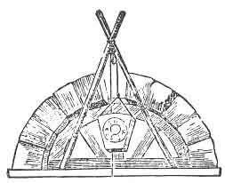
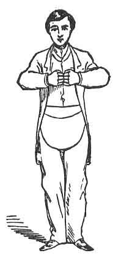
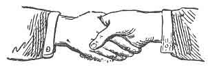
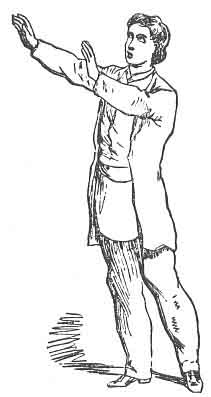

:::figure

:::

## НАЙ-ДОСТОЕН МАЙСТОР

Нито един масон не може да приеме степента **Най-достоен майстор**, преди да е станал **почитен майстор** и да е председателствал в Ложа, или, с други думи, да е бил въведен в Ориенталния стол на цар Соломон. Когато Храмът в Йерусалим бил завършен¹, онези, които се били доказали достойни чрез своята добродетел, умение и вярност, били инсталирани като **най-достойни майстори**; и дори и до днес никой, освен онези, които притежават съвършено познание за всички предходни степени, не е (или не би трябвало да бъде) допускан².

Ложа на **Най-достойните майстори** се открива почти по същия начин, както Ложите в предходните степени. Офицерите са: Майстор, Старши и Младши надзиратели, Старши и Младши дякони, Секретар и Касиер, и, разбира се, Тайлър.

Офицерите на Капитула се подреждат по следния ред:  
Първосвещеникът — като Право-достоен майстор;  
Царят — като Старши надзирател;  
Писарят — като Младши надзирател;  
Главният пътник — като Старши дякон;  
Капитанът на Кралската арка — като Младши дякон.  
Касиерът, Секретарят и Тайлърът съответстват по ранг на същите длъжности в другите степени.

Символичният цвят на степента **Най-достоен майстор** е пурпурен. Престилката е от бяла агнешка кожа, обшита с пурпурно. Яката е пурпурна, обшита със злато. Но тъй като Ложите от тази степен се държат под патентите на Капитулите на Кралската арка, при даването на степента обикновено се използват яките, престилките и бижутата на Капитула.

Право-достойният майстор представлява цар Соломон и трябва да бъде облечен в алена роба, да носи корона и да държи скиптър в ръката си.

За кандидата, който получава тази степен, се казва, че е „**приет и признат за Най-достоен майстор**“.

Ложите на Най-достойните майстори са „**посветени на цар Соломон**“.

Офицерите на Ложата са разположени както в степента Чирак, описана на стр. 8. Председателстващият майстор призовава Ложата към ред и казва:

**Майстор (към Младшия надзирател):**  
— Братко Младши, всички ли са Най-достойни майстори на юг?

**Мл. надз.:**  
— Всички са, Право-достойни.

**Майстор (към Старшия надзирател):**  
— Братко Старши, всички ли са Най-достойни майстори на запад?

**Ст. надз.:**  
— Всички са, Право-достойни.

**Майстор:**  
— Такива са и на изток.

Майсторът дава един удар, който изправя двамата дякони.

**Майстор (към Младшия дякон):**  
— Братко Младши, коя е първата грижа на масона?

**Мл. дякон:**  
— Да се увери, че вратата е тилована, Най-достойни.

**Майстор:**  
— Изпълни тази част от дълга си и уведоми Тайлъра, че сме на път да открием Ложа на Най-достойните майстори, и му нареди да тилова съответно.

Младшият дякон отива до вратата и дава шест удара, на които Тайлърът отвън отговаря с още шест. След това дава един удар, на който Тайлърът отговаря с един; тогава дяконът леко отваря вратата и уведомява Тайлъра, че по заповед на Най-достойния майстор в това място предстои откриването на Ложа на Най-достойните майстори и че той трябва да тилова съответно. След това се връща на мястото си и се обръща към Майстора:

**Мл. дякон:**  
— Ложата е тилована, Най-достойни.

**Майстор:**  
— От кого?

**Мл. дякон:**  
— От Най-достоен майстор масон извън вратата, въоръжен с надлежните инструменти на своята длъжност.

**Майстор:**  
— Какъв е дългът му там?

**Мл. дякон:**  
— Да държи далеч всички профани и подслушвачи и да следи никой да не влиза или излиза без позволение на Право-достойния майстор.

След това Майсторът разпитва всеки офицер на Ложата за неговите задължения, които те изричат, както в другите степени.

**Майстор (към Старшия надзирател):**  
— Братко Старши, събери братята около олтара за нашето откриване.

**Ст. надз.:**  
— Братя, моля да се съберете около олтара с цел откриването на тази Ложа на Най-достойните майстори.

Братята се събират около олтара и образуват кръг, като застават така, че да се докосват един друг, оставяйки място за Право-достойния майстор; след това всички коленичат на лявото коляно и се хващат за ръце, като всеки подава на брат си отдясно лявата си ръка, а на брат си отляво — дясната; лявите им ръце са отгоре, а главите им са сведени надолу. В това положение Право-достойният майстор прочита следните стихове от Псалм XXIV:

> „Господня е земята и всичко, що я изпълня,  
> вселената и онези, които живеят в нея.  
> Защото Той я основа върху моретата  
> и я утвърди върху водите.  
> Кой ще възлезе на хълма Господен?  
> И кой ще застане на Неговото свято място?  
> Оня, който има чисти ръце и непорочно сърце,  
> който не е въздигнал душата си към суета  
> и не се е клел лъжливо.  
> Той ще получи благословение от Господа  
> и правда от Бога на своето спасение.  
> Това е родът на ония, които Го търсят,  
> които търсят лицето Ти, о, Яков. Села.  
> Подигнете главите си, порти…“

(Тук коленичилите братя последователно повдигат и свеждат главите си, докато четенето продължава.)

> „…и се подигнете, вечни врати,  
> и Царят на славата ще влезе.  
> Кой е Този Цар на славата?  
> Господ силен и могъщ,  
> Господ, могъщ в битка.  
> Подигнете главите си, порти;  
> да, подигнете ги, вечни врати,  
> и Царят на славата ще влезе.  
> Кой е Този Цар на славата?  
> Господ на силите — Той е Царят на славата. Села.“

Докато чете тези стихове, Право-достойният майстор напредва към кръга от коленичили братя, като прави стъпки само при онези места от текста, които се отнасят до Царя на славата.

След като четенето завърши, Право-достойният майстор коленичи, хваща се за ръце с останалите, с което затваря кръга, и всички заедно вдигат и спускат свързаните си ръце шест пъти, в такт с думите, които Право-достойният майстор произнася:  
„Едно, две, три; едно, две, три.“

Това в масонството се нарича **балансиране**. След това те се изправят, освобождават ръцете си и ги вдигат над главите си с умерено и донякъде грациозно движение, като повдигат очи нагоре; едновременно се обръщат надясно, протягат ръцете си и после ги оставят да паднат свободно и леко отпуснати край тялото. Този знак, според масоните, представя знака на удивление, направен от царицата на Савá при първия ѝ поглед към Храма на Соломон. (Виж фиг. 30.)

Право-достойният майстор заема отново мястото си и казва:  
„Братя, обърнете внимание на знаците.“  
След това той сам дава всички знаци — от степента Чирак до тази степен — а братята го следват и повтарят.

**Майстор (към Старшия надзирател):**  
— Братко Старши, моята воля и желание е тази Ложа на Най-достойните майстори сега да бъде открита за разглеждане на дела, като строго се забраняват всякакви частни съвещания или профанен език, чрез които хармонията ѝ би могла да бъде нарушена, докато сме заети с нашите законни занятия, под не по-малко наказание от това, което уставите предвиждат или мнозинството от братята сметне за необходимо да наложи.

Старшият надзирател повтаря това на Младшия, а Младшият го обявява на Ложата, както следва:

**Мл. надз.:**  
— Братя, чухте волята и желанието на нашия Право-достоен майстор, както току-що ми бе съобщено — тъй да бъде сторено.

След откриването Ложата преминава през обичайните дела на вечерта, както в предходните степени. Ако предстои посвещаване на кандидат, Младшият дякон отива в стаята за подготовка, където кандидатът го очаква, и го подготвя. Той сваля палтото на кандидата, поставя въже шест пъти около тялото му и го отвежда до вратата на Ложата, където дава шест отчетливи удара (на които Старшият дякон отвътре отговаря), а след това един удар, на който също се отговаря по същия начин.

**Ст. дякон (леко отваряйки вратата):**  
— Кой идва тук?

**Мл. дякон:**  
— Достоен брат, който е бил редовно приет като масон Чирак преминал в степента **Калфа**; въздигнат в възвишената степен **Майстор масон**; напреднал в почетната степен **Марков майстор**; председателствал в стола като **почитен майстор**; и сега желае по-нататъшна светлина в Масонството, като бъде приет и признат за **Най-достоен майстор**.

**Ст. дякон:**  
— По своя собствена свободна воля и съгласие ли прави това искане?

**Мл. дякон:**  
— Да.

**Ст. дякон:**  
— Должно и истински ли е подготвен?

**Мл. дякон:**  
— Да.

**Ст. дякон:**  
— Достоен и добре квалифициран ли е?

**Мл. дякон:**  
— Да.

**Ст. дякон:**  
— Направил ли е подобаващ напредък в предходните степени?

**Мл. дякон:**  
— Направил е.

**Ст. дякон:**  
— По какво по-нататъшно право или полза очаква да получи тази милост?

**Мл. дякон:**  
— По ползата от паролата.

**Ст. дякон:**  
— Има ли парола?

**Мл. дякон:**  
— Той я няма, но аз я имам за него.

**Ст. дякон:**  
— Дай ми я.

Младшият дякон прошепва в ухото на Старшия дякон думата **RABBONI**.  
(В много ложи думата на почитния майстор, **GIBLEM**, се използва като парола за тази степен, а думата **RABBONI**¹ — като действителната дума.)

**Ст. дякон:**  
— Думата е вярна. Ще почакаш, докато Най-достойният майстор бъде уведомен за твоето искане и отговорът му бъде върнат.

Старшият дякон отива при Право-достойния майстор на изток и дава шест удара на вратата.

**Майстор:**  
— Кой идва тук?

**Ст. дякон:**  
— Достоен брат, който е бил редовно приет като Чирак; преминал в степента Калфа; въздигнат в възвишената степен Майстор масон; напреднал в почетната степен Марков майстор; председателствал като майстор в стола; и сега желае по-нататъшна светлина в Масонството, като бъде приет и признат за Най-достоен майстор.

**Майстор:**  
— По своя собствена свободна воля и съгласие ли прави това искане?

**Ст. дякон:**  
— Да.

**Майстор:**  
— Должно и истински ли е подготвен?

**Ст. дякон:**  
— Да.

**Майстор:**  
— Достоен и квалифициран ли е?

**Ст. дякон:**  
— Да.

**Майстор:**  
— Направил ли е подобаващ напредък в предходните степени?

**Ст. дякон:**  
— Направил е.

**Майстор:**  
— По какво по-нататъшно право или полза очаква да получи тази милост?

**Ст. дякон:**  
— По ползата от паролата.

**Майстор:**  
— Има ли парола?

**Ст. дякон:**  
— Той я няма, но аз я имам за него.

**Майстор:**  
— Дай я.

Старшият дякон прошепва в ухото му думата **RABBONI**.

**Майстор:**  
— Паролата е вярна. Тъй като идва, надарен с всички тези необходими качества, нека бъде допуснат в тази Ложа на Най-достойните майстори, в името на Господа.

Вратата се разтваря широко и Старшият дякон приема кандидата **върху ключовия камък**.

След това кандидатът бива обиколен шест пъти около Ложата от Старшия дякон, движейки се по слънцето. Първия път, когато минават край Младшия надзирател, той дава един удар с чукчето; при Старшия надзирател — също един; и също така при Право-достойния майстор. Втория път всеки дава по два удара; третия — по три, и така нататък, докато стигнат до шест. (Виж бележка K, Приложение.)

През това време Право-достойният майстор чете следните стихове от Псалм CXII:

> „Зарадвах се, когато ми казаха:  
> Да идем в дома Господен. (• •)
> 
> Нозете ни ще стоят в твоите порти, Йерусалиме.  
> Йерусалим е изграден като град,  
> здраво свързан в едно. (• • •)
> 
> Там възлизат племената, племената Господни,  
> според свидетелството на Израил,  
> за да благодарят на името Господне. (• • • •)
> 
> Защото там са поставени престоли за съд,  
> престолите на Давидовия дом. (• • • • •)
> 
> Молете се за мира на Йерусалим:  
> да благоденстват онези, които те обичат.  
> Мир да бъде в стените ти  
> и благоденствие в дворците ти. (• • • • • •)
> 
> Заради братята си и приятелите си  
> сега ще кажа: Мир да бъде в тебе.  
> Заради дома на Господа, нашия Бог,  
> ще търся твоето добро.“

Четенето е така съобразено по време, че да не приключи напълно, докато Старшият дякон и кандидатът не извършат шестото обикаляне.

Веднага след това Старшият дякон и кандидатът достигат до поста на Младшия надзирател на юг, където се задават същите въпроси и се дават същите отговори, както при вратата („Кой идва тук?“ и пр.). Младшият надзирател след това нарежда кандидатът да продължи към Старшия надзирател на запад за по-нататъшно изпитване; там се задават същите въпроси и се дават същите отговори. Старшият надзирател нарежда той да бъде отведен при Право-достойния майстор на изток за по-нататъшно изпитване. Право-достойният майстор задава същите въпроси и получава същите отговори, както преди.

**Майстор (към Старшия дякон):**  
— Моля, отведи кандидата обратно на запад, откъдето дойде, и го предай на грижите на Старшия надзирател, като го помолиш да научи кандидата как да пристъпи към изток, като напредне по шест изправени редовни стъпки до шестата стъпка, и да го постави в положение да приеме върху себе си тържествената клетва или задължение на Най-достоен майстор масон.

Кандидатът бива отведен обратно на запад и Старшият надзирател го обучава как да пристъпи към изток в тази степен: първо, като направи първата стъпка в Масонството, както в степента Чирак — т.е. като пристъпи с левия крак и приведе десния, така че да образуват квадрат; след това прави стъпките, както са указани в степента Калфа, и така нататък до тази степен — като винаги започва със стъпката на Чирака. (Виж фиг. 14, стр. 93.)

Пристигайки до олтара, кандидатът коленичи на двете колена и поставя двете си ръце върху Библията, квадрата и пергела. Майсторът тогава пристъпва напред и се обръща към него:

**Майстор:**  
— Братко, сега си поставен в надлежно положение да приемеш върху себе си тържествената клетва или задължение на Най-достоен майстор масон, което, както и преди, те уверявам, че не засяга нито твоята религия, нито твоята политика. Ако си готов да го приемеш, повтори името си и казвай след мен:

**Аз, Питър Гейб**, по своя собствена свободна воля и съгласие, в присъствието на Всемогъщия Бог и на тази Ложа на Най-достойните майстори, въздигната за Него и посветена на цар Соломон, тук и сега най-тържествено и искрено обещавам и се заклевам, в допълнение към предишните си задължения, че няма да предавам тайните на Най-достоен майстор на никого от по-ниска степен, нито на което и да е лице в познатия свят, освен на истински и законен брат от тази степен и то само в тялото на справедлива и законно конституирана Ложа от такива; и не на онзи или онези, за които само ще чуя, че са такива, а единствено на онзи или онези, за които ще установя, че са такива, след строг изпит и надлежно разследване или законно удостоверяване.

**Освен това обещавам и се заклевам**, че ще се подчинявам на всички редовни знаци и призовавания, предадени, изпратени или подхвърлени към мен от брат от тази степен или от тялото на справедлива и законно конституирана Ложа от такива; **при условие, че това бъде в рамките на дължината на моя кабел-тегел**.

**Освен това обещавам и се заклевам**, че ще подкрепям Конституцията на **Генералния Велик Кралски Арков Капитул на Съединените щати**; също и тази на **Великия Капитул на този щат**, под чиято юрисдикция се държи тази Ложа, и ще се съобразявам с всички устави, правила и наредби на тази или на всяка друга Ложа, в която бих могъл занапред да стана член.

**Освен това обещавам и се заклевам**, че ще подпомагам и оказвам съдействие на всички бедни и нуждаещи се братя от тази степен, както и на техните вдовици и сираци, където и да са разпръснати по земното кълбо, доколкото е по силите ми, без да нанасям вреда на себе си или на семейството си.
:::figure

:::
**Освен това обещавам и се заклевам**, че тайните на брат от тази степен, поверени ми като такива, и които¹ знам, че са такива, ще останат толкова тайни и неприкосновени в гърдите ми, колкото и в неговите собствени — **убийство и държавна измяна изключени**, като последното се оставя на моята собствена свободна воля и избор.

**Освен това обещавам и се заклевам**, че няма съзнателно да ощетя тази Ложа на Най-достойните майстори, нито брат от тази степен, на стойността на каквото и да било, нито сам, нито ще допусна това да бъде сторено от други, ако е в моята власт да го предотвратя.

**Освен това обещавам и се заклевам**, че ще раздавам светлина и знание на всички невежи и неосведомени братя по всяко време, доколкото е по силите ми, без съществена вреда за себе си или семейството си.

**На всичко това най-тържествено се заклевам**, с твърдо и устойчиво намерение в ума си да го спазвам и изпълнявам; като се обвързвам под не по-малко наказание от това гърдите ми да бъдат разкъсани, а сърцето и вътрешностите ми извадени оттам и изложени да гният на бунището, ако някога наруша която и да е част от тази моя тържествена клетва или задължение на **Най-достоен майстор масон**.  
**Тъй да ми помогне Бог и да ме поддържа непоколебим в надлежното изпълнение на същото.**

**Майстор (към кандидата):**  
— Отдели ръцете си и целуни книгата шест пъти.¹  
(Кандидатът се подчинява.)  
— Сега ще се изправиш и ще получиш от мен **знака, хвата и думата** на Най-достоен майстор масон.
:::figure

:::
**Знакът** се дава, като поставиш двете си ръце — по една върху всяка гърда, пръстите се срещат в средата на тялото — и ги дръпнеш рязко настрани, сякаш се опитваш да разкъсаш гърдите си. Той се отнася до наказанието на задължението. (Виж фиг. 28.)

**Хватът** се дава, като си подадете десните ръце и ги стиснете така, че всеки да притиска третия пръст на другия с палеца си. (Ако едната ръка е голяма, а другата малка, двамата не могат да дадат хвата едновременно.) Нарича се **хватът на всички хватове**, защото се казва, че обхваща всички предходни хватове. (Виж фиг. 29.)

**Майсторът** (държейки кандидата за ръката и поставяйки вътрешната страна на десния си крак до вътрешната страна на десния крак на кандидата) прошепва в ухото му:  
— **RABBONI**.

Ако има повече от един кандидат за посвещение, церемонията спира дотук, докато и останалите бъдат напреднати дотолкова, след което всички заедно получават останалото.

В Ложата сега се чува шум от разбъркване на крака, който умишлено се създава от някои от братята.

**Майстор (към Старшия надзирател):**  
— Каква е причината за цялото това смущение?

**Ст. надз.:**  
— Не е ли това денят, определен за тържеството на **покривния камък**, Право-достойни?

**Майстор:**  
— Ах, бях забравил. (Към Секретаря.) Така ли е, братко Секретар?

**Секретар** (поглеждайки в книгата си):  
— Така е, Право-достойни.

**Майстор (към Старшия надзирател):**  
— Братко Старши, събери братята и образувай процесия с цел да отпразнуваме покривния камък.

Кандидатът застава настрана, докато братята се събират и образуват процесия по двойки, и маршируват шест пъти около Ложата **против движението на слънцето**, като пеят от учебника първите три стиха от **Песента на Най-достойния майстор**:

> Всички привет на утрото, що ни зове да се радваме;  
> Храмът е завършен — нека високо всеки глас се извиси;  
> Покривният камък е поставен, трудът ни е свършен;  
> Звукът на чукчето вече няма да ни зове.
> 
> На Всемогъщата сила, която винаги е водила  
> Племената на древния Израил, възвисявайки тяхната слава;  
> На Този, Който е управлявал сърцата ни неразделени,  
> Да отправим гласовете си, за да възхвалим великото Му име.
> 
> Спътници, съберете се в този радостен ден  
> (Случаят е славен) ключовият камък да положим;  
> Изпълнено е обещанието на Древния по дни,  
> Да изведе покривния камък с възгласи и хвала.

**Ключовият камък** сега се донася напред и се поставя на надлежното му място; а именно: издигат се две колони, наречени **Яхин** и **Воаз** (вж. стр. 71 и 83), всяка около пет фута висока, и върху тях се поставя арка, направена от дъски или греди, в подражание на каменен градеж, в средата на която е оставено гнездо за приемане на ключовия камък; Най-достойният майстор взема ключовия камък, качва се на стол, поставя го в арката и го набива на мястото му, като му нанася **шест удара с чукчето си**.¹

Щом тази церемония приключи, всички братя отново се движат както преди, продължавайки песента:

> Вече няма нужда  
> От нивелир или отвес,  
> От мистрия или чукче,  
> От пергел или квадрат.

При тези думи всички братя свалят своите бижута, престилки, пояси и др., и ги окачват на арката, докато минават край нея.

> Делата ни са завършени,  
> Ковчегът е сигурно поставен,  
> И ние ще бъдем приветствани  
> Като работници най-редки.

**Ковчегът**, който през цялото това време е бил носен в кръг от четирима братя, се донася напред и се поставя върху олтара, а върху него се поставя **съд с тамян**.²

> А сега онези, които са достойни,  
> Които са споделили трудовете ни  
> И са доказали своята вярност,  
> Ще срещнат своята награда;
> 
> Тяхната добродетел и знание,  
> Усърдие и умение,  
> Имат нашето одобрение —  
> Спечелили са нашето благоволение.

Всички братя сега спират и се обръщат навътре към олтара, и с жест приканват кандидата да пристъпи напред и да се присъедини към церемониите, което той прави.

> Приемаме ги и ги признаване,  
> Най-достойни майстори,  
> Облечени с чест  
> И власт да председателстват
> 
> Сред достойни занаятчии,  
> Където и да са събрани,  
> Да разпространяват знанието на масоните  
> Надлъж и нашир.

При започване на следващите стихове всеки вдига ръцете си нагоре и извърта очите си към небето — давайки знак на възхищение или удивление, подобен на онзи, описан (вж. стр. 203), като изразен от **царицата на Сава**, когато за първи път съзерцала Соломоновия храм — и ги държи в това положение, докато се пеят следните два стиха от песента: (Виж фиг. 30.)

> Всемогъщи Йехова,  
> Слез сега и изпълни  
> Тази Ложа със Своята слава;  
> Сърцата ни ще бъдат с благоволение;
> 
> Председателствай на нашите събрания,  
> Помагай ни да намерим  
> Истинска радост в поучаването  
> На доброжелателство към човечеството.
> 
> Твоята мъдрост вдъхнови  
> Великото учреждение;  
> Твоята сила ще го поддържа,  
> Докато Природата загине;
> 
> И когато творението  
> Ще рухне в разруха,  
> Неговата красота ще се въздигне  
> Сред самия огън.

Братята сега всички се хващат за ръце, както при откриването, и в това положение Право-достойният майстор чете следния откъс от Писанието:  
**II Летописи, VII, 1 и 4.**

:::figure

:::
**„А когато Соломон свърши молитвата си, огън слезе от небето и погълна всеизгарянето и жертвите; и славата на Господа изпълни дома. И свещениците не можеха да влязат в дома Господен, защото славата на Господа бе изпълнила дома Господен. И когато всички израилеви синове видяха как огънят слезе и славата Господня върху дома, поклониха се с лице до земята върху настилката, и се поклониха, и възхвалиха Господа, казвайки: Защото Той е благ“** (тук Майсторът, който е Първосвещеникът на Капитула, коленичи и се хваща за ръце с останалите), **„защото Неговата милост пребъдва довека.“**

След това всички заедно повтарят в хор думите:  
**„Защото Той е благ“** (тук един от братята, застанал зад кандидата, хвърля парче горяща смола от камфор или друго запалимо вещество в съда с тамян, поставен върху олтара, около който братята са коленичили), **„защото Неговата милост пребъдва довека“**, шест пъти, като всеки път навеждат главите си дълбоко към пода.

След това членовете **балансират шест пъти**, както при откриването (вж. стр. 203), изправят се и **балансират още шест пъти**, след което, разхващайки се един от друг, заемат местата си.

**Майстор (към кандидата):**  
— Братко, твоето приемане в тази степен на Масонството е доказателство за доброто мнение, което братята от тази Ложа имат за твоите масонски способности. Нека това съображение те подтиква да внимаваш да не изгубиш, чрез неправомерно поведение или невнимание към нашите правила, онова уважение, което те е издигнало до степента, която сега притежаваш. Едно от великите ти задължения като **Най-достоен майстор** е да раздаваш светлина и истина на неосведомения масон; и не е нужно да ти напомням, че е невъзможно да изпълняваш това задължение, без да притежаваш точно и пълно познаване на лекциите на всяка степен. Ако все още не си напълно запознат с всички степени, които досега са ти били дадени, помни, че снизхождение, продиктувано от вярата, че ще се посветиш с двойно усърдие, за да станеш такъв, е подтикнало братята да те приемат. Нека, следователно, твоето неотклонно старание бъде да придобиеш такава степен на знание и осведоменост, която да ти позволи достойно да изпълняваш различните задължения, които ти се възлагат, и да запазиш неопетнено званието, което сега ти е дадено — **Най-достоен майстор**.

Това наставление завършва посвещението и обикновено се прави предложение за разпускане и закриване на Ложата.

**Майстор (към Младшия надзирател):**  
— Братко Младши, моля те да събереш братята около олтара с цел да закрием тази Ложа на Най-достойните майстори.

Братята незабавно се събират около олтара в кръг, коленичат на **дясното коляно**, поставят **лявата си ръка отгоре** и се хващат за ръце, както и преди. Докато коленичат в това положение, Майсторът прочита следните стихове от **Сто тридесет и четвъртия псалм**:

**„Ето, благославяйте Господа, всички служители Господни,  
които нощем стоите в дома Господен.  
Вдигнете ръцете си към светилището  
и благословете Господа.  
Господ, Който е сътворил небето и земята,  
да те благослови от Сион.“**

След това Майсторът затваря кръга, както при откриването, когато всички **балансират шест пъти**, изправят се и **балансират още шест пъти**, разхващайки ръцете си и давайки знаците **от тази степен надолу**. Ложата след това се закрива, както в предходните степени. При закриването се чете следното:

**„Господ е мой пастир; няма да остана в нужда.  
Той ме води на зелени пасбища,  
при тихи води ме води;  
подкрепя душата ми;  
води ме в пътища на правда заради името Си.  
И да ходя през долината на смъртната сянка,  
няма да се уплаша от зло,  
защото Ти си с мене;  
Твоята тояга и Твоята сопа ме утешават.  
Приготвяш пред мене трапеза  
в присъствието на враговете ми;  
помазваш с миро главата ми;  
чашата ми прелива.  
Наистина, благост и милост ще ме следват  
през всичките дни на живота ми,  
и ще обитавам в дома Господен довека.“**  
— _Псалм XXIII_

## **ГРАДЕЖ НА СТЕПЕНТА НАЙ-ДОСТОЕН МАЙСТОР**

**Въпрос.** Най-достоен майстор ли си?  
**Отговор.** Аз съм. Изпитай ме.

**В.** По какво ще бъдеш изпитан?  
**О.** По завършващия камък.

**В.** Защо по завършващия камък?  
**О.** Защото той завърши Храма на цар Соломон, върху обредите по чието посвещаване е основана тази степен.

**В.** Къде бе приет и признат за Най-достоен майстор?  
**О.** В редовна и надлежно учредена Ложа на Най-достойните майстори.

**В.** Как получи достъп?  
**О.** Чрез шест отделни удара. (• • • • • •)

**В.** На какво се отнасят шестте отделни удара?  
**О.** Към Шестата степен на Масонството, тъй като това бе степента, в която предстоеше да встъпя.

**В.** Какво ти бе казано отвътре?  
**О.** Кой идва тук?

**В.** Твоят отговор?  
**О.** Един достоен брат, който е бил надлежно посветен, преминал в степента Калфа, въздигнат в възвишената степен Майстор-масон, напреднал в степента Марков майстор и редовно преминал през стола, сега желае по-нататъшно издигане в Масонството, като бъде приет и признат за Най-достоен майстор.

**В.** Какво бе поискано от теб след това?  
**О.** Дали това е акт на моята собствена свободна воля и съгласие; дали съм достоен и добре подготвен; дали съм направил подходящ напредък в предходните степени и дали съм надлежно препоръчан — на всички тези въпроси отговорих утвърдително, след което бях запитан по какво право или предимство очаквам да получа тази важна привилегия.

**В.** Твоят отговор?  
**О.** Чрез предимството на пропуска.

**В.** Дай го.  
**О.** _(Дума — „Mark Well“ / „Отбележи добре“.)_

**В.** Какво ти бе казано след това?  
**О.** Бях насочен да почакам, докато Праводостойният майстор бъде уведомен за моята молба и отговорът му бъде върнат.

**В.** Какъв бе неговият отговор?  
**О.** Нека кандидатът влезе.

**В.** Какво последва с теб?  
**О.** Бях воден шест пъти около Ложата до Достойния Старши надзирател на Запад, където ми бяха зададени същите въпроси и дадени същите отговори, както при вратата.

**В.** Как те насочи Достойният Старши надзирател?  
**О.** Той ме разпореди да бъда отведен при Праводостойния майстор на Изток, където бяха зададени същите въпроси и дадени същите отговори, както преди.

**В.** Как постъпи Праводостойният майстор с теб?  
**О.** Той нареди да бъда отведен при Достойния Старши надзирател на Запад, който ме научи как да пристъпя към олтара, напредвайки с шест изправени масонски стъпки, стъпалата ми да образуват квадрат, а тялото ми да бъде изправено, към Праводостойния майстор.

**В.** Какво направи Праводостойният майстор с теб?  
**О.** Той ме направи Най-достоен майстор.

**В.** Как?  
**О.** В надлежна форма.

**В.** Каква е тази надлежна форма?  
**О.** Коленичил на двете колена, с двете си ръце, покриващи Светата Библия, квадрат и пергел, тялото ми изправено — в която надлежна форма приех върху себе си тържествената клетва на Най-достоен майстор.

**В.** Имаш ли това задължение?  
**О.** Имам.

**В.** Ще го дадеш ли?  
**О.** Ще го дам, с ваша помощ.

**В.** Продължи.  
**О.** _(Аз, А. Б. и т. н. — вж. задължението.)_

**В.** Имаш ли знак, принадлежащ на тази степен?  
**О.** Имам няколко.

**В.** Покажи ми знак.  
_(Дава знака.)_

**В.** Как се нарича той?  
**О.** Дюгард.

**В.** Покажи ми друг знак.  
_(Дава знака.)_

**В.** Как се нарича той?  
**О.** Знакът.

**В.** На какво се отнася той?  
**О.** Към наказанието на моето задължение — че бих позволил гърдите ми да бъдат разкъсани, сърцето ми изтръгнато и изложено да изгние на бунището, по-скоро отколкото да разкрия неправомерно която и да е тайна на тази степен.

**В.** Покажи ми друг знак.  
_(Дава знака на възхищението.)_

**В.** Как се нарича той?  
**О.** Знакът на възхищението.

**В.** На какво се отнася той?  
**О.** Към удивлението и възхищението на нашите древни братя, които присъстваха и бяха допуснати да видят вътрешността на онова великолепно здание, което цар Соломон бе издигнал и се готвеше да посвети на служение на Върховното Същество.

**В.** Имаш ли ръкостискане?  
**О.** Имам.

**В.** Предай го на брат.  
_(Дава ръкостискането.)_

**В.** Има ли име?  
**О.** Има.

**В.** Дай го.  
**О.** _Rabboni._

**В.** Какво означава то?  
**О.** Добър учителю или Най-достоен майстор.

**В.** Как иначе се нарича?  
**О.** Покриващото ръкостискане.

**В.** Защо?  
**О.** Защото, както това покрива ръкостисканията на предходните степени, така и ние, като Най-достойни майстори, като имаме предвид, че човек и в най-доброто си състояние е подвластен на слабости и грешки, трябва да се стремим да покриваме неговите недостатъци и несъвършенства с широката мантия на милосърдието и братската любов.

**В.** Кога възникна това ръкостискане?  
**О.** При завършването на Храма. Когато цар Соломон влезе, той бе тъй доволен от главния строител, че го хвана за дясната ръка и възкликна: „Здравей, Рабони“, което означава „Добър учителю“ и „Най-достоен майстор“.

**В.** Какво последва?  
**О.** Образува се процесия, Ковчегът бе безопасно поставен, завършващият камък бе положен в главната арка и Ложата бе закрита с тържествени призовавания към Божеството.

