:::figure
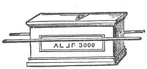
:::

Степента **Кралска арка** изглежда не е била позната на т. нар. съвременни масони дори към около 1750 година. Онази част от старите свободни зидари, които се събирали в прочутата кръчма „Ябълковото дърво“ през 1717 г. и оформили обществото върху донякъде нови принципи — а именно дотолкова, че да приемат в братство без разлика почтени лица от всички професии — били наричани от непривържениците на този план **съвременни масони**. Това събитие предизвикало разделение на Масонското общество на две партии, което продължило до 1813 година, почти сто години. Смята се, че именно на съперничеството, породено от този разкол, Масонството дължи в значителна степен голямата си известност по света.

Изглежда, че неприспособилите се към тази нова система, които се считали за ортодоксалната страна, ровейки се из старите архиви на Ордена, първи открили степента **Кралска арка**, която вероятно е лежала в забрава в продължение на векове; през което време обществото, изглежда, е било почти изцяло ограничено до оперативни зидари, които са поддържали само обредите на чирака, калфата (пътуващия зидар) и майстор-масона — тъй като те се считали за подходящи за тяхното занятие.

Обществото на масоните от Кралската арка се нарича **Капитул**, а не Ложа, както в предходните степени. Всички Капитули на масоните от Кралската арка са **„посветени на Зоровавел“**, а символичният цвят на тази степен е **аленият**. Степените **Марков майстор**, **Настоящ или почитен майстор**, и **Най-достоен майстор** се дават само под покровителството на Капитула на Кралската арка; и един майстор-масон, който кандидатства за тези степени, обикновено постъпва и в Капитула, като понякога четирите степени се дават наведнъж. Ако приеме и четирите, гласуването за него се извършва само веднъж — а именно в степента **Марков майстор**. Кандидатите, които получават тази степен, се казва, че са **„възвисени в най-възвишената степен на Кралската арка“**.

Един от принципите на степента Кралска арка е да не се помага и да не се присъства на възвисяването в тази степен на повече или по-малко от **трима кандидати едновременно**. Ако няма трима кандидати, един или двама спътници, според случая, доброволно се съгласяват да представят кандидати, за да се достигне необходимият брой, или т. нар. **„екип“**, както се нарича технически, и съпровождат кандидата или кандидатите през всички етапи на възвисяването.

При разрушаването на Йерусалим от Навуходоносор, **трима Най-достойни майстори** били отведени в плен във Вавилон, където останали седемдесет години и били освободени от Кир, цар на Персия. Те се завърнали в Йерусалим, за да помогнат при възстановяването на Храма, след като изминали пеша тежки и неравни пътища. Те пристигнали при **външната завеса на Скинията**, която била издигната близо до развалините на Храма. Тази Скиния представлявала продълговат правоъгълник, заграден с четири завеси или покривала и разделен на отделни помещения чрез четири напречни завеси, включително западната завеса или входа. Завесите били разтворени по средата и пазени от четирима стражи с извадени мечове.

В източния край на Скинията **Агей, Иисус (Иошуа) и Зоровавел** обикновено заседавали в тържествен съвет, за да изпитват всички, които желаели да бъдат наети в благородното и славно дело по възстановяването на Храма. Оттогава всеки Капитул на масоните от Кралската арка, ако е правилно устроен, представлява Скинията, издигната от нашите древни братя близо до развалините на Храма на цар Соломон; а нашата гравюра показва вътрешното разположение на Капитул на степента Кралска арка. _(Вж. фиг. 31.)_

Тези трима Най-достойни майстори, при пристигането си, били въведени пред Великия съвет, наети на работа, снабдени с инструменти и упътени да започнат труда си в **североизточния ъгъл** на развалините на стария Храм, като разчистват и отстраняват отломките, за да положат основите на новия. Великият съвет им дал и строги заповеди да запазят всичко, което попадне по пътя им (като образци на древна архитектура и пр.) и да го донесат за преглед.

Сред откритията, направени от тримата майстори, имало **тайнствен свод**, в който те намерили съкровища от голяма полза за занаята и за братството. Церемонията по възвисяването на спътници в тази степен представлява повторение на приключенията на тези трима Най-достойни майстори и именно поради това **са необходими трима кандидати** за едно посвещение.

Великият съвет се състои от **Най-достойния Първосвещеник, Царя и Свещения Писар**. Първосвещеникът е облечен в бяла роба, с нагръдник от шлифовано стъкло, състоящ се от дванадесет части, престилка и митра. Царят носи алена роба, престилка и корона. Митрата и короната обикновено са изработени от картон; понякога са правени от най-блестящи материали — златно и сребърно кадифе — но те се пазят за тържествени случаи. На митрата, с позлатени букви, на челото е изписано: **„Святост Господу“**. Писарят носи пурпурна роба, престилка и тюрбан.

Капитулът на масоните от Кралската арка се състои от **девет длъжностни лица**, както следва:

1. **Първосвещеник**, или Майстор (Иисус / Иошуа).
    
2. **Цар**, или Старши велик надзирател (Зоровавел).
    
3. **Писар**, или Младши велик надзирател (Агей).
    
4. **Капитан на воинството** (като маршал или церемониалмайстор), или Старши дякон.
    
5. **Главен странник**, който представлява Младшия дякон.
    
6. **Капитан на Кралската арка**, който представлява Главния надзирател.
    
7. **Велик майстор на Третата завеса**, или Старши надзирател.
    
8. **Велик майстор на Втората завеса**, или Младши надзирател.
    
9. **Велик майстор на Първата завеса**.
    

Освен тях обикновено присъстват още три длъжностни лица, а именно: **Секретар, Касиер и Тилър**, или страж.

След като длъжностните лица и спътниците на Капитула заемат местата си, както е показано на гравюрата (вж. фиг. 31), Първосвещеникът пристъпва към работа по следния начин:

**Първосвещеник** — Спътници, аз се готвя да отворя в това място Капитул на масоните от Кралската арка за разглеждане на дела и ви благодаря за вниманието и съдействието ви. Ако тук присъства лице, което не е спътник от Кралската арка, то се приканва да напусне залата.

След като изчака всеки чужд или брат, който не е от тази степен, да се оттегли, той дава един удар с чука, с което изправя Капитана на воинството.

**Първосвещеник** — Спътнико Капитане, коя е първата грижа на събраните масони?

:::figure
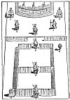
:::

1. **Касиер**
2. **Секретар**
3. **Цар**
4. **Първосвещеник**
5. **Писар**
6. **Капитан на воинството**
7. **Главен странник**
8. **Капитан на Кралската арка**
9. **Велик майстор на Третата завеса**
10. **Велик майстор на Втората завеса**
11. **Велик майстор на Първата завеса**
12. **Горящият храст**
13. **Олтарът**

**Капитанът** _(поставя дланта на дясната си ръка на челото, сякаш засенчва очите си)_ —  
Да се уверя, че Скинията е надлежно охранявана, Най-достойни.

_(За този знак вж. фиг. 36.)_

**Първосвещеникът** —  
Изпълни тази част от задълженията си и уведоми Стража, че сме на път да отворим в това място Капитул на масоните от Кралската арка за разглеждане на дела; нареди му да пази съобразно това.

Капитанът на воинството поставя Стража отвън при вратата, дава му заповедите си, затваря вратата и отвътре прави сигнал от **три пъти по три удара**  
(• • • • • • • • •),  
за да се увери, че Стражът е на поста си; Стражът отговаря с девет съответни удара. След това Капитанът дава един удар, и Стражът отговаря със същото. Капитанът се връща на мястото си.

**Капитанът (към Първосвещеника)** —  
Капитулът е надлежно охраняван, Най-достойни.

**Първосвещеникът** —  
Как е охраняван?

**Капитанът** —  
От спътник на тази степен, на външния подход, с изваден меч в ръката.

**Първосвещеникът** —  
Какво е задължението му там?

**Капитанът** —  
Да наблюдава приближаването на всички профани и подслушвачи и да не допуска да преминава или да се връща никой, освен онези, които са надлежно квалифицирани.

**Първосвещеникът** —  
Спътници, ще се облечем.

Спътниците подреждат обзавеждането на Капитула по установения ред, обличат се със съответните си бижута, одежди и отличителни знаци на тази степен и разтварят завесите, с което залата се превръща в едно помещение, след което заемат местата си. Първосвещеникът дава два удара с чука, което изправя всички длъжностни лица, след което Първосвещеникът задава следните въпроси, а Капитанът на воинството отговаря:

**Първосвещеникът** —  
Спътнико Капитане на воинството, ти масон ли си от Кралската арка?

**Капитанът** —  
Аз съм, такъв съм.

**Първосвещеникът** —  
Как да те позная като масон от Кралската арка?

**Капитанът** —  
По три пъти по три.

**Първосвещеникът** —  
Къде беше направен масон от Кралската арка?

**Капитанът** —  
В редовен и законно учреден Капитул на масоните от Кралската арка, състоящ се от Най-достойния Първосвещеник, Царя и Писаря, Капитана на воинството, Главния странник, Капитана на Кралската арка и тримата Велики майстори на завесите, събрани в зала или място, представящо Скинията, издигната от нашите древни братя близо до развалините на Храма на цар Соломон.

**Първосвещеникът** —  
Къде е мястото на Първосвещеника и какви са задълженията му?

**Капитанът** —  
Мястото му е в **Светая Светих**. Задължението му, заедно с Царя и Писаря, е да заседава във Великия съвет, да изготвя планове и да дава наставления на работниците.

**Първосвещеникът** —  
Мястото и задълженията на Царя?

**Капитанът** —  
Мястото му е отдясно на Първосвещеника; задължението му е да го подпомага със съвет и наставление, а в негово отсъствие — да председателства.

**Първосвещеникът** —  
Мястото и задълженията на Писаря?

**Капитанът** —  
Мястото му е отляво на Първосвещеника; задължението му е да подпомага него и Царя в изпълнение на техните задължения и да председателства в тяхно отсъствие.

**Първосвещеникът** —  
Мястото и задълженията на Капитана на воинството?

**Капитанът** —  
Мястото му е отпред, отдясно на Великия съвет; задължението му е да приема заповедите и да следи за тяхното точно изпълнение.

**Първосвещеникът** —  
Мястото и задълженията на Главния странник?

**Капитанът** —  
Мястото му е отпред, отляво на Великия съвет; задължението му е да води слепите по път, който не познават; да ги води по пътеки, които не са знаели; да превръща тъмнината в светлина пред тях и кривото — в право.

**Първосвещеникът** —  
Мястото и задълженията на Капитана на Кралската арка?

**Капитанът** —  
Мястото му е при вътрешната завеса, или входа към Светая Светих; задължението му е да я охранява и да не допуска никой да премине, освен онези, които са надлежно квалифицирани и притежават правилните пароли и **печатa на истината**.

**Първосвещеникът** —  
Какъв е цветът на неговото знаме?

**Капитанът** —  
Бял — и той е символ на чистотата на сърцето и правотата на поведението, които са необходими, за да се получи достъп до небесната Светая Светих.

**Първосвещеникът** —  
Местата и задълженията на тримата Велики майстори на завесите?

**Капитанът** —  
Мястото им е при входа на съответните им завеси; задължението им е да ги охраняват и да не допускат да премине никой, освен онези, които са надлежно квалифицирани и притежават съответните пароли и знаци.

**Първосвещеникът** —  
Какви са цветовете на техните знамена?

**Капитанът** —  
На третата — **алено**, което е символ на пламенност и ревност и е характерният цвят на степента Кралска арка. То ни увещава да бъдем пламенни в нашите богослужения към Бога и ревностни в усилията си да насърчаваме щастието на човеците.  
На втората — **пурпурно**, което, като се получава от правилното съчетание на синьо и алено, първото от които е характерният цвят на символичните, или първите три степени, ни учи да развиваме и усъвършенстваме духа на хармония между братята от символичните степени и спътниците от възвишените степени — дух, който винаги трябва да отличава членовете на общество, основано върху принципите на вечната истина и всеобщата човеколюбивост.  
На първата — **синьо**, особеният цвят на трите древни, или символични степени. То е символ на всеобщото приятелство и благотворителност и ни наставлява, че в ума на масона тези добродетели трябва да бъдат толкова обширни, колкото самия син свод на небето.

**Първосвещеникът** —  
Мястото и задълженията на Касиера?

**Капитанът** —  
Мястото му е отдясно, зад Капитана на воинството; задължението му е да води точен и редовен отчет за цялото имущество и средства на Капитула, поверени му, и да ги представя на Капитула при поискване.

**Първосвещеникът** —  
Мястото на Секретаря в Капитула?

**Капитанът** —  
Мястото му е отляво, зад Главния странник; задължението му е да издава заповедите и известията на висшите си длъжностни лица, да записва действията на Капитула, които следва да бъдат вписани, да приема всички дължими на Капитула суми и да ги предава на Касиера.

**Първосвещеникът** —  
Мястото и задълженията на Стража?

**Капитанът** —  
Мястото му е на външния подход към Капитула; задължението му е да пази от приближаването на профани и подслушвачи и да не допуска да преминава или да се връща никой, освен онези, които са надлежно квалифицирани.

**Първосвещеникът (към Капитула)** —  
Спътници, ще се съберете около олтара, за да ми съдействате при откриването на Капитул на масоните от Кралската арка.

Всички присъстващи членове (с изключение на Великия съвет) се приближават до олтара и, образувайки кръг, коленичат — всеки на дясното си коляно. В кръга се оставя отвор за Първосвещеника, Царя и Писаря. Първосвещеникът става и чете от Второто послание на апостол Павел към солуняните, глава III, стихове 6–18:

„А заповядваме ви, братя, в името на нашия Господ Иисус Христос, да се отдалечавате от всеки брат, който живее безредно, а не според преданието, което сте приели от нас. Защото сами знаете как трябва да ни подражавате; понеже ние не живяхме безредно между вас, нито ядохме ничий хляб даром, но с труд и усилие, денем и нощем работехме, за да не бъдем в тежест на никого от вас; не че нямаме право, но за да бъдем пример за вас, за да ни подражавате…“ и т.н.

След четенето Първосвещеникът, Царят и Писарят пристъпват към олтара и заемат местата си в кръга, коленичейки с останалите — Царят отдясно, а Писарят отляво на Първосвещеника. Всеки сега кръстосва ръцете си и подава дясната си ръка на спътника отляво и лявата си ръка на спътника отдясно. Това образува **живата арка**, под която трябва да бъде дадено **Великото всеобхватно слово на Кралската арка**, което обаче трябва да бъде дадено и **по три пъти по три**, както ще бъде обяснено по-нататък.

Първосвещеникът прошепва в ухото на Царя паролата **RABBONI**.  
Царят я прошепва на спътника отдясно, той — на следващия и така нататък, докато достигне до Писаря, който я прошепва на Първосвещеника.

**Първосвещеникът** —  
Думата е вярна.

Спътниците сега **балансират три пъти по три** с ръцете си; тоест вдигат ръцете си и ги спускат върху коленете си три пъти в съгласие — след кратка пауза още три пъти и след още една пауза още три пъти. След това стават и дават всички знаци — от Чирак до тази степен, след което се събират на групи по трима, за да дадат **Великото всеобхватно слово на Кралската арка**, както следва:

Всеки хваща с дясната си ръка дясната китка на спътника отляво и с лявата си ръка — лявата китка на спътника отдясно. След това всеки изнася десния си крак напред, с вдлъбнатината отпред, така че пръстът да докосва петата на спътника отдясно. Това се нарича **„три пъти по три“** — т.е. три десни крака, образуващи триъгълник; три леви ръце, образуващи триъгълник; и три десни ръце, образуващи триъгълник. В това положение всеки произнася следното:

> Както ние трима се съгласихме,  
> В мир, любов и единство,  
> Свещеното слово да пазим;  
> Така и ние трима се съгласяваме,  
> В мир, любов и единство,  
> Свещеното слово да търсим;  
> Докато ние трима,  
> Или трима като нас, не се съгласим  
> Да затворим тази Кралска арка.

След това те балансират три пъти по три, като привеждат дясната ръка с известна сила върху лявата. После дясната ръка се вдига над главата и думите **„Ях-бу-лун, Йехова, Б-о-г“** се произнасят с тих дъх, като всеки спътник изговаря сричките или буквите последователно, както следва:

:::figure
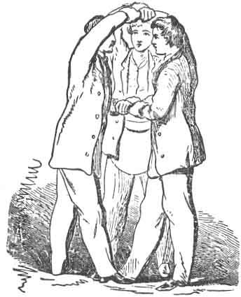
:::

**Първи:**            **Втори:**         **Трети:**  
Ях                        бу                    лун
            Ях                     бу 
лун                                               Ях
бу                        лун
Йе                       хо                     ва
            Йе                     хо
ва                                                    Йе
хо                        ва
Г                          О                        Д
            Г                        О
Д                                                      Г
О                          Д

След като думата бъде дадена по този начин, Първосвещеникът запитва дали думата е вярна.  
Всяка тройка отговаря, че е вярна.

Длъжностните лица и спътниците заемат местата си.

Първосвещеникът удря три пъти с чука си; Царят повтаря същото, както и Писарите; това се извършва три пъти  
(• • • • • • • • •).

**Първосвещеникът (изправяйки се)** —  
С настоящото обявявам този Капитул на масоните от Кралската арка за открит по надлежен и древен ред; и с това забранявам всяко неподобаващо поведение, чрез което би могъл да се наруши мирът и хармонията на този Капитул, под не по-малки наказания, отколкото уставът или мнозинството на Капитула могат да преценят за уместни.

**Първосвещеникът (към Капитана на воинството)** —  
Спътнико Капитане, моля, уведоми Стража, че Капитулът е открит.

Капитанът изпълнява това задължение, докато Секретарят чете протокола от последното заседание.

Ако има кандидати, за които предстои гласуване, това е първата работа по ред. Ако един или повече кандидати чакат отвън, Главният странник отива в подготвителната стая, за да ги подготви. Ако те не са трима, един или двама спътници доброволно се включват, за да се образува необходимата тройка, тъй като не по-малко от трима могат да извършат церемониите. Тримата свалят горните си дрехи, след което Главният странник завързва превръзки на очите им и, вземайки дълго въже, го увива седем пъти около тялото на всеки, като оставя около три фута свободни между тях.

След това ги отвежда до вратата на Капитула и дава **седем отчетливи удара**.

**Капитанът (изправяйки се)** —  
Има сигнал на вратата, Най-достойни.

**Първосвещеникът** —  
Обърни внимание на причината и виж кой идва там.

Капитанът на воинството отива до вратата и чука девет пъти. Главният странник отвън отговаря с **три пъти по три**, след което дава един удар, на който Капитанът отговаря с един и частично отваря вратата.

**Капитанът** —  
Кой идва там?

**Главният странник** —  
Трима достойни братя, които са били приети, повишени и въздигнати до възвишената степен на Майстор масон, напреднали до почетната степен Марк Майстор, председателствали като Майстори на стола и, при завършването и посвещаването на Храма, били приети и признати за Най-достойни майстори; и сега желаят по-нататъшна светлина в Масонството, като бъдат възвисени до високата и възвишена степен на Светата Кралска арка.

**Капитанът (към кандидатите)** —  
По ваша ли свободна воля и желание отправяте тази молба?

**Първият кандидат (подсказано)** —  
По своя воля.

**Капитанът (към Главния странник)** —  
Надлежно и истинно ли са подготвени?

**Главният странник** —  
Надлежно са.

**Капитанът** —  
Направили ли са подходящ напредък в предходните степени?

**Главният странник** —  
Направили са.

**Капитанът** —  
По какво по-нататъшно право или предимство очакват да получат достъп до този Капитул на масоните от Кралската арка?

**Главният странник** —  
По силата на парола.

**Капитанът** —  
Имат ли тази парола?

**Главният странник** —  
Нямат я; но аз я имам за тях.

**Капитанът** —  
Пристъпи и я дай.

Главният странник прошепва в ухото му думата **RABBONI**.

**Капитанът** —  
Думата е вярна; ще изчакате, докато Най-достойният Първосвещеник бъде уведомен за молбата им и отговорът му бъде върнат.

Капитанът на воинството затваря вратата и се връща на мястото си в Капитула, дава сигнала, на който Първосвещеникът отговаря, като задава същите въпроси и получава същите отговори от Капитана, каквито бяха зададени и дадени на вратата.

**Първосвещеникът** —  
След като това е така, ще ги допуснеш да влязат в този Капитул на масоните от Кралската арка и да бъдат приети под даваща Арка.

Капитанът на воинството отива до вратата, отваря я и казва:

**Капитанът** —  
По заповед на нашия Най-достоен Първосвещеник, кандидатите да влязат в този Капитул на масоните от Кралската арка и да бъдат приети под Жива Арка.

**Главният странник (водейки кандидатите с въжето)** —  
Спътници, следвайте ме.  
_(Въвежда ги.)_  
Ще доведа слепите по път, който не знаят; ще ги водя по пътеки, които не са познавали; ще направя тъмнината светлина пред тях и кривото — право. Това ще сторя за тях и няма да ги оставя. Наведете се ниско, братя: защото който се смирява, ще бъде възвисен.

Междувременно братята, или спътниците на Капитула, образуват две редици една срещу друга — от вратата до средата на залата — и всеки хваща и заключва пръстите си с тези на стоящия срещу него спътник. Докато кандидатите преминават под тази Жива Арка, всяка двойка поставя кокалчетата си върху вратовете и гърбовете на кандидатите, понякога притискайки ги доста силно и дори ги поваля на пода. Така те срещат значителни трудности при преминаването. След като преминат, първо биват поведени около Капитула, а след това до олтара, където трябва да коленичат, за да приемат задължението.

**Главният странник (към кандидатите)** —  
Братя, с напредването ви в Масонството вашето задължение става все по-обвързващо. Вие сега коленичите пред олтара за седми път и сте на път да приемете тържествена клетва или задължение, което, както и предишните ви задължения, не трябва да противоречи на дълга, който дължите към вашата страна или към Създателя си. Ако сте готови да продължите, ще произнесете християнското си име и фамилията си и ще повтаряте след мен:

**Аз, Питър Гейб**, по своя собствена свободна воля и съгласие, в присъствието на Всемогъщия Бог и на този Капитул на Кралските Арх Масони, издигнат в чест на Бога и посветен на Зоровавел, тук и сега най-тържествено и искрено обещавам и се заклевам, в допълнение към предишните си задължения, че няма да разкривам тайните на тази Степен на никого от по-ниска степен, нито на което и да е същество в познатия свят, освен на истински и законен Спътник Кралски Арх Масон, или в пределите на справедлив и законно учреден Капитул на такива; и никога на онзи или онези, за които само ще чуя, че са такива, а само на онзи или онези, за които след строго изпитване и надлежно изследване, или по законно дадено уверение, ще установя, че са такива.

Освен това обещавам и се заклевам, че няма да ощетя този Капитул на Кралските Арх Масони, нито спътник от тази Степен, с каквато и да е стойност, нито лично, нито ще допусна това да бъде сторено от други, ако е в моята власт да го предотвратя.

Освен това обещавам и се заклевам, че няма да разкривам ключа към неизречимите знаци на тази Степен, нито ще го задържам в свое притежание, а ще го унищожавам всеки път, когато попадне пред погледа ми.

Освен това обещавам и се заклевам, че няма да произнасям Великия Омнифичен Кралски Арх Слово, което предстои да получа, по какъвто и да е начин, освен по начина, по който ще го получа – а именно в присъствието на трима Спътници Кралски Арх Масони, като аз самият съм един от тях; и тогава – чрез три по три, под Жива Арка и с тих глас.

Освен това обещавам и се заклевам, че няма да присъствам на възвисяването на кандидати в нелегален Капитул, нито ще разговарям за тайните на тази Степен с масон, произведен по нелегален начин, или с такъв, който е бил изключен или временно отстранен, докато е под такова наказание.

Освен това обещавам и се заклевам, че няма да съдействам или присъствам при възвисяването в тази Степен на кандидат, който не е получил степените: Чирак, Калфа, Майстор Масон, Марков Майстор, Минал Майстор и Най-Отличен Майстор.

Освен това обещавам и се заклевам, че няма да присъствам при възвисяване на повече или по-малко от трима кандидати едновременно.

Освен това обещавам и се заклевам, че няма да присъствам при учредяването или откриването на Капитул на Кралските Арх Масони, освен ако не присъстват девет Кралски Арх Масони, като аз самият съм един от този брой.

Освен това обещавам и се заклевам, че няма да говоря зло за Спътник Кралски Арх Масон, нито зад гърба му, нито в лицето му, а ще го предупреждавам за всяка надвиснала опасност, ако е в моята власт.

Освен това обещавам и се заклевам, че ще подкрепям Конституцията на Генералния Велик Капитул на Кралската Арка на Съединените Американски Щати, както и тази на Великия Капитул на този Щат, под чиято власт се намира този Капитул; и че ще спазвам всички устави, правила и наредби на този Капитул или на всеки друг, на който бих могъл да стана член в бъдеще.

Освен това обещавам и се заклевам, че ще отговарям и се подчинявам на всички надлежни знаци и призовки, подадени, изпратени или хвърлени към мен от Капитул на Кралските Арх Масони или от Спътник Кралски Арх Масон, ако са в рамките на дължината на моя кабел-трос.

Освен това обещавам и се заклевам, че няма да ударя Спътник Кралски Арх Масон в гняв така, че да пролее кръв.

Освен това обещавам и се заклевам, че ще предпочитам да наемам Спътник Кралски Арх Масон пред всяко друго лице с равни качества.

Освен това обещавам и се заклевам, че ще помагам на Спътник Кралски Арх Масон, когато го видя въвлечен в каквото и да е затруднение, и ще защитавам делото му дотолкова, доколкото е възможно да го изведа от него, независимо дали е прав или неправ.

Освен това обещавам и се заклевам, че ще пазя всички тайни на Спътник Кралски Арх Масон (когато са ми поверени като такива, или когато знам, че са такива), без никакви изключения.

Освен това обещавам и се заклевам, че ще подпомагам и оказвам помощ на всички бедни и нуждаещи се Спътници Кралски Арх Масони, техните вдовици и сираци, където и да се намират по света, когато се обърнат към мен като такива, ако ги намеря достойни и ако мога да сторя това без съществена вреда за себе си или семейството си.

Всичко това тържествено и искрено обещавам и се заклевам, с твърда и непоколебима решимост да го спазвам и изпълнявам, без каквото и да е двусмислие, умствена уговорка или вътрешно заобикаляне; като се обвързвам под не по-малко наказание от това – главата ми да бъде отсечена, а мозъкът ми изложен на изгарящите лъчи на обедното слънце – ако съзнателно или умишлено наруша или престъпя която и да е част от тази моя тържествена клетва или задължение на Кралски Арх Масон.  
**Тъй да ми помага Бог и да ме укрепва в точното изпълнение на същото.**

**Главният Странник:** – Целунете Книгата седем пъти.  
(Кандидатът изпълнява.)

**Главният Странник:** – Спътници, станете и ме последвайте. Защото макар вече да сте обвързани като Кралски Арх Масони, тъй като тайните на тази Степен са от безкрайно по-голямо значение от всички предходни, необходимо е да преминете през груби и трудни пътища и да издържите много изпитания, като свидетелство за вашата вярност към Ордена, преди да бъдете наставени в по-важните тайни на тази Степен.

Кандидатите биват поведени веднъж около Капитула, след което отново са накарани да коленичат, докато Главният Странник чете следната молитва:

**Молитва**

Върховен и неизследим Архитекте на всеобщата Природа, Който с всемогъщото Си слово си призовал в битие величествената небесна арка и за наставление и наслада на Твоите разумни творения си я украсил с по-големи и по-малки светила, чрез което си възвеличил Своята сила и си направил Своята благост още по-скъпа за синовете човешки, ние смирено се прекланяме и почитаме Твоето неизказано съвършенство. Благодарим Ти, че когато човек падна от своята невинност и щастие, Ти му остави способността да разсъждава и възможността за усъвършенстване и радост. Благодарим Ти, че сред болките и неволите на настоящето ни състояние си ни запазил толкова много средства за отрада и удовлетворение, докато пътуваме по неравния път на живота; и особено Ти благодарим в този момент за институцията, като членове на която сме сега събрани, и за всички удоволствия, които сме получили чрез нея. Благодарим Ти, че малцината, събрани тук пред Теб, са били удостоени с нови подбуди и са поели нови и по-силни задължения към добродетел и святост. Нека тези задължения, о, благословени Отче, окажат пълното си въздействие върху нас. Научи ни, молим Те, на истинското благоговение към Твоето велико, могъщо и страшно Име. Вдъхни ни твърда и непоколебима решимост в нашите добродетелни стремежи. Дарувай ни благодат усърдно да изследваме Твоето слово в книгата на природата, в която задълженията на нашето високо призвание са внушени с Божествена власт. Нека тържествеността на обредите на нашата институция се отпечата дълбоко в умовете ни и да има щастливо и трайно въздействие върху живота ни! О, Ти, Който някога се яви на Твоя служител Моисей в пламък от огън сред къпинов храст, разпали, молим Те, във всяко от нашите сърца пламък на преданост към Теб, на любов един към друг и на милосърдие към цялото човечество! Нека всички Твои чудеса и могъщи дела ни изпълват със страхопочитание към Теб, а Твоята благост да ни вдъхва любов към Твоето свято Име! Нека „Святост за Господа“ бъде изписана върху всичките ни мисли, думи и дела! Нека благоуханието на благочестието непрестанно се възнася към Теб от олтара на нашите сърца и да гори ден и нощ като жертва с благоприятно ухание, угодна Тебе! И тъй като грехът е разрушил в нас първия храм на чистота и невинност, нека Твоята небесна благодат ни води и подпомага в изграждането на втори храм на обновление, и нека славата на този последен дом бъде по-голяма от славата на първия!  
**Амин. Тъй да бъде.**

**Главният Странник:** – Спътници, станете и ме последвайте.

След това той ги повежда веднъж около Капитула, като през това време чете от ритуалната книга първите шест стиха от третата глава на **Изход**:

„А Моисей пасеше стадото на тъста си Йотор, мадиамския свещеник; и заведе стадото отвъд пустинята, и стигна до Божията планина, Хорив. И Ангелът Господен му се яви в пламък от огън изсред един храст; и той погледна, и ето – храстът гореше в огън, а храстът не изгаряше.“ и т.н.

Четенето на тези стихове е така нагласено, че точно когато те свършат, кандидатите да са пристигнали пред изображение на горящия храст, поставено в един от ъглите на Капитула; тогава Главният Странник им нарежда да спрат и повдига превръзките от очите им. Един от членовете, застанал зад храста, сега олицетворява Божеството и извиква:

**Глас зад храста:** – Моисей! Моисей!

**Главният Странник** (отговаря от името на кандидатите): – Ето ме.

**Спътникът зад храста:** – Не се приближавай тук; събуй обувките си от нозете си, защото мястото, на което стоиш, е свята земя. Аз съм Бог на бащите ти – Бог на Авраам, Бог на Исаак и Бог на Яков.

Главният Странник нарежда на кандидатите да коленичат, отново покрива лицата им и казва:

– „А Моисей скри лицето си, защото се боеше да гледа Бога.“

**Главният Странник** (към кандидатите): – Станете и ме последвайте.

След това ги повежда три пъти около Капитула, като през това време чете от ритуалната книга **Втора книга Паралипоменон**, глава XXXVI, стихове 11–20:

„Седекия беше на двадесет и една години, когато се възцари, и царува единадесет години в Йерусалим. И вършеше зло пред Господа, своя Бог, и не се смири пред пророк Йеремия, който говореше от устата на Господа. И се възпротиви на цар Навуходоносор, закорави врата си и ожесточи сърцето си, за да не се обърне към Господа, Бога на Израил. Освен това всички началници на свещениците и народът престъпваха твърде много, следвайки всички мерзости на езичниците, и оскверниха дома Господен, който Той беше осветил в Йерусалим. И Господ, Бог на бащите им, пращаше към тях Своите пратеници отрано и често, защото имаше милост към народа Си и към жилището Си. Но те се подиграваха с Божиите пратеници, презираха Неговото слово и злоупотребяваха с Неговите пророци, докато гневът Господен се възпламени против народа Му, така че нямаше вече изцеление. Затова Той доведе против тях халдейския цар, който избиваше с меч младежите им в дома на светилището им и не пощади ни момък, ни девица, ни старец, ни престарял; всички ги предаде в ръката му. И всички съдове на Божия дом – големи и малки, и съкровищата на дома Господен, и съкровищата на царя и на първенците му – всичко това той отнесе във Вавилон. И изгориха Божия дом, и събориха стената на Йерусалим, и изгориха всичките му дворци с огън, и унищожиха всички негови скъпоценни съдове. А ония, които бяха избегнали от меча, той отведе пленници във Вавилон, където бяха слуги нему и на синовете му, докато се възцари царството на Персия.“

Когато Главният Странник стигне до частта от четенето, в която се споменава как халдейците избиват младежите с меч, спътниците на Капитула започват да вдигат всякакви странни и зловещи шумове – търкалят оръдейни гюлета по пода, блъскат стари мечове, викат, стенат, свирят, тропат, хвърлят пейки и т.н. Този шум продължава до края на четенето, като целта е да се изобрази обсадата и разрушението на Йерусалим. По време на това смущение тримата кандидати биват сграбчени, хвърлени на пода, вързани ръце и крака и пренесени телом в подготвителната стая, след което вратата се затваря.

След няколко минути спътниците започват да викат:

**„Ура за пленниците!“**, като повтарят това няколко пъти.

**Капитанът на Воинството** отива, отваря вратата и казва:

– Излезте! Вие сте свободни да се върнете! Защото Кир е издал своята прокламация за изграждането на втори Храм в Йерусалим.

**Главният Странник** (който е при кандидатите): – Ще прочетете ли прокламацията?

**Капитанът на Воинството** прочита първите три стиха от първата глава на **Ездра**, както следва:

„В първата година на Кир, цар на Персия, Господ подбуди духа на Кир, царя на Персия, така че той издаде прокламация по цялото си царство и я изложи и писмено, като каза:“

### **ПРОКЛАМАЦИЯ**

„Тъй казва Кир, цар на Персия: Господ, Богът на небето, ми даде всички земни царства и ми заповяда да Му съградя дом в Йерусалим, който е в Юдея. Кой от вас е от целия Му народ? Неговият Бог да бъде с него, и нека възлезе в Йерусалим, който е в Юдея, и да построи дома на Господа, Бога на Израил, Който е в Йерусалим.“

**Капитанът на Воинството:** – Какво казвате за прокламацията? Готови ли сте да възлезете в Йерусалим?

**Главният Странник** (след като се съветва с кандидатите): – Да, готови сме да възлезем, но нямаме парола, чрез която да се разпознаем от братята, когато пристигнем там. Какво да им кажем?

**Капитанът на Воинството** прочита стихове 13 и 14 от трета глава на **Изход**:

„А Моисей каза на Бога: Ето, когато отида при израилевите синове и им кажа: Богът на бащите ви ме изпрати при вас, и те ми кажат: Какво е Неговото име? – какво да им кажа?  
И Бог каза на Моисей: АЗ СЪМ ОНЗИ, КОЙТО СЪМ; и рече: Тъй ще кажеш на израилевите синове: АЗ СЪМ ме изпрати при вас.“

Бяхме упътени да използваме думите **„АЗ СЪМ ОНЗИ, КОЙТО СЪМ“** като парола.

**Главният Странник:** – Ще възлезем. Спътници, вие ще ме последвате; нашата парола е: **АЗ СЪМ ОНЗИ, КОЙТО СЪМ.**

При влизането си в Капитула те отново преминават под Живата Арка.

**Главният Странник:** – Наведете се ниско, братя. Който се смирява, ще бъде възвисен.

От едната страна на залата или Капитула Живата Арка е образувана, както беше описано по-рано; от другата страна се намира тъй нареченият „грапав път“. Той обикновено се прави от дървени трупи и блокове, стари столове, пейки и др.

Спътниците, които образуват Живата Арка, притискат кандидатите все по-силно при всяко преминаване, а сега те преминават три пъти. Докато преминават, Главният Странник казва:

**Главният Странник:** – Това е пътят, по който много велики и добродетелни мъже са преминали преди вас, без никога да смятат за унизително за своето достойнство да се изравнят с братството. Аз често съм пътувал по този път от Вавилон до Йерусалим и обикновено го намирам груб и неравен. Но мисля, че никога не съм го виждал много по-гладък, отколкото е в настоящия момент.

След като преминат под Живата Арка, кандидатите се спъват по грапавия път и отново достигат до входа на арката.

**Главният Странник:** – Спътници, пред нас има едно много трудно и опасно място, което лежи право на пътя ни. Преди да се опитаме да го преминем, трябва да коленичим и да се помолим.  
(Чете **Псалм CXII**.)

„Господи, към Теб викам; побързай към мене; дай ухо на гласа ми.  
Нека молитвата ми бъде като кадило пред Теб, и издигането на ръцете ми – като вечерна жертва.  
Постави, Господи, стража на устата ми; пази вратата на устните ми.  
Не накланяй сърцето ми към зло, да върша нечестиви дела с хора, които вършат беззаконие.  
Нека праведният ме порази – това ще бъде милост; и нека ме изобличи – това ще бъде като скъпоценно масло.  
Очите ми са към Теб, Господи Боже; на Теб се уповавам; не оставяй душата ми без закрила.  
Пази ме от примката, която ми поставиха, и от мрежите на вършителите на беззаконие.  
Нека нечестивите паднат в собствените си мрежи, а аз да се спася.“

Кандидатите стават и отново преминават под Живата Арка и по грапавия път. След това отново коленичат.

**Главният Странник:** – Нека се помолим.  
(Чете от ритуалната книга **Псалм CXLII**.)

„С гласа си извиках към Господа; с гласа си към Господа отправих молбата си,“ и т.н.

След това те обикалят за трети път, както по-рано, и кандидатите отново коленичат.

**Главният Странник** чете **Псалм CXLIII** от ритуалната книга:

„Чуй молитвата ми, Господи, дай ухо на молбите ми; в Твоята вярност ми отговори и в Твоята правда,“ и т.н.

**Главният Странник:** – Сега пристигнахме пред развалините на стария Храм, близо до външната завеса на Скинията.

Завесите сега се разтварят, за да допуснат кандидатите, но веднага щом те влязат, завесите отново се затварят и всички длъжностни лица (с изключение на Главния Странник) заемат местата си.

**Главният Странник** дава сигнал, като тропва девет пъти по пода, което извежда **Наставника на Първата Завеса**.  
(Виж Бележка O, Приложение.)

**Наставникът на Първата Завеса:** – Кой идва тук? Кой дръзва да се приближи до тази външна завеса на нашата свещена Скиния? Кои сте вие?

**Главният Странник:** – Трима изнемощели пътници от Вавилон.

**Наставникът на Първата Завеса:** – Какви са вашите намерения?

**Главният Странник:** – Дошли сме да помагаме в благородното и славно дело по възстановяването на дома Господен, без надежда за заплата или награда.  
(Виж Бележка M, Приложение.)

**Наставникът на Първата Завеса:** – По какъв начин очаквате да влезете тук?

**Главният Странник:** – Чрез парола, която получихме във Вавилон.

**Наставникът на Първата Завеса:** – Дайте ми я.

**Главният Странник:** – **АЗ СЪМ ОНЗИ, КОЙТО СЪМ.**

**Наставникът на Първата Завеса:** – Паролата е вярна. Имате моето позволение да влезете.

Кандидатите сега влизат през Първата Завеса, когато превръзките се махат от очите им.

**Наставникът на Първата Завеса:** – Вие със сигурност не бихте могли да сте стигнали дотук, ако не бяхте трима Най-Достойни Майстори; но по-нататък не можете да продължите без моите думи, знак и слово на наставление.  
Моите думи са: **Сим, Хам и Яфет**; моят знак е този (като държи тояга), по подобие на онзи, даден от Бога на Моисей, когато му заповяда да хвърли жезъла си на земята – така (хвърля тоягата), и той стана змия; но когато протегна ръката си и я хвана за опашката, тя отново стана жезъл в ръката му.  
Моето слово на наставление разяснява този знак и се намира в писанията на Моисей, а именно в първите стихове на четвърта глава на **Изход**.  
(Виж Бележка N, Приложение.)

„И Господ каза на Моисей: Какво е това в ръката ти? А той каза: Жезъл. И Господ каза: Хвърли го на земята; и той го хвърли на земята, и той стана змия, и Моисей побягна от нея,“ и т.н.

:::figure
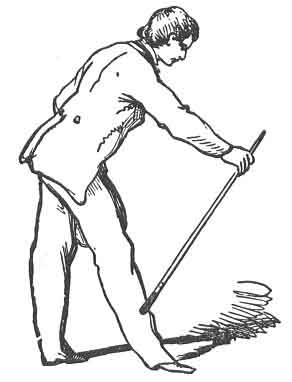
:::
**Главният Странник:** – Спътници, преминахме първата стража и ще дадем знак при Втората Завеса.  
(Тропва по пода, както по-рано.)

**Наставникът на Втората Завеса:** – Кой идва тук? Кой дръзва да се приближи до тази Втора Завеса на нашата свещена Скиния?

**Главният Странник:** – Трима уморени странници от Вавилон, които са дошли да помагат при възстановяването на дома Господен, без надежда за заплата или награда.

**Наставникът на Втората Завеса:** – По какъв начин очаквате да влезете през Втората Завеса?

**Главният Странник:** – Чрез думите, знака и словото на наставление на Наставника на Първата Завеса.

**Наставникът на Втората Завеса:** – Дайте ги.

**Главният Странник:** – **Сим, Хам и Яфет.**  
(Дава знака, като хвърля тояга и я вдига от края, както беше обяснено по-рано.)

**Наставникът на Втората Завеса:** – Те са верни. Имате моето позволение да влезете през Втората Завеса.

Кандидатите, водени от Главния Странник, влизат.

:::figure
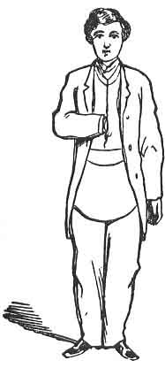
:::

:::figure
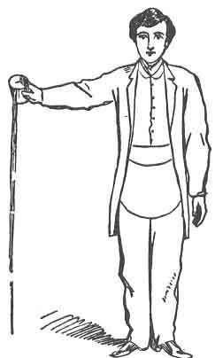
:::

**Наставникът на Втората Завеса:** – Трима Най-Достойни Майстори трябва да сте били, иначе дотук не бихте могли да стигнете; но по-нататък не можете да продължите без моите думи, знак и слово на наставление.  
Моите думи са: **Сим, Яфет и Адонирам**; моят знак е този:  
(пъха ръката си в пазвата) – по подобие на онзи, даден от Бога на Моисей, когато Той му заповяда да пъхне ръката си в пазвата си, и когато я извади, тя стана прокажена, бяла като сняг.  
Моето слово на наставление разяснява този знак и се намира в писанията на Моисей, а именно в четвърта глава на **Изход**:

„И Господ каза на Моисей: Пъхни сега ръката си в пазвата си. И той пъхна ръката си в пазвата си; и когато я извади, ето, ръката му беше прокажена, бяла като сняг,“ и т.н.

---

**Главният Странник:** – Спътници, ще продължим напред и ще дадем знак при Третата Завеса.  
(Тропва девет пъти.)

**Наставникът на Третата Завеса:** – Кой идва тук? Кой дръзва да се приближи до тази Трета Завеса на нашата свещена Скиния?

**Главният Странник:** – Трима уморени странници от Вавилон, които са дошли да помагат при възстановяването на дома Господен, без надежда за заплата или награда.

**Наставникът на Третата Завеса:** – По какъв начин очаквате да влезете?

**Главният Странник:** – Чрез думите, знака и словото на наставление на Наставника на Втората Завеса.

**Наставникът на Третата Завеса:** – Дайте ги.

**Главният Странник:** – **Сим, Яфет и Адонирам.**  
(Пъха ръката си в пазвата, както направи Наставникът на Втората Завеса.)

**Наставникът на Третата Завеса:** – Те са верни. Можете да влезете през Третата Завеса.

Кандидатите влизат.

---

**Наставникът на Третата Завеса (към кандидатите):** – Трима Най-Достойни Майстори трябва да сте били, иначе дотук не бихте могли да стигнете. Но по-нататък не можете да продължите без моите думи, знак и слово на наставление.  
Моите думи са: **Агей, Иисус и Зоровавел**.  
Моят знак е този:  
(държи чаша с вода и излива малко на пода) – по подобие на онзи, даден от Бога на Моисей, когато му заповяда да излее вода върху сухата земя и тя стана кръв.  
Моето слово на наставление разяснява този знак и се намира в писанията на Моисей, а именно в четвърта глава на **Изход**:

„И ще стане, ако не повярват на първите два знака, да вземеш вода от реката и да я излееш на сухата земя; и водата ще стане кръв върху сухата земя.“

**Наставникът на Третата Завеса:** – Представям ви също **Печатa на Истината**, който е този на Зоровавел.  
(Поднася триъгълно парче метал, с гравирано името **ЗОРОВАВЕЛ**.)

---

**Главният Странник (към кандидатите):** – Спътници, вече преминахме Третата Завеса; нека дадем знак при Четвъртата.  
(Тропва, както преди.)

**Капитанът на Кралския Арх:** – Кой идва тук? Кой дръзва да се приближи до Четвъртата Завеса на нашата свещена Скиния, където кадилото гори ден и нощ върху светия олтар? Кои сте вие и какви са намеренията ви?

**Главният Странник:** – Трима уморени странници от Вавилон, които са стигнали дотук, за да помагат и съдействат в благородното и славно дело по възстановяването на дома Господен, без надежда за заплата или награда.

**Капитанът на Кралския Арх:** – По какъв начин очаквате да влезете през тази Четвърта Завеса на нашата свещена Скиния?

**Главният Странник:** – Чрез думите, знака и словото на наставление на Наставника на Третата Завеса.

**Капитанът на Кралския Арх:** – Дайте ги.

**Главният Странник:** – **Агей, Иисус и Зоровавел.**  
(Излива малко вода от чаша или съд на пода – за знака.)

**Капитанът на Кралския Арх:** – Те са верни. Имате моето позволение да влезете през Четвъртата Завеса.

---

Завесите сега се разтварят и кандидатите влизат сред ослепителна светлина, и виждат **Първосвещеника, Царя и Писаря**, седящи в Велик Съвет. Светлината обикновено се създава чрез запалване на камфора в урна върху олтара.

**Капитанът на Кралския Арх:** – Трима Най-Достойни Майстори трябва да сте били, иначе дотук не бихте могли да стигнете. Ще ви представя на Великия Съвет.  
(Тропва девет пъти.)

**Първосвещеникът:** – Кой идва тук?

**Главният Странник:** – Трима уморени странници от Вавилон, които са стигнали дотук, за да помагат и съдействат при възстановяването на дома Господен, без надежда за заплата или награда.

**Първосвещеникът:** – Имате ли печата на Зоровавел?

**Главният Странник:** – Имаме го.  
(Поднася печата, даден му от Наставника на Третата Завеса.)

**Първосвещеникът** го взема и чете от втора глава на **книгата на Агей**:

„В онзи ден ще те взема, о Зоровавеле, слуго Мой, сине на Салатиил, казва Господ, и ще те направя като печат, защото теб избрах.“

**Първосвещеникът (към Царя, показвайки му печата):** – Спътнико, удовлетворен ли си, че това е печатът на Зоровавел?

**Царят** (взема печата и го оглежда внимателно): – Удовлетворен съм, Най-Достойни, че е така.

**Първосвещеникът (показвайки печата на Писаря):** – Спътнико Писарю, мислиш ли, че това е истинският печат на Зоровавел?

**Писарят** (оглеждайки го проницателно): – Удовлетворен съм, че е така, Най-Достойни.

**Първосвещеникът** (прокарва печата по челото си, по подобие на наказанието – виж Фиг. 36): – **Печат на Истината и Святост Господу!**

Царят и Писарят, всеки по ред, поставят ръка на челото си, повтаряйки: – **Святост Господу.**

**Първосвещеникът (към кандидатите):** – Мнението на Великия Съвет е, че сте представили истинския печат на Зоровавел. Но поради трудности, възникнали от допускането на чужденци сред работниците, никому не се позволява да участва в благородното и славно дело, освен истинските потомци на дванадесетте племена. Нужно е да бъдете особено точни при проследяването на родословието си. Кои сте вие и какви са намеренията ви?

**Главният Странник:** – Ние сме ваши сродници, потомци на онези благородни семейства на гиблимитите, които работиха тъй усърдно при строежа на първия Храм. Бяхме редовно посветени като Чираци, преминахме в степента Калфа, бяхме въздигнати в възвишената степен Майстор Масон, напреднахме до почетната степен Марк Майстор, председателствахме като Майстори в стола и при завършването и освещаването на Храма бяхме признати за Най-Достойни Майстори. Присъствахме при разрушаването му от Навуходоносор и от него бяхме отведени в плен във Вавилон, където останахме негови слуги и на неговите наследници до царуването на Кир, цар на Персия, чрез чиято прокламация бяхме освободени, и сме дошли дотук, за да помагаме и съдействаме в благородното и славно дело по възстановяването на дома Господен, без надежда за заплата или награда.

**Първосвещеникът:** – Нека пленниците бъдат развързани и доведени на светлина. Спътнико Царю, мисля, че е добре да наемем тези странници. Те изглеждат добри и корави мъже – тъкмо такива, каквито са ни нужни при строежа. Какво ще кажеш?

**Царят:** – Моето мнение, Най-Достойни, е, че те са много опитни работници. Желая да бъдат изпитани.

**Първосвещеникът:** – Какво е вашето мнение, Спътнико Писарю?

**Писарят:** – Ако могат да ни удовлетворят, че са Свободни зидари, ще бъда за това незабавно да бъдат наети.

**Първосвещеникът:** – Казвате, че сте Чираци. Удовлетворете Великия Съвет.

Тримата кандидати дават знаците на степента **Чирак**.  
(Виж фиг. 1 и 2, стр. 17–18.)

**Първосвещеникът (към Царя и Писаря):** – Спътници, удовлетворени ли сте?

Царят се покланя благородно, а Писарят отговаря:  
– Удовлетворени сме, Най-Достойни.

**Първосвещеникът (към кандидатите):** – Великият Съвет е удовлетворен, че сте Чираци. Били ли сте напреднати в степента **Калфа**?

Кандидатите дават знаците на степента **Калфа**  
(виж фиг. 3 и 4, стр. 17),  
след което Първосвещеникът, както и преди, пита членовете на Великия Съвет дали са удовлетворени и след това уведомява кандидатите, че Великият Съвет ги признава за истински Калфи и т.н.

По същия начин се задават същите въпроси и се дават същите отговори за всяка степен, чак до и включително степента **Най-Достоен Майстор**, като кандидатите дават всички знаци на тези степени подробно пред Великия Съвет.

**Първосвещеникът** (след съвещание с Царя и Писаря): – Спътници, удовлетворени сме, че сте трима достойни **Най-Достойни Майстори**. Като такива ще ви наемем за работа по Храма. Коя част от делото ще поемете?

**Главният Странник:** – Ще приемем всяка служба, колкото и подчинена или опасна да е тя, заради напредването на това велико и благородно начинание.

**Първосвещеникът (към Капитана на Кралския Арх):** – Ще ги снабдите с работните инструменти и ще ги насочите да отидат в североизточния ъгъл на развалините на стария Храм, с нареждане да разчистват отломките, като подготовка за полагането на основите на новия Храм. Наставлявайте ги внимателно да запазват всичко, което може да бъде полезно за Занаята и което им се изпречи по пътя, и да го донасят пред Великия Съвет.

Кандидатите получават инструментите: единият – **кирка**, другият – **лост**, а третият – **лопата**, които обикновено са направени от дърво и се пазят за тази цел в Ложата или Капитула.

:::figure
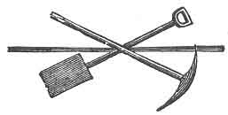
:::

**Главният Странник (към кандидатите):** – Следвайте ме.

Всеки кандидат поема на рамо своя работен инструмент и следва Главния Странник, в една редица, към ъгъл на залата, където са разпръснати множество каменни блокове или тухли. Те ги разместват леко, когато попадат на железен пръстен в капак на люк. Те го повдигат и откриват, че той е оформен като **ключов камък на арка**. Всеки от тях го оглежда внимателно, след което наднича надолу в отвора. Главният Странник предлага той незабавно да бъде отнесен пред Великия Съвет. След това той отвежда кандидатите обратно.

**Първосвещеникът:** – Спътнико Царю, имате ли още дела за разглеждане от този Велик Съвет?

**Царят:** – Нямам нищо, Най-Достойни.

**Първосвещеникът (към Писаря):** – Имате ли нещо, достойни Спътнико?

**Писарят:** – Не зная за нищо, Най-Достойни.

**Първосвещеникът:** – И аз не зная за нищо, освен ако работниците от развалините не носят нещо за разглеждане. Работниците да пристъпят напред и да дадат отчет за своите трудове.

**Главният Странник:** – Най-Достойни, в изпълнение на нарежданията на този Велик Съвет, ние отидохме при развалините и започнахме нашия труд. След като работихме няколко дни, открихме нещо, което приличаше на скала, но когато го ударихме с лоста, то издаде кух звук. При по-внимателен оглед открихме в него железен пръстен, с чиято помощ успяхме да го извадим от мястото му и установихме, че това е **ключовият камък на арка**, а през отвора под него се виждаше огромен сводест подземен свод, изкусно изграден. Донесохме този ключов камък, за да бъде прегледан от Великия Съвет.

**Първосвещеникът:** – Представете го.

Главният Странник поднася ключовия камък.

**Първосвещеникът** (вглеждайки се внимателно в него): – Спътнико Царю, това е наистина много ценно откритие. То несъмнено е **ключов камък на Марк Майстор**.

**Царят:** – Смятам, че това е камъкът, изработен от нашия Велик Майстор **Хирам Абиф**.

**Първосвещеникът:** – Какво мислите за него, Спътнико Писарю?

**Писарят:** – Несъмнено това е камъкът, изработен от нашия Велик Майстор Хирам Абиф.

**Първосвещеникът** (прекарвайки ключовия камък по челото си и давайки знака): – **Ключовият камък на Марк Майстор! Светост Господу!**

Царят и Писарят правят същото и изричат същите думи.

**Първосвещеникът (към кандидатите):** – Това е изключително ценно откритие. Без съмнение то ще ни отведе към някакво важно съкровище с неизмерима стойност за Занаята. Готови ли сте да продължите трудовете си и да се опитате да проникнете в този таен свод?

**Главният Странник** (след съвещание с кандидатите): – Готови сме, дори с риск за живота си.

**Първосвещеникът:** – Вървете; и нека Богът на вашите отци бъде с вас. Пазете всичко, което срещнете по пътя си.

Главният Странник отвежда кандидатите обратно на мястото, където е бил повдигнат капакът, и те се съвещават кой да слезе в свода. Един от кандидатите се съгласява и около тялото му се навива въже **седем пъти**, като се оставят два дълги края.

**Главният Странник (към кандидата, който ще слиза):** – Спътнико, необходимо е да вземеш малка предпазна мярка. Ако пожелаеш да слезеш още по-надолу, дръпни въжето в лявата си ръка; ако пожелаеш да се изкачиш, дръпни това в дясната.

Двама спътници хващат краищата на въжето и спускат кандидата осем или десет фута надолу, до друг люк, където той открива **три малки изпитателни квадрата**; подава знак за изкачване и е изтеглен нагоре.

Всеки кандидат взема по един квадрат и те се отправят към Великия Съвет. Когато се явяват пред него, Първосвещеникът чете следния откъс от четвърта глава на пророк Захария:

> „Това е словото Господне към Зоровавел, казвайки:  
> Не чрез сила, нито чрез мощ, но чрез Моя Дух.  
> Кой си ти, голяма планина? Пред Зоровавел ще станеш равнина,  
> и той ще изнесе главния камък с възгласи:  
> Благодат, благодат над него!  
> … Ръцете на Зоровавел положиха основите на този дом,  
> и ръцете му ще го завършат…“

**Първосвещеникът (към Царя):** – Спътнико, имате ли още дела за разглеждане от Великия Съвет?

**Царят:** – Нямам нищо, Най-Достойни.

**Първосвещеникът (към Писаря):** – Имате ли нещо, достойни Спътнико?

**Писарят:** – Нищо, Най-Достойни.

**Първосвещеникът:** – И аз не зная за нищо, освен ако работниците от развалините не носят нещо за нашия преглед.

**Главният Странник:** – Прегледахме тайния свод, Най-Достойни, и ето какво открихме в него.  
(Поднася трите изпитателни квадрата.)

**Първосвещеникът** (прекарвайки един от квадратите по челото си): –  
**Скъпоценностите на нашите древни Велики Майстори – цар Соломон, Хирам, царят на Тир, и Хирам Абиф! Светост Господу!**

Царят и Писарят всеки вземат по един и подражават на Първосвещеника.

**Първосвещеникът (към кандидатите):** – Желаете ли да продължите трудовете си и още по-дълбоко да проникнете в този таен свод?

**Главният Странник:** – Желанието ни е същото – дори с риск за живота си.

**Първосвещеникът:** – Вървете; и нека Богът на вашите отци бъде с вас; и помнете, че трудовете ви няма да останат невъзнаградени.

Главният Странник отново отвежда кандидатите, както преди, и увива въжето около един от тях, който е спуснат още по-дълбоко в свода. Там той открива **Ковчега**, подава знака и е изтеглен нагоре.

Групата незабавно се връща пред Великия Съвет, двама от тях носят Ковчега. Първосвещеникът им нарежда да пристъпят напред и да дадат отчет за своите трудове.

**Главният Странник:** – Най-Достойни, в изпълнение на вашите заповеди, ние отидохме в тайния свод и спуснахме един от нашите спътници. Слънцето по това време беше в своя зенит и лъчите му му позволиха да открие малък ковчег или сандък, поставен върху постамент, изкусно изработен и обкован със злато. При вида му ръката му неволно се издигна в това положение  
(дава се знакът, фиг. 36),  
за да предпази очите си от силната светлина и жега, отразени от него. Въздухът стана задушлив и той даде знак за изкачване и беше незабавно изтеглен. Донесохме този ковчег за разглеждане от Великия Съвет.

**Първосвещеникът** (с изненада, гледайки Ковчега): – Спътнико Царю, това е **Ковчегът на Завета Божи**.

**Царят:** – Без съмнение това е истинският Ковчег на Завета, Най-Достойни.

**Писарят:** – И аз съм на същото мнение.

**Първосвещеникът** (взема Ковчега): – Да го отворим и да видим какво ценно съкровище съдържа.  
(Отваря Ковчега и изважда книга.)

**Първосвещеникът (към Царя):** – Спътнико, тук има много древна книга; каква ли е тя? Нека прочетем от нея.  
(Чете първите три стиха от първа глава на Битие.)

След това Първосвещеникът разгръща Второзаконие, гл. 31, и чете стихове 24–26, а после се връща към **Изход, гл. 25**, и чете **стих 21**.

:::figure
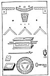
:::

1. Ключовият камък. 
2. Трите скъпоценности на древните Велики Майстори.  
3. Ковчегът.  
4. Книгата на Закона.  
5. Съдът с манна.  
6. Жезълът на Аарон.  
7. Ключът.  
8. Великото всеобхватно Слово.

> „И да поставиш очистилището отгоре върху Ковчега; а в Ковчега да поставиш свидетелството, което ще ти дам.“

**Първосвещеникът:** – Това е **Книга на Закона** – отдавна изгубена, но сега намерена. **Светост Господу!**  
(Повтаря това още два пъти.)

**Царят:** – Книга на Закона – отдавна изгубена, но сега намерена. **Светост Господу!**

Писарят повтаря същото.

**Първосвещеникът (към кандидатите):** – Сега виждате, че светът е задължен на Масонството за съхраняването на този свещен том. Ако не беше мъдростта и предпазливостта на нашите древни братя, тази – единствената останала – книга на Закона би била унищожена при разрушаването на Йерусалим.

**Първосвещеникът** (изваждайки малък съд от Ковчега): – Спътнико Царю, какво ли е това? Съд с манна? Нека прочетем в Книгата на Закона и да видим какво казва тя.  
(Чете Изход 16:32–34.)

> „И Мойсей рече: Това е, което Господ заповяда: Напълнете гомор с манна, за да се пази за поколенията ви, за да видят хляба, с който ви храних в пустинята, когато ви изведох от египетската земя.  
> И Мойсей рече на Аарон: Вземи съд и сложи в него гомор, пълен с манна, и го положи пред Господа, за да се пази за поколенията ви. Както Господ заповяда на Мойсей, така Аарон го положи пред свидетелството, за да се пази за знак.“

**Първосвещеникът:** – **Съд с манна! Светост Господу!**

**Царят:** – Съд с манна! Светост Господу!

Писарят повтаря същото.

**Първосвещеникът:** – Спътници, в Книгата на Закона четем, че „на онзи, който победи, ще дам да яде от скритата манна“. Пристъпете напред, спътници – вие имате право на нея.  
(На всеки се дава малко парче захар.)  
Но как е била положена тук, не можем сега да кажем подробно. Трябва да напреднете по-високо в Масонството, преди да можете да узнаете това.

Първосвещеникът отново поглежда в Ковчега и намира **жезъл с пъпки**, който показва на Царя и Писаря. След съвещание те решават, че това е **Жезълът на Аарон**, и този факт се провъзгласява по същия начин, както откриването на манната.

След това Първосвещеникът чете следния откъс, Числа 17:10:

> „И Господ рече на Мойсей: Върни жезъла на Аарон пред свидетелството, за да се пази за знак.“

И също от Евреи 9:2–5:

> „Защото беше направена скиния: първата, в която бяха светилникът, трапезата и присъствените хлябове, която се нарича Светилище;  
> а след втората завеса – скинията, наречена Светая Светих;  
> която имаше златна кадилница и Ковчега на завета, обкован отвсякъде със злато, в който бяха златният съд с манна, жезълът на Аарон, който разцъфна, и плочите на завета;  
> а над него – херувимите на славата, които засенчваха очистилището; за които не можем сега да говорим подробно.“

Отново поглеждайки в Ковчега, Първосвещеникът изважда **четири листа хартия**, които оглежда внимателно, съвещава се с Царя и Писаря и след това ги съединява така, че да образуват **ключ към неизразимите знаци на тази Степен**:

:::figure
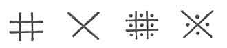
:::

Ключът към неизразимите знаци, или **Шифърът на Кралската Арка**, споменат по-горе, се състои от **прави ъгли**, разположени в различни положения, с добавянето на **точка**. Чрез разместване те образуват **двадесет и шест отделни знака**, съответстващи на **двадесет и шестте букви на английската азбука**.

Съществуват **два начина** за комбиниране на тези знаци при тайна кореспонденция.

**Първият начин** е да се нарече 
първият знак **a**,
:figure 
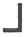
:::
вторият – **b**,
:::figure
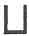
третият – **c**,  
:::figure
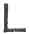
и така нататък, като се чете **отляво надясно**.
:::figure
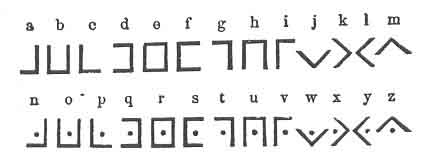
:::

**Вторият начин** за четене на азбуката е следният:  
:::figure
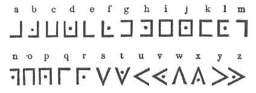
:::

**Горният ляв ъгъл без точка** означава **a**;  
**същият с точка** означава **b**, и т.н.

След това **Първосвещеникът** чете Изход 6:2–3:

> „И Бог говори на Мойсей и му рече: Аз съм Господ;  
> и се явявах на Авраам, на Исаак и на Яков като Бог Всемогъщ;  
> но с името Си Йехова не бях познат на тях.“

След като разглежда Ключа, той пристъпва към прочитане, с негова помощ, на знаците, изписани **по четирите страни на Ковчега**.

**Първосвещеникът** (чете първата страна):  
– Положен в годината три хиляди.

**Втора страна:**  
– От Соломон, цар на Израил.

**Трета страна:**  
– Хирам, цар на Тир, и Хирам Абиф.

**Четвърта страна:**  
– За благото на Масонството като цяло, а на юдейския народ в частност.

**Първосвещеникът (към кандидатите):**  
– Спътници, тук има **три тайнствени думи**, разположени в **триъгълна форма** върху Ковчега, които при първоначалното им откриване бяха покрити с **три квадрата** – скъпоценностите на нашите **три древни Велики Майстори**; и поради това обстоятелство ние предположихме, че това е **отдавна изгубеното Слово на Майстор Масона**.  
И когато приложихме нашия Ключ към тях, се уверихме, че подозренията ни са били основателни.

Това е **Името на Божеството на три езика**, а именно: **халдейски, еврейски и сирийски**, което представлява **отдавна изгубеното Слово на Майстор Масона**, или **Логос**, и което сега се е превърнало във **Великото Омнифично Слово на Кралската Арка**.

Това е **божественият Логос**, или **Словото**, за което се говори в Евангелието от Йоан (1:1–5):

> „В началото бе Словото (Логосът), и Словото беше у Бога, и Словото беше Бог.  
> То беше в началото у Бога.  
> Всичко чрез Него стана, и без Него не стана нищо от това, което е станало.  
> В Него беше животът, и животът беше светлината на човеците.  
> И светлината свети в тъмнината, а тъмнината я не обзе.“

Това Слово в древността е било изписвано **единствено с тези свещени знаци** и така е било съхранявано от едно поколение на друго.  
То било изгубено при смъртта на **Хирам Абиф**, било намерено отново при строежа на Храма и сега ще бъде предадено на вас; и вие ще **помните начина**, по който го получавате, и че сте се **заклели никога да не го предавате на други**, освен **по този определен начин**.

Кандидатите, наставлявани от **Главния Пътник**, сега научават **Великото Омнифично Слово на Кралската Арка**, както следва:

Всеки хваща с **дясната си ръка дясната китка** на своя спътник отляво, а с **лявата си ръка хваща лявата китка** на спътника си отдясно. След това всеки поставя **десния си крак напред**, така че вдлъбнатината отпред да допира петата на спътника му отдясно.

Това се нарича **„три по три“**; тоест:  
– три десни стъпала, образуващи триъгълник;  
– три леви ръце, образуващи триъгълник;  
– три десни ръце, образуващи триъгълник.

Те се уравновесяват по същия начин и след това, с вдигнати ръце, **произнасят на тих глас думите**:  
**Ях-бух-лун, Йехова, Бог**,  
както е описано по-рано. (Вж. стр. 224–225, фиг. 32.)

:::figure

:::

:::figure
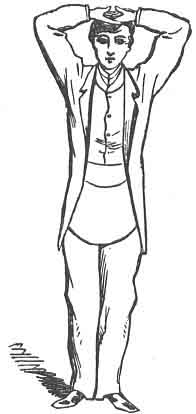
:::
### **Знаци на тази Степен**

Знаците на тази Степен сега се предават на кандидатите, както следва:

**Първо:** вдигнете дясната ръка до челото, като ръката и предмишницата са хоризонтални, а палецът е насочен към челото; плъзнете я бързо напречно по челото и я спуснете перпендикулярно надолу край тялото.  
Това съставлява **дюгардата и знака на тази Степен** и се отнася не само до наказанието на задължението, но също така напомня за начина, по който братът, слязъл във свода и открил Ковчега, е намерил ръцете си **неволно поставени**, за да предпазят главата му от лъчите на слънцето в неговия зенит. (Вж. фиг. 36.)

Този знак трябва да се дава на **Първосвещеника** при **влизане и излизане от Глава**.

**Първосвещеникът** (поставяйки корони върху главите на кандидатите):  
– Спътници, сега вие сте **въведени във всички важни тайни на тази Степен**, и сте **короновани и приети като достойни Спътници Масони от Кралската Арка**.

След това Първосвещеникът прочита от книга **поучението на тази Степен**, като ги осведомява, че тя дължи своя произход на **Зоровавел и неговите сподвижници**, които възстановили Храма по заповед на **Кир, цар на Персия**.  
Той също така ги уведомява, че **откриването на тайния свод и безценните съкровища**, заедно с **отдавна изгубеното Слово**, действително се е случило по начина, представен при посвещаването в тази Степен, и че **това обстоятелство е основата**, върху която тя главно се гради.

Посвещението приключва, и Първосвещеникът започва **заключителната лекция**, която представлява повторение, под формата на въпроси и отговори, на **откриването на Глава** и **възвишаването на спътник в тази Степен**. Тя започва така:

**Първосвещеникът** (към Капитана на Войската):  
– Ти Масон от Кралската Арка ли си?

**Капитанът:**  
– Аз съм Онзи, Който Съм.

**Първосвещеникът:**  
– По какво ще те позная като Масон от Кралската Арка?

**Капитанът на Войската:**  
– По три по три.

**Първосвещеникът:**  
– Къде бе направен Масон от Кралската Арка?

**Капитанът на Войската:**  
– В справедливо и законно устроена Глава на Масони от Кралската Арка, състояща се от **Най-достоен Първосвещеник, Цар и Писар, Капитан на Войската, Главен Пътник, Капитан на Кралската Арка и тримата Велики Майстори на Завесите**, събрани в помещение или място, представящо **Скинията**, издигната от нашите древни братя близо до развалините на Храма на цар Соломон.

Първосвещеникът продължава с въпроси относно **положението и задълженията на всеки офицер на Главата**, както и всички подробности, свързани с нейното устройство, посвещаването или възвишаването на кандидати и т.н.  
Капитанът на Войската възпроизвежда и описва **цялото точно така**, както вече е изложено. Тези заключителни лекции имат за цел да **усъвършенстват членовете в пълното разбиране на всяка Степен**.

След лекцията Главата се закрива **по същия начин, както при откриването**, до въздигането на **Живата Арка**. Спътниците се хващат за ръце по трима, по същия начин, и в един глас произнасят:

> **Както трима се съгласихме**  
> **Свещеното Слово да пазим —**  
> **Както трима се съгласихме**  
> **Свещеното Слово да търсим;**  
> **Тъй и трима се съгласяваме**  
> **Тази Кралска Арка да закрием.**

След това се разделят и Първосвещеникът прочита следната молитва:

> „По мъдростта на Върховния Първосвещеник да бъдем направлявани,  
> по Неговата сила да бъдем укрепвани  
> и по красотата на добродетелта да бъдем подтиквани  
> да изпълняваме задълженията, тук възложени върху нас,  
> да пазим неприкосновени тайнствата, тук разкрити пред нас,  
> и неизменно да практикуваме всички онези дългове извън Главата,  
> които са внушени в нея.“

**Спътниците:**  
– Така да бъде. Амин.

**Първосвещеникът:**  
– Сега обявявам тази Глава на Масоните от Кралската Арка за **закрита**.

---

Обикновено масонските автори признават, че **древното Масонство завършва с Кралската Арка**. В издание на _„Илюстрации на Масонството“_ от г-н Престън, публикувано в Лондон през 1829 г., редакторът г-н Оливър отбелязва:

> „Всички степени отвъд Кралската Арка следва внимателно да бъдат отделени от истинското Масонство, тъй като те са предимно основани на неясни и несигурни предания, които не притежават дори сянка от авторитет, за да заслужат нашето внимание.“

Допълнителните степени, включително и онези, считани за законни, наброяват **повече от петдесет**. Те са основани отчасти на **астрономически принципи**, съответстващи на древното поклонение на египтяните, и отчасти на **еврейски и християнски учения**.

Може общо да се отбележи, че много от **рицарските степени** са основани върху **християнските рицарства**, възникнали по времето на Кръстоносните походи през XII век, и че техните церемонии са подражание на тези суеверни учреждения. Бивш Велик Първосвещеник на Главите в щата Ню Йорк ме увери, че е посветил френски джентълмен в Степента на **Рицар на Малта**, който му заявил, че е член на древния орден със същото име и че церемониите са **много сходни**.

По времето, когато тези древни рицарства били създадени,  
„**суеверието се намесвало във всяко обществено и лично действие на живота; в светите войни то освещавало занятието на оръжието; а рицарският орден бил приравнен по своите права и привилегии със свещените духовни ордени. Къпелът и бялата дреха на новака били непристойно подражание на възраждането чрез кръщение; неговият меч, който той принасял на олтара, бил благославян от служителите на религията; тържественото му приемане било предшествано от пости и бдения; и той бил произведен в рицар в името на Бога, на свети Георги и на свети Михаил архангел**.“  
— _Енциклопедия на Рийс_

**Емблемата на Степента на Кралската Арка** се нарича **Тройният Тау** и представлява фигура, съставена от **три тау-кръста**. Тя е приета в **Чикаго през 1859 г.** от **Великата Генерална Глава на Съединените щати** и се носи **отпечатана върху всички престилки** на Степента на Кралската Арка.

##  **ГРАДЕЖ НА КРАЛСКАТА АРКА** 
### **ПЪРВИ РАЗДЕЛ**

**Въпрос.** Ти Масон от Кралската Арка ли си?  
**Отговор.** Аз съм Онзи, Който Съм.

**В.** По какво ще те позная, че си Масон от Кралската Арка?  
**О.** По три по три.

**В.** Къде бе възвишен в най-възвишената Степен на Масон от Кралската Арка?  
**О.** В редовно и надлежно устроена Глава на Масони от Кралската Арка, събрана на място, представящо Скиния, издигната от нашите древни братя близо до развалините на Храма на цар Соломон.

**В.** Колко души съставляват една Глава на Масоните от Кралската Арка?  
**О.** Девет редовни Масони от Кралската Арка — състоящи се от **Най-достоен Първосвещеник, Достоен Цар и Писар, Капитан на Войската, Главен Пътник, Капитан на Кралската Арка и трима Майстори на Завесите**.

**В.** Кого представят първите трима?  
**О.** Онези от нашите древни братя, които образували първия Най-велик Съвет в Йерусалим и провеждали своите събрания в Скиния.

**В.** Кого представят последните трима?  
**О.** Онези от нашите древни братя, които направлявали и извадили на светлина главните тайни на тази Степен, след като те били погребани в мрак от смъртта на нашия Велик Майстор Хирам Абиф до издигането на втория Храм, и които, като награда за своята ревност, твърдост и привързаност към Масонството, били възвишени, за да станат **трима Велики Майстори на Завесите**.

**В.** Колко бяха завесите?  
**О.** Четири.

**В.** Какви бяха техните цветове?  
**О.** Син, пурпурен, ален и бял.

**В.** Какво означава синият цвят?  
**О.** Приятелство, и той е главният цвят на Степента на Майстор Масон.

**В.** Какво означава пурпурният цвят?  
**О.** Тъй като е съставен от синьо и алено, той се поставя пред първата и третата завеса, за да обозначи тясната връзка между тази най-възвишена Степен и древното Занаятчийско Масонство.

**В.** Какво означава аленият цвят?  
**О.** Онази пламенност и ревност, които трябва да вдъхновяват всички Масони от Кралската Арка, и той е характерният цвят на тази Степен.

**В.** Какво означава белият цвят?  
**О.** Онази чистота на живота и правота на поведението, които трябва да ръководят всички, търсещи допускане до онова **Sanctum Sanctorum**, или **Светая Светих**.

**В.** Към какво се отнасят четирите завеси?  
**О.** Към четирите племена на синовете Израилеви, които носели знамената през пустинята, а именно: **Юда, Рувим, Ефрем и Дан**, емблематично представени чрез **силата на Лъва, разума на Човека, търпението на Вола и бързината на Орела**.

**В.** Къде бяха поставени завесите?  
**О.** Във външните дворове на Скинията.

**В.** Защо именно там?  
**О.** За да служат като покривало за Скинията и като постове за стражите.

**В.** Защо там бяха поставени стражи?  
**О.** За да полагат особена грижа никой да не преминава или да се завръща, освен онези, които са надлежно подготвени; тъй като никому не бе позволено да влезе в присъствието на **Най-достойния Първосвещеник, Достойния Цар и Писаря**, освен на истинските потомци на **дванадесетте (12) племена на синовете Израилеви**.

**В.** Как синовете Израилеви се разпознаваха пред различните стражи?  
**О.** По същите думи и знаци, дадени от Бога на Моисей. Той бе повелен да изведе синовете Израилеви от земята Египетска, от оковите на робството.

## **ВТОРИ РАЗДЕЛ**

**Въпрос.** Къде бе подготвен, за да бъдеш възвишен в Най-възвишената Степен на Масон от Кралската Арка?  
**Отговор.** В помещение, съседно на редовно и надлежно устроена Глава на Масоните от Кралската Арка.

**В.** Как бе подготвен?  
**О.** Бях лишен от външното си облекло, поставен в работно положение, със завързани очи и с кабел-теглич, седем пъти увит около тялото ми, придружен от двама (2) братя, притежаващи същите изисквани качества; в това състояние бяхме отведени до вратата на Главата, където бе отправено редовно искане чрез седем (7) отделни удара.

**В.** На какво се отнасят седемте (7) отделни удара?  
**О.** Към седмата Степен на Масонството, тъй като именно в нея предстоеше да бъда въведен.

**В.** Какво ти бе казано отвътре?  
**О.** „Кой идва тук?“

**В.** Какъв бе твоят отговор?  
**О.** Трима достойни братя, които са били редовно приети, преминали в Степента на Калфа, въздигнати в възвишената Степен на Майстор Масон, напреднали в Степента на Марков Майстор Масон, редовно председателствали в Стола, били приети и признати за Най-достойни Майстори и които сега желаят по-нататъшно усъвършенстване в Масонството, като бъдат възвишени в Най-възвишената Степен на Масон от Кралската Арка.

**В.** Какво ти бе запитано след това?  
**О.** Дали това е акт на моята собствена свободна воля и съгласие; дали съм достоен и добре подготвен; дали съм надлежно и истински подготвен; дали съм постигнал задоволителен напредък в предходната Степен и дали съм надлежно препоръчан — на всички тези въпроси бе отговорено утвърдително; след което бях попитан по какво по-нататъшно право или преимущество очаквам да получа тази важна привилегия.

**В.** Твоят отговор?  
**О.** По преимуществото на паролата.

**В.** Дай паролата.  
**О.** Раббони.

**В.** Какво означава тя?  
**О.** Добър Учителю, или Най-достоен Учителю.

**В.** Какво ти бе казано след това?  
**О.** Бяхме наставени да изчакаме, докато Капитанът на Войската бъде уведомен за нашето искане и неговият отговор бъде върнат.

**В.** Какъв бе отговорът му, когато бе върнат?  
**О.** „Нека кандидатите влязат и бъдат приети по надлежния и древен ред.“

**В.** Как бяхте приети в Глава на Масоните от Кралската Арка?  
**О.** Под жив свод.

**В.** Защо под жив свод?  
**О.** За да се запечата в ума ми по най-тържествен начин, че главните тайни на тази Степен трябва да бъдат предавани единствено под жив свод.

**В.** Как бяхте разпоредени след това?  
**О.** Бяхме поведени веднъж около външните дворове на Скинията, където бяхме накарани да коленичим при олтара и да призовем благословение от Божеството.

**В.** След призоваването на благословението от Божеството, как бяхте разпоредени?  
**О.** Отново бяхме поведени около външните дворове на Скинията, където ни посрещна Капитанът на Войската, който ни попита кои сме и какви са нашите намерения.

**В.** Твоят отговор?  
**О.** Както при вратата.

**В.** За какво те уведоми Капитанът на Войската?  
**О.** Че при преследването на нашите намерения ще бъдем подложени на неприятната необходимост да преминем по онези груби и неравни пътища, по които всички Масони от Кралската Арка са преминали преди нас; но преди да продължим по-нататък, ще бъде необходимо да коленичим при олтара по надлежния ред и да поемем върху себе си тържествената клетва или задължение на Масон от Кралската Арка.

**В.** Какъв бе този надлежен ред?  
**О.** Коленичил на двете колене, с двете ръце върху Светата Библия, квадрат и пергел, в който надлежен ред поех върху себе си тържествената клетва или задължение на Масон от Кралската Арка.

**В.** Имаш ли тази клетва?  
**О.** Имам.

**В.** Ще я дадеш ли?  
**О.** Ще я дам с ваша помощ.

**В.** Продължи.  
**О.** (Аз, А. Б., и т.н.)

**В.** След клетвата как бяхте разпоредени?  
**О.** Отново бяхме поведени около външните дворове на Скинията, където бе показан символът на Горящия храст.

**В.** Защо символът на Горящия храст бе показан в този момент на твоето възвишение?  
**О.** За да се запечата в ума ми по най-тържествен начин, че думите и знаците, които следват, са от божествен произход и като такива са били считани за свещени от синовете Израилеви — от тях предадени на потомците им като думи и знаци, чрез които да се разпознават и отличават един от друг завинаги.

**В.** Как бяхте разпоредени след това?  
**О.** Отново бяхме поведени около външните дворове на Скинията, където бе представено разрушението на Храма.

**В.** От кого бе разрушен той?  
**О.** От Навуходоносор, цар Вавилонски, който в единадесетата година от царуването на Седекия, цар на Йерусалим, дойде, обсади и превзе града, завладя всички свещени съдове заедно с двата медни стълба; а остатъка от народа, който избегна меча, отведе в плен във Вавилон.

**В.** Какъв бе срокът на техния плен?  
**О.** Седемдесет (70) години.

**В.** От кого бяха освободени?  
**О.** От Кир, цар Персийски, който в първата година от своето царуване издаде своята годишна прокламация, казвайки: „Тъй казва Кир, цар Персийски…“ и т.н.

**В.** Кого представляхте тогава?  
**О.** Нашите древни братя, освободени от плен.

**В.** В този случай какъв отговор дадохте на Кир, цар Персийски?  
**О.** „Но ето, когато дойда при синовете Израилеви…“ и т.н.

**В.** Какъв отговор получихте от Капитана на Войската?  
**О.** „Аз Съм, Който Съм; Аз Съм ме изпрати при вас.“

**В.** Продължихте ли пътя си?  
**О.** Продължихме — по грубите и неравни пътища.

**В.** Какво означават грубите и неравни пътища?  
**О.** Странстването на синовете Израилеви през пустинята.

**В.** Срещнахте ли препятствия?  
**О.** Срещнахме — няколко.

**Въпрос.** Къде срещнахте първото препятствие?  
**Отговор.** При първия завес, където, след като отправихме редовното искане, чухме Майстора на този завес да възкликне: „Кой се осмелява да се приближи до този първи завес на нашата свещена Скиния?“ И той, предполагайки, че се приближава враг, повика своите спътници, които, след като се събраха, запитаха: „Кой идва тук?“

**В.** Какъв бе вашият отговор?  
**О.** Ние сме от вашите собствени братя и сродници — чеда на плена — потомци на онези благородни гиблимити; бяхме приети и признати за Най-достойни Майстори при завършването и освещаването на първия Храм; бяхме свидетели на разрушаването на този Храм от Навуходоносор, от когото бяхме отведени в плен във Вавилон, където останахме слуги на него и на неговите приемници до времето на Кир, цар Персийски, по чиято заповед бяхме освободени; и сега сме дошли да помогнем, съдействаме и подпомогнем възстановяването на Дома Господен, без надежда за възнаграждение или награда.

**В.** Какво ви бе запитано след това?  
**О.** По каква по-нататъшна награда или преимущество очакваме да получим тази важна привилегия.

**В.** Вашият отговор?  
**О.** По преимуществото на паролата.

**В.** Дайте я.  
**О.** „Аз Съм, Който Съм; Аз Съм ме изпрати при вас.“

**В.** Даде ли ви това допуск?  
**О.** Даде — вътре в първия завес.

**В.** Какво ви бе казано тогава?  
**О.** Добри и верни мъже трябва да сте били, за да сте стигнали дотук и да подпомогнете едно толкова благородно и добро дело; но по-нататък не можете да продължите без моята дума, знак и обяснителна дума.

**В.** Каква бе думата на Майстора на първия завес?  
**О.** „Аз Съм, Който Съм; Аз Съм ви изпрати при нас — Сим, Хам и Яфет.“

**В.** Какъв е неговият знак?  
**О.** Той е подражание на знака, даден от Бога на Моисей, когато му бе заповядано да хвърли жезъла си на земята и той се превърна в змия.

**В.** Каква бе неговата обяснителна дума?  
**О.** Тя обяснява знака, както е записано от Моисей, и е както следва:  
„А Моисей отговори и рече: Но ето, те няма да ми повярват и няма да послушат гласа ми, защото ще кажат: Господ не ти се е явил. И Господ му рече: Какво е това в ръката ти? А той рече: Жезъл. И Той каза: Хвърли го на земята. И той го хвърли на земята, и той стана змия, и Моисей побягна от нея. И Господ рече: Простри ръката си и я хвани за опашката. И той простря ръката си и я хвана, и тя стана жезъл в ръката му — за да повярват, че Господ, Богът на бащите им, Богът на Авраам, Богът на Исаак и Богът на Яков, ти се е явил.“

**В.** Къде срещнахте следващото препятствие?  
**О.** При втория завес, където, след като отправихме редовното искане, чухме Майстора на този завес да възкликне, както и преди.

**В.** Вашият отговор?  
**О.** Както и преди.

**В.** Какво ви бе запитано тогава?  
**О.** По какво по-нататъшно право или преимущество очакваме да получим тази важна привилегия.

**В.** Вашият отговор?  
**О.** По думата и знака, дадени ни от Майстора на първия завес.

**В.** Дадоха ли ви те допуск?  
**О.** Дадоха — вътре във втория завес.

**В.** Какво ви бе казано тогава?  
**О.** Добри и верни мъже трябва да сте били, за да сте стигнали дотук и да се заемете с толкова благородно и славно дело; но по-нататък не можете да продължите без моята дума, знак и обяснителна дума.

**В.** Каква бе думата на Майстора на втория завес?  
**О.** „Аз Съм, Който Съм; Аз Съм ме изпрати при вас — Сим, Хам и Яфет.“

**В.** Какъв е неговият знак?  
**О.** Той е подражание на знака, даден от Бога на Моисей, когато му бе заповядано да постави ръката си в пазвата си, и когато я извади, тя беше прокажена, бяла като сняг.

**В.** Каква е неговата обяснителна дума?  
**О.** Тя обяснява този знак, записана е от Моисей и е както следва:  
„И Господ рече на Моисей: Пъхни сега ръката си в пазвата си. И той пъхна ръката си в пазвата си; и когато я извади, ето, ръката му беше прокажена, бяла като сняг. И Той рече: Пъхни ръката си в пазвата си отново. И той отново пъхна ръката си в пазвата си; и като я извади, ето, тя се беше възвърнала като другата му плът. И ще стане тъй: ако не ти повярват и не послушат гласа на първия знак, ще повярват гласа на втория знак.“

**В.** Къде срещнахте следващото препятствие?  
**О.** При третия завес, където, след като отправихме редовното искане, чухме Майстора на този завес да възкликне, както и преди.

**В.** Вашият отговор?  
**О.** Както и преди.

**В.** Какво ви бе запитано тогава?  
**О.** По какво по-нататъшно право или преимущество очакваме да получим тази важна привилегия.

**В.** Вашият отговор?  
**О.** По преимуществото на думата и знака, дадени ни от Майсторите на първия и втория завес.

**В.** Дадоха ли ви те допуск?  
**О.** Дадоха — вътре в третия завес.

**В.** Какво ви бе казано тогава?  
**О.** Добри и верни мъже трябва да сте били, за да сте стигнали дотук и да подпомогнете толкова благородно и добро дело; но по-нататък не можете да продължите без моя знак, обяснителна дума и печат.

**В.** Какъв бе неговият знак?  
**О.** Подражание на знака, даден от Бога на Моисей, когато му бе заповядано да вземе вода от реката и да я излее върху сухата земя.

**В.** Каква бе неговата обяснителна дума?  
**О.** Тя обяснява този знак, записана е от Моисей и е както следва:  
„И ще стане тъй: ако не повярват и на тези два знака и не послушат гласа ти, тогава ще вземеш вода от реката и ще я излееш върху сухата земя; и водата, която вземеш от реката, ще стане кръв върху сухата земя.“

**В.** Къде срещнахте следващото препятствие?  
**О.** При четвъртия завес, или светилището, където, след като отправихме редовното искане, чухме Капитана на Кралската Арка да възкликне: „Кой се осмелява да се приближи до четвъртия завес или светилището, където кадилният дим гори на нашия свят олтар ден и нощ? Кой идва тук?“

**В.** Вашият отговор?  
**О.** Трима достойни странници, които са дошли да помогнат, съдействат и подпомогнат възстановяването на Дома Господен, без надежда за възнаграждение или награда.

**В.** Какво ви бе запитано тогава?  
**О.** Откъде идвате?

**В.** Вашият отговор?  
**О.** От Вавилон.

**В.** За какво бяхте уведомени тогава?  
**О.** Че по решение на Великия Съвет, заседаващ тогава, взето поради възникнали затруднения вследствие допускането на чужденци между работниците, никой не се допуска в присъствието на Най-достойния Първосвещеник, Достойния Цар и Писаря, докато заседават в съвет, освен истинските потомци на дванадесетте племена на синовете Израилеви; поради което бе необходимо по-точно да проследим своето родословие, и ни бе поискано да заявим кои сме.

**В.** Вашият отговор?  
**О.** Ние сме от вашите братя и сродници — чеда на плена; приети сме като Най-достойни Майстори и като такива сме се разкрили пред различните стражи; и сега очакваме позволение да влезем в присъствието на Великия Съвет.

**В.** Какво ви бе запитано след това?  
**О.** По какво по-нататъшно право или преимущество очакваме да получим тази важна привилегия.

**В.** Вашият отговор?  
**О.** По преимуществото на думите и знаците, дадени ни от Майсторите на първия, втория и третия завес, заедно с печата.

**В.** Какво ви бе казано тогава?  
**О.** Бяхме наставени да изчакаме, докато Капитанът на Войската бъде уведомен за нашето искане и неговият отговор бъде върнат.

**В.** Какъв отговор върна той?  
**О.** „Нека бъдат допуснати.“

**В.** От кого бяхте приети?  
**О.** От Капитана на Войската, който ни въведе в присъствието на Великия Съвет; те ни изпитаха относно нашата подготовка в предходната Степен и изразиха удовлетворение от нашата среща, след което ни запитаха коя част от работата сме готови да поемем.

**В.** Вашият отговор?  
**О.** Всяка част — дори и най-низката — за да се подпомогне толкова благородно и славно дело.

**В.** За какво бяхте уведомени тогава?  
**О.** Че от показаните от нас образци на умение Великият Съвет има увереност и вяра, че сме способни да поемем всяка част, дори и най-трудната; но че е необходимо още част от развалините да бъдат отстранени от североизточната част на руините; и ни бе наредено да наблюдаваме и съхраняваме всичко, което бихме могли да открием с ценност, защото те не се съмняваха, че там се намират много ценни паметници на изкуството, които ще бъдат съществени за Занаята.

**В.** Какво последва?  
**О.** Капитанът на Войската ни снабди с необходимите работни инструменти и ние се отправихме към посоченото място, където ние работихме усърдно в продължение на четири дни, без да открием нещо от особен интерес, освен преминавайки покрай развалините на няколко колони от архитектурния ордер; на петия ден, като все още продължавахме труда си, се натъкнахме на нещо, което първоначално предположихме, че е непробиваема скала; но когато моят спътник я удари с лоста си, тя отекна с кух звук, поради което удвоихме старанието си и, след като отстранихме още от развалините, открихме, че тя наподобява върха на арка, в апекса на която имаше камък с определени знаци, които поради дългото време бяха почти заличени. Тъй като нощта вече наближаваше, отнесохме го при Великия Съвет.

**Въпрос.** Какво бе тяхното мнение за камъка?  
**Отговор.** Че това е ключовият камък на главната арка на Храма на цар Соломон и, съдейки по мястото, където бе намерен, те не се съмняваха, че ще доведе до важни открития; поради което ни попитаха дали сме готови на следващия ден да слезем по арката в търсене на тях.

**В.** Вашият отговор?  
**О.** Че макар задачата да е съпътствана от трудности и опасности, ние сме готови дори с риск за живота си да подпомогнем едно толкова благородно и славно начинание.

**В.** Какво последва?  
**О.** Отправихме се отново към мястото, както и преди, и отстранихме още от развалините, след което поставихме въже (кабел) седем пъти около тялото на един от моите спътници, за да му помогнем при слизането; и се уговорихме, че ако мястото стане вредно за здравето или зрението, той да го люлее надясно като знак да бъде изтеглен нагоре; а ако пожелае да продължи надолу — да го люлее наляво. По този начин той слезе и откри три квадрата, които без съмнение са били дълго време скрити; той даде знака и бе изтеглен нагоре, а с тях ние се отправихме към Великия Съвет.

**В.** Какво бе тяхното мнение за квадратите?  
**О.** Че това са майсторски накити (бижута), най-вероятно носени от нашите древни Велики Майстори — Соломон, цар Израилев, Хирам, цар Тирски, и Хирам Абиф; и от мястото, където бяха намерени, те не се съмняваха, че ще доведат до още по-нататъшни и по-важни открития, поради което ни попитаха дали сме готови отново да слезем по арката в търсене на съкровищата.

**В.** Вашият отговор?  
**О.** Както и преди.

**В.** Какво последва?  
**О.** Отправихме се отново към мястото, както и преди, и този път аз слязох, както и преди. Слънцето изгря с такъв удвоен блясък, че ми позволи да сляза; в най-източната част открих сандък с необичайна форма, обкован със злато, имащ върху горната си част и страните си определени тайнствени знаци; възползвайки се от това, дадох сигнала и бях изтеглен нагоре; при достигане върха на арката ръцете ми неволно заеха това положение, за да предпазят очите ми от силната светлина и жега, които се излъчваха отгоре; със сандъка се отправихме към Великия Съвет.

**В.** Какво бе тяхното мнение за сандъка?  
**О.** Че това е Ковчегът на Завета.

**В.** Какво съдържаше той?  
**О.** Съд, жезъл и книга.

**В.** Какво бе тяхното мнение за съда?  
**О.** Че това е съдът с манна, която Моисей по божествено повеление положи отстрани на ковчега като паметник на чудодейния начин, по който синовете Израилеви бяха снабдявани с тази храна в продължение на четиридесет години в пустинята.

**В.** Какво бе тяхното мнение за жезъла?  
**О.** Че това е жезълът на Аарон, който покара, разцъфтя и даде плод в един ден, и който Моисей също по божествено повеление положи отстрани на ковчега като свидетелство, за да се пази за знак.

**В.** Какво бе тяхното мнение за книгата?  
**О.** Че това е Книгата на Закона, в която е написано: „Аз съм Господ; явих се на Авраам, на Исаак и на Яков с името Бог Всемогъщ, но с Моето велико и свято име не бях познат на тях.“

**В.** Какво съдържа тя?  
**О.** Ключ към тайнствените знаци върху горната ѝ част и страните, чрез който те откриха, че тези по страните са инициалите на нашите трима древни Велики Майстори — С. Ц. И., Х. Ц. Т. и Х. Абиф; а тези върху горната част — Великият Омнифик, или Кралско-Арковата дума, която ние като Кралско-Аркови Масони никога не трябва да даваме, освен в присъствието на трима Кралско-Аркови Масони, след като предварително се съгласим „три пъти по три“ и под жива арка.

**В.** Как бяха възнаградени вашите заслуги?  
**О.** Великият Съвет слезе и ни въведе във владение на тайните на Степента.

**В.** Как бяха предадени те?  
**О.** Чрез Великия Омнифик Кралско-Арковата дума, в присъствието на трима редовни Кралско-Аркови Масони, след като предварително се съгласихме „три пъти по три“ и под жива арка.

**В.** Имате ли знаци в тази Степен?  
**О.** Имам няколко.

**В.** Покажете ми знак.  
_(Ръката към челото.)_

**В.** Как се нарича той?  
**О.** Дюгард.

**В.** На какво се отнася?  
**О.** На начина и обстоятелството, при които ръцете ми неволно заеха това положение при достигане на арката, за да предпазят очите ми от силната светлина и жега, които се излъчваха отгоре.

**В.** Покажете ми друг знак.  
_(Дава знака.)_

**В.** Как се нарича той?  
**О.** Знакът.

**В.** На какво се отнася?  
**О.** На наказанието на моето задължение — че бих предпочел черепът ми да бъде отсечен, отколкото да разкрия неправомерно която и да е от тайните на тази Степен.

**В.** Дайте ми още един знак.  
_(Дава знака.)_

**В.** Как се нарича той?  
**О.** Великият призивен знак, или знакът на бедствие на Кралско-Арков Масон.

**В.** На какво се отнася?  
**О.** На допълнителната част от наказанието на моето задължение — че бих предпочел черепът ми да бъде разцепен и мозъкът ми изложен на изгарящите лъчи на пладнешното слънце, отколкото да разкрия неправомерно която и да е от тайните на тази Степен.

**В.** Кои са работните инструменти на Кралско-Арков Масон?  
**О.** Кирката, лопатата и лостът.

**В.** Какво ни поучава лопатата като Кралско-Аркови Масони?  
**О.** _(Мониторно.)_

**В.** Какво е предназначението на лоста?  
**О.** Той се използва от оперативните масони за описване на кръгове, всяка част от чиято окръжност е еднакво близо и еднакво далеч от центъра; така и всяко създание, което Бог е сътворил, е еднакво близко и еднакво скъпо.

**В.** На какво е символ равностранният или съвършен триъгълник, върху който е образувана Думата?  
**О.** На трите несъмнени атрибута на Божеството — а именно: Всезнание, Всемогъщество и Вездесъщност; защото както трите равни страни или ъгли образуват един триъгълник, така и трите атрибута съставляват един Бог.

