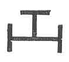

### АХИЛ

Възможно е някои почтени хора да се удивят, когато посочим Ахил като Свободен зидар. _Как!_ — ще възкликнат те — _възможно ли е онзи свиреп и жесток човекоубиец, дори човекоядец по сърце, защото той прояви силно канибалско влечение, жадувайки да погълне мъртвото тяло на Хектор — възможно ли е той да е бил член на нашето човеколюбиво общество?_ Да — отговаряме ние — това е действителният факт; и Наполеон Бонапарт също бе такъв, и то в най-висока степен. Но ако не желаете да вярвате нито на Омир, нито на нас, повярвайте на собствените си очи — ако, разбира се, сте Масон. **Ecce signum!** Ето знака! Вижте Ахил, който подава **РЪКАТА** на Приам, когато последният го моли за тялото на своя убит син:

> „Като изрече това, старецът с дясната си ръка хвана  
> китката му, за да не се смути духът му по никакъв начин.“

Такъв е масонският и буквален превод на текста от онзи прочут гръцки учен и брат — Кристофър Норт; и кой сега ще каже, че Ахил не е бил Масон? 

_Според това, брат Ахил е дал на брат Приам захвата на Майстор Масон; но няма доказателство дали са употребили думата **МАХ-ХА-БОН** и Петте точки на братството._

---

### СЪЩЕСТВЕНИ ТАЙНИ

Съществените тайни на Масонството се състоят от нищо повече освен знаците, захватите, паролите и жетоните, необходими за предпазване на обществото от посягането на самозванци; заедно с определени символични емблеми, чиито технически наименования служат като своеобразен универсален език, чрез който членовете на братството могат да се разпознават помежду си на всички места и във всички страни, където са учредени ложи.  

---

### ЗРЕНИЕ

Този, който временно е бил лишен от зрението си, е сведен до състоянието на новородено дете или на онези нещастни хора, чиято природна немощ прави присъствието на водач абсолютно необходимо; но когато няма външни предмети, които да отвличат вниманието му, тогава именно той с окото на размисъла прониква в най-дълбоките и най-тъмни кътчета на собственото си сърце и открива своите природни несъвършенства и нечистоти много по-лесно, отколкото би могъл, ако не бе лишен от зрението си. Това кратко лишение от зрение е запалило в сърцето му искра от най-яркия и най-чист пламък.  
Трябва още да признаем, че онези, които са били лишени от зрението си и имат надежда да го възвърнат, се стремят най-усърдно и прилежно да го получат; че нямат по-голямо желание и че с най-голяма готовност ще се задължат да сторят всичко, което може да се изисква от тях, за да получат това безценно благословение.  
Човек, лишен от зрение, може да бъде въведен на места, където е заобиколен от най-странни и най-редки предмети, без никаква възможност да стане предател. В същото време онези, които притежават зрение, не могат да почувстват грижата на своите водачи така силно, както онези, които са със завързани очи и осъзнават, че без непрестанното внимание на своите наставници биха били далеч по-безпомощни; но колкото и доказателства за внимание и грижа да получават, все пак остава нещо, за което да копнеят; и на въпроса: **„Кое е главното ти желание?“** отговорът неизменно ще бъде: **„Светлина.“** 

---

### ПЕТТЕ ТОЧКИ НА БРАТСТВОТО

Петте точки на братството са били разяснявани в лекциите, използвани от Атолските масони през миналия век, както следва:

1. Когато нуждите на брат изискват моята подкрепа, винаги ще бъда готов да му подам помагаща ръка, за да го предпазя от падение, ако го намеря достоен за това.
2. Леността няма да накара стъпките ми да се забавят, нито гневът да ги отклони; но, забравяйки всякакви егоистични съображения, ще бъда винаги бърз в краката си да спасявам, помагам и проявявам благотворителност към страдащ ближен, а най-вече към брат Масон.
3. Когато отправям своите молитвени въздишки към Всемогъщия Бог, ще помня благополучието на брата си така, както и своето собствено; защото както гласът на младенците възлиза към престола на благодатта, така и въздишките на пламенно сърце със сигурност ще се възнесат към обителите на блаженството.
4. Тайната на брат, поверена ми като такава, ще пазя, както бих пазил своята собствена; защото ако предам доверието, което ми е било гласувано, бих могъл да му нанеса непоправима вреда; това би било като злодеянието на убиец, който се спотайва в тъмнина, за да прободе противника си, когато той е невъоръжен и най-малко готов да срещне враг.
5. Характера на брат ще поддържам в негово отсъствие, както бих го сторил и в негово присъствие. Няма сам да го злословя, нито ще позволя това да бъде сторено от други, ако е по силите ми да го предотвратя.

Така, чрез Петте точки на братството, ние сме свързани в една неделима верига от искрена привързаност, братска любов, подкрепа и истина.

---

### ГУТУРАЛЕН ЗНАК

Гутуралният знак се отнася до въздържанието, което изисква такава предпазлива дисциплина на самоконтрол, каквато е необходима, за да ни предпази от риска да нарушим задължението си и да навлечем неговото наказание.  
_(Това се отнася до „Дюгарда на Чирака?“)_

---

### ГРАНИЧНИ КАМЪНИ (ЛАНДМАРКИ)

Какво представляват граничните камъни? — това е въпрос, който често се задава, но рядко получава определен отговор. В древността граничните камъни са служели като ориентири преди да бъдат познати нотариалните актове, а тяхното преместване е било строго забранено от закона. По отношение на масонските гранични камъни, някои ги ограничават до задължителните знаци, жетони и думи. Други включват церемониите по посвещение, преминаване и въздигане; формата, размерите и опората; мястото, разположението и покритието; украшенията, обзавеждането и бижутата на ложата, или техните характерни символи. Някои смятат, че Орденът няма други гранични камъни освен своите особени тайни. Ясно е обаче, че заповедта против премахване или изменение на граничните камъни е била всеобщо спазвана във всички епохи на Занаята.

---

### МЕТАЛ

Мнозина хора обожават металите — сребро и злато — с цялата си душа и не познават друг критерий, по който да оценяват собствената си стойност или стойността на своите ближни, освен количеството от тези метали, които притежават; по този начин те принизяват и обезценяват онези качества на ума и духа, чрез които единствено човечеството следва да бъде оценявано. Онзи, който желае да бъде посветен в Свободното зидарство, трябва да бъде готов да се откаже от всякакъв вид метал и от всички случайни обстоятелства на ранг и богатство; защото **ЧОВЕКЪТ** бива приеман в Свободното зидарство, а не неговото положение или богатства. 

---

### ПЪРВОНАЧАЛНИ ТОЧКИ

Древното Масонство признава дванадесет първоначални точки, които съставляват основата на цялата система и без които никой човек никога не е бил или не може законно да бъде приет в Ордена. Всеки кандидат е длъжен да премине през всички тези съществени форми и церемонии; в противен случай посвещението му не би било законно. Те са:  
**откриване, подготовка, докладване, влизане, молитва, обикаляне, напредване, задължение, поверяване, обличане, поставяне, закриване.**

---

### НАКАЗАТЕЛЕН ЗНАК

Наказателният знак отбелязва нашето задължение и ни напомня също за падението на Адам и страшното наказание, произтекло от него за греховното му потомство — не по-малко от смърт. Той подсказва, че коравият врат на непокорния ще бъде отсечен от земята на живите чрез Божия съд, както главата бива отделена от тялото чрез меча на човешкото правосъдие.  
_(Това се отнася както за Дюгарда на Чирака, така и за този на Кралско-Арковия Масон.)_

---

### ФРАЗИ НА ПРИЕМАНЕ

Когато кандидатът получи първата Степен, се казва, че е **посветен**; при втората стъпка той е **преминал**; при третата — **въздигнат**; когато приеме Марковата Степен, той е **поздравен (напреднал)**; след като е преминал стола, се казва, че е **председателствал**; когато стане Най-Отличен Майстор, той е **признат и приет**; а когато стане Кралско-Арков Масон — той е **възвеличен**.

---

### ЗНАК НА БЕДСТВИЕ

В общество, чиито членове са длъжни братски да се обичат и подпомагат, естествено е да се очаква, че ще имат знак, чрез който могат незабавно да се разпознаят помежду си, в каквито и бедствени обстоятелства да се окажат, и едновременно с това да заявят своето право на помощ и закрила. Това е знакът на бедствие, в съчетание с няколко думи. Който попадне в най-голямо затруднение и опасност и предполага, че има брат в полезрението или слуха му, нека употреби този знак — и един истински и верен брат е длъжен незабавно да му се притече на помощ. 

---

### ЕДНООБРАЗИЕ

Почти излишно е да се обсъжда въпросът за еднообразието на работата, защото такова никога не може да съществува — казваме **никога**, докато живеем според ученията на Отците и устно предаваме тайните на кандидатите. За да се постигне еднообразие, работата трябва да бъде записана — а това никога няма да се случи, докато Свободните зидари почитат своите задължения. Един Всеобщ Велик Ориент би могъл — ако братството някога се окаже достатъчно неразумно да санкционира подобна организация, което никога няма да стане — по подражание на съвременни сдружения да се опита, в името на еднообразието, чрез свои постановления да разреши записването на работата; но при никакви други обстоятелства това не би могло или не би било опитано; и дори в такъв случай би последвало всеобщо въстание на Занаята, за да се предотврати такова нарушение на задължението.  
Еднообразието във всичко не е абсолютно необходимо и никога не е било считано за такова. Не може да се очаква различни лица да изразяват едни и същи идеи с напълно еднакъв език; освен това езикът изменя своето значение, а идеите се променят с напредъка на науката и развитието на философията. Достатъчно е било за древните да твърдят, че слънцето изгрява на Изток, че земята е неподвижна като дърво или къща и че слънцето се движи около нашето малко земно кълбо; но времето на тези представи е отминало. Днес, чрез промяна на изразите, идеите се предават в съгласие със здрави философски принципи — като това, че слънцето на Изток открива и украсява деня и т.н.; и така неизбежно трябва да бъде и по отношение на масонския език и масонските идеи. Езикът, използван за изразяване на дадена идея преди хиляди или дори преди няколкостотин години, би бил неразбираем днес. Да се очаква еднообразие на езика за всички времена е напразно очакване и никога не може да бъде постигнато. 

---

### СКЛЕП

Склепове се откриват във всяка страна по света, както и в Юдея, и са били използвани за тайни цели. Така Стивънс, говорейки за някои руини в Юкатан, казва: „Единственият начин за слизане беше да се завърже въже около тялото и човек да бъде спуснат от индианците. По този начин бях спуснат и почти преди главата ми да премине през отвора, краката ми докоснаха върха на купчина развалини, натрупани право под отвора и спускащи се отстрани. Спускайки се по тях, се оказах в кръгла камера, толкова пълна с развалини, че не можех да застана изправен. Със свещ в ръка пропълзях наоколо на колене и ръце. Камерата беше във формата на купол и беше измазана с хоросан, по-голямата част от който бе паднала и сега покриваше пода. Дълбочината не можеше да бъде установена без разчистване на вътрешността.“

---

### НАДНИЦИ

Преданието относно изплащането на надниците на работниците при строежа на Храма на Соломон може да е вярно или не, тъй като не е известен източникът, на който се основават тези изчисления. Всъщност вероятно е това предание да е било създадено в по-късна епоха, без наличието на каквито и да било документи, които да удостоверят неговата достоверност.

:::figure

:::
